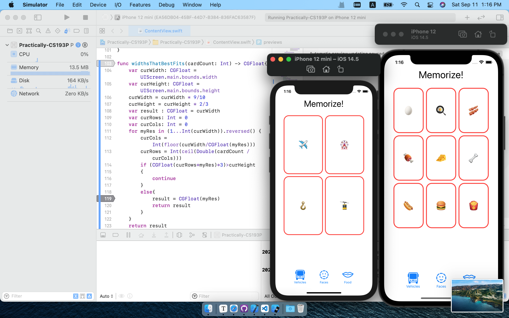
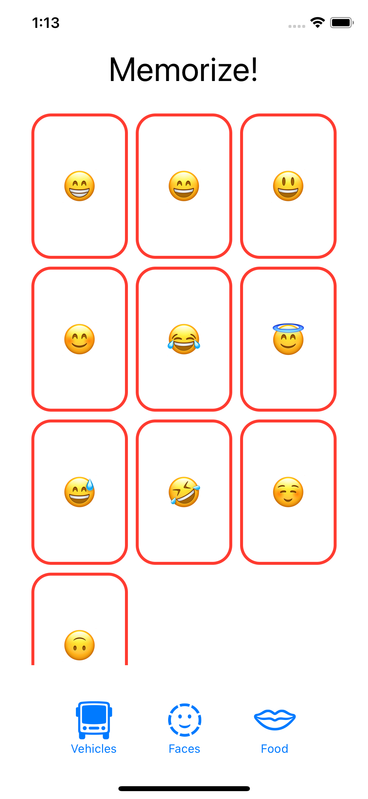

# CS193P @Stanford - Another Try

## Lecture 2 - Learning more about SwiftUI

### Preview Generator

```swift
struct ContentView_Previews: PreviewProvider {
    static var previews: some View {
        ContentView()
            .preferredColorScheme(.light)
        ContentView()
            .preferredColorScheme(.dark)
    }

}
```

This brings both light and dark mode on the right side of the screen.

### Initialize Variables

::red_circle:`Missing argument for parameter 'XXX' in call`

If not, probably the error message above appears.

You can initialize in the declaration or calling.

`CardView(isFaceUp: true)`

**`var body: some View`**

This is a `var` because the value of `body` is determined by executing the `body` function.'

### The View Modifier

> When something or events happened, the entire UI is being **constantly rebuilt**. New views would be created to reflect the changes.

So you can't assign gesture action to a variable **inside a View object** 

::red_circle:`Cannot assign to property: 'self' is immutable`

Solution: **`@State`**

`@State var isFaceUp: Bool = true`

In this case the `isFaceUp` is no longer a `Boolean`, but a **pointer**. So though the value change but the pointer points the same place.

**BUT** this is not commonly used. Mostly the logic will cover changes. 

### A Reference Trick

`option` + `click` gives you document on certain functions or variables.

### A Bag of Lego

So an array is a bag of Lego. Now I want to create a CardView for each Lego in the bag. It's `ForEach` statement's job basically.

Apple's Official Doc for `ForEach`:

#### Overview - ForEach

Use `ForEach` to provide views based on a [`RandomAccessCollection`](doc://com.apple.documentation/documentation/swift/randomaccesscollection?language=swift) of some data type. Either the collection’s elements must conform to [`Identifiable`](doc://com.apple.documentation/documentation/swift/identifiable?language=swift) or you need to provide an `id`parameter to the `ForEach` initializer.

The following example creates a `NamedFont` type that conforms to [`Identifiable`](doc://com.apple.documentation/documentation/swift/identifiable?language=swift), and an array of this type called `namedFonts`. A `ForEach` instance iterates over the array, producing new [`Text`](doc://com.apple.documentation/documentation/swiftui/text?language=swift)instances that display examples of each SwiftUI [`Font`](doc://com.apple.documentation/documentation/swiftui/font?language=swift) style provided in the array.

```swift
private struct NamedFont: Identifiable 
{    
  let name: String    
  let font: Font    
  var id: String { name }
}

private let namedFonts: [NamedFont] = [    
  NamedFont(name: "Large Title", font: .largeTitle),    
  NamedFont(name: "Title", font: .title),    
  NamedFont(name: "Headline", font: .headline),    
  NamedFont(name: "Body", font: .body),    
  NamedFont(name: "Caption", font: .caption)]

var body: some View {    
  ForEach(namedFonts) { namedFont in        
         Text(namedFont.name)            
               .font(namedFont.font)    
                      }
}
```

So this explains the error below.

```swift
ForEach(emojis, content:{ emoji in
//err: Referencing initializer 'init(_:content)' on 'ForEach' requires that 'String' conform to 'Identifiable'
    CardView(content: emoji)
})
```

For now, we only want the view to generate different emojis. So we do this:

```swift
ForEach(emojis, id: \.self, content:{ emoji 
    CardView(content: emoji)
})
```

> When we use `\.self` as an identifier, we mean “the whole object”, but in practice that doesn’t mean much – a struct is a struct, so it doesn’t have any sort of specific identifying information other than its contents. So what actually happens is that Swift computes the *hash value* of the struct, which is a way of representing complex data in fixed-size values, then uses that hash as an identifier.

### Buttons

Two equivalent way of putting a button:

```swift
		var remove: some View {
        Button(action: {
            if emojiCount < emojis.count
            {
                emojiCount-=1
            }
        }, label: { Image(systemName: "minus") })
    }
    
    var add: some View {
        Button{
            if emojiCount > 1
            {
                emojiCount-=1
            }
        } label: { Image(systemName: "plus") }
    }

// and these views can be add directly to the major big view.

HStack{
  	add
    Spacer()
    remove
  }.padding(.horizontal)
```

### LazyVGrid

To display our cards in grid style, we use this type of `View Layout and Presentation`.

#### Overview - LazyVGrid

The grid is “lazy,” in that the grid view does not create items until they are needed.

In the following example, a [`ScrollView`](doc://com.apple.documentation/documentation/swiftui/scrollview?language=swift) contains a `LazyVGrid`consisting of a two-column grid of [`Text`](doc://com.apple.documentation/documentation/swiftui/text?language=swift) views, showing Unicode code points from the “Smileys” group and their corresponding emoji:

```swift
 var columns: [GridItem] =
         Array(repeating: .init(.flexible()), count: 2)
 ScrollView {
     LazyVGrid(columns: columns) {
         ForEach((0...79), id: \.self) {
             let codepoint = $0 + 0x1f600
             let codepointString = String(format: "%02X", codepoint)
             Text("\(codepointString)")
             let emoji = String(Character(UnicodeScalar(codepoint)!))
             Text("\(emoji)")
         }
     }.font(.largeTitle)
 }
```

The `HStack` uses **all the space it can**. But the `LazyVGrid` distributes the space quite differently. It uses all the space horizontally but the least possible space vertically.

### Homework - Assignment 1

[CS193P - Programming Assignment 1](https://cs193p.sites.stanford.edu/sites/g/files/sbiybj16636/files/media/file/assignment_1.pdf)

After this assignment, what really matters to me is that I fixed an issue to make images and text align in the ideal way.

If you hardcode `VStack` of `Button`'s `Image` and `Text`, when you `HStack` the `VStack`s they don't align due to the SF Symbol images are in different sizes. To solve this, use the `.fixedSize()` and `frame()` methods in `View`s

Secondly, the multi-theme problem, can be easily solved use a 2-D array. But the array had better not to be `let`. Because to display them in unpredictable order, we call `array.shuffle()` in the theme button actions. Thanks to Swift's simplicity this is relatively easy.
*`Model`-`View`-`ViewModel`*

#### Things to Learn 

Here is a partial list of concepts this assignment is intended to let you gain practice with or otherwise demonstrate your knowledge of. 

1. Xcode 12 
2. Swift 5.4 
3. Writing code in the in-line function that supplies the value of a View’s body `var` 
4. Syntax for passing closures (aka in-line functions) (i.e. code in { }) as arguments 
5. Understanding the syntax of a `ViewBuilder` (e.g. “bag of Lego”) function 
6. Using basic building block Views like `Text`, `Button`, `Spacer`, etc. 
7. Putting Views together using `VStack`, `HStack`, etc. 
8.  Modifying Views (using .font(), etc.) 
9. Using `@State` (we’ll learn much more about this construct later, by the way) 
10. Very simple use of Array 
11. Using a Range (e.g. `0..<emojiCount`) as a subscript to an Array
12. The SF Symbols application 
13. Putting system images into your UI using `Image(systemName:)` 
14. Looking things up in the documentation (Array and possibly Font) 
15. `Int.random(in:)` (Extra Credit) 
16. Running your application in different simulators

#### Extra Credits

> Make a random number of cards appear each time a theme button is chosen

`emojiCount = Int.random(in: 4...24)` 

> Try to come up with some sort of equation that relates the number of cards in the game to the width you pass when you create your `LazyVGrid’s GridItem(.adaptive(minimum:maximum:))` such that each time a theme button is chosen, the `LazyVGrid` makes the cards as big as possible without having to scroll.

So I used a function to **roughly** calculate this value. Since I don't quite know how to access the exact width and height of the gaming area, I guessed the value instead. The shitty part of the code below which contains a random fraction number is the result of that.

```swift
func widthsThatBestFits(cardCount: Int) -> CGFloat{
    var curWidth: CGFloat = UIScreen.main.bounds.width
    var curHeight: CGFloat = UIScreen.main.bounds.height
    curWidth = curWidth * 9/10
    curHeight = curHeight * 2/3
    var result : CGFloat = curWidth
    var curRows: Int = 0
    var curCols: Int = 0
    for myRes in (1...Int(curWidth)).reversed() {
        curCols = Int(floor(curWidth/CGFloat(myRes)))
        curRows = Int(ceil(Double(cardCount / curCols)))
        if (CGFloat(curRows*myRes)*3)>curHeight
        {
            continue
        }
        else{
            result = CGFloat(myRes)
            return result
        }
    }
    return result
}
```

This works well when `cardCount` is 4, but not well when it's 5. I think It'd be quite eloqunt if I knew the exact width/height of the center area. Maybe `lldb` debugger can help?

But now let's call it a day and move on.

Here's my app's screenshots

After paras adjusting, theses are displayed beautifully:



But these aren't.




## Letcure 3 - MVVM and the Swift type system

### MVVM

*Model-View-ViewModel*

**Model**: UI independent. Pure data and logic. Backbend of the app. Single source of "Truth".

**View**: Reflects the model. Stateless, so ~~@State~~ is not a regular solution to logic in the apps. `@State` only facilitating transient movements in the UI. View is immutable. **Declared**: It performs exactly what we declared in the `body var`. Imperative. 

Data flows from Model to View (i.e. read-only). Any change inthe model will cause the affected parts of the view to be rebuilt.

**ViewModel**: Binds View to Model. Sort of a **Interpreter**. A **Gatekeeper**. The View will always get data from the Model from The ViewModel. Constantly noticing changes in the Model, the publishes "something changes" to those interested in such changes. The View automatically observes publications and pulls data and rebuilds.

For the VM, there are keywords like... `ObservableObject`, `@Published`, `objectWillChange.send()`...

For the View, there are `@ObservedObejct`, `@Binding`, `.onReceive`, `@EnvironmentObject`, `.environmentObject()`...

**But what about the other direction?**

After the user interacts with the View, the View calls Intent Function to the VM. The VM processes Intent and modifies the Model. This is often seen in *Store Data* process. Make sure to leave database access statements in the VM.


### Varieties of Types

What's a class and what's a protocol? The `ViewModel` is a class and the `View` or `body var`  is protocol.

#### `struct` and `class`

Both `struct` and `class` have:

- stored `var`s

- computed `var`s

- constant `let`s

- `function`s

  ```swift
  func multiply(operand: Int, by: Int) -> Int {
      return operand * by 
  }
  
  multiply(operand: 5, by: 6)
  
  func multiply(_ operand: Int, by otherOperand: Int) -> Int {
      return operand * otherOperand
  }
  
  multiply(5, by: 6)
  
  ```

- `init`ializers

Differences:

| `struct`                                                     | `class`                                                      |
| ------------------------------------------------------------ | ------------------------------------------------------------ |
| Value type                                                   | Reference type                                               |
| **Copied** When passed or assigned                           | Passed around via **pointers**                               |
| Copy on write. (Doesn't actually copy until you modify it)   | Automatically reference counted. ( Tracking how many pointers points to the piece of memory, when it's zero, auto-cleans memory ) |
| Functional Programming                                       | Object-oriented programming                                  |
| No inheritance                                               | Inheritance (**single**)                                     |
| "Free" `init` initializes ALL `var`s                         | "Free" `init` initializes NO `var`s                          |
| Mutability must be explicitly stated                         | Always mutable                                               |
| Your "go to" data structure                                  | Used in specific circumstances                               |
| **Everything** you've seen and done so far is a `struct` except `View` which is a `protocol` | The `ViewModel` is always a `class`. Also, `UIKit` is `class`-based |

#### Generics

We just don't care the type.

For instance `Array`, in Swift arrays are implemented by `template` in C++.  The name here is called `Type Parameter`. Swift combines these with protocols, which makes it very powerful.

#### Functions as Types

```swift
var operation: (Double) -> (Double)
//is a var called operation

//We have a function takes a Double returns a Double:
func sqaure(operand: Double) -> Double {
    return operand * operand
}
operation = square
//assigns a value to operation var
let result1 = operation(4)
//result1 is 16

operation = sqrt
//sqrt is a built-in function
let result2 = operation(2)
//result2 is 4
```

*Closures*: Something like in-line functions but quite diferent.

### Back to Demo

#### File Dependency

As covered in the MVVM, our app in this stage needs to separate models and views.

For this situation, we create 2 different Swift file (`.swift`), one is `EmojiMemoryGame.swift`, the other `MemoryGame.swift`. The former is called specifically `emoji` game so it's our `ViewModel`, the latter is like pure data, the only truth. So it's called `MemoryGame`. 

#### `MemoryGame.swift`

**The Model**.

```swift
import Foundation

struct MemoryGame<CardContent> {
    private(set) var cards: Array<Card>
    
    func choose(_ card: Card){
        //no keyword.
        //choose(curCard)
    }

    struct Card {
        var isFaceUp: Bool
        var isMatched: Bool
        var content: CardContent
    }
}

```

Generics - `CardContent`

`private`: access control. Prevent the View from touching our model.

`(set)`: This makes `get` gets default (internal) access control level but `set` private.

You can look at them but you can't touch 'em.

#### `EmojiMemoryGame.swift`

```swift
import SwiftUI

class EmojiMemoryGame {
    private var model: MemoryGame<String> = ?
    var cards: Array<MemoryGame<String>.Card> {
        return model.cards
    }
}

```

Your `ViewModel` creates a model. 

The `var cards` provide the `View` with a bridge to let the `View` know what card to display without letting `View` touch the `Model`.

Continue implementing:

We haven't implement the `initializer` in the Model. So back to the Model struct:

```swift
struct MemoryGame<CardContent> {
    private(set) var cards: Array<Card>
    
    func choose(_ card: Card){
        //no keyword.
        //choose(curCard)
    }
  
+  	init(numberOfPairOfCards: Int) {
+      cards = Array<Card>()
+    }
  

    struct Card {
        var isFaceUp: Bool
        var isMatched: Bool
        var content: CardContent
    }
}
```


