# 编译原理

## 第一章：引论

#### 何为编译程序

在宿主机上运行，把高级语言程序翻译成机器运行程序（在目标机上运行），最终得到结果

#### 程序的两种执行方式

1. 解释方式。边解释边执行元语言程序，不产生目标语言程序。
2. 编译方式。把某种语言的程序转换为另一种语言的程序。后者与前者在逻辑上等价。

`java`应该是编译和解释都有，`class`文件就是编译方式，`jvm`执行`BYTECODE`是解释方式。

#### 编译程序的进一步分类

- 诊断编译程序
- 优化编译程序
- 交叉编译程序（产生不同与其宿主机的机器代码）
- 可变目标编译程序（不用重写编译程序中与机器无关的部分）

#### 编译与计算思维

抽象、自动化、分解、递归、权衡

#### 编译过程概述

##### 词法分析

扫描程序，输入是字符流，输出是等长的内部形式（属性字）。也就是要识别出标识符、常量、关键字（基本字）等等。

依循语言的词法规则（构词规则），使用描述词法规则的有效工具：正规式、有限自动机。

方法：状态图、DFA、NFA

##### 语法分析

读入上述输出的符号，根据给定规则识别出各个语法单位（短语、子句、语句、程序段、程序），生成另一种内部表示

依据语法规则，使用上下文无关文法进行描述。

方法：递归子程序法、LR分析法、算符优先分析法

由小到大，逐步识别整个语句。得到一棵描述结构的分析树。

##### 语义分析与中间代码产生

**语义分析**

静态语义检查，审查算符是否符合语言规范。

**中间代码生成**

生成含义明确、便于处理的记号系统。比如四元式、三元式、树。输入句子，输出中间代码序列。

方法：语义子程序、DAG图、语法制导翻译

​	**四元式**：算符、左操作数、右操作数、结果

##### 优化

将中间代码进行加工，变换成功能相同、功效更高的中间代码。

依据程序的等价变换规则。

方法：公共子表达式的提取、循环优化、删除无用代码

##### 目标代码生成

中间代码变成目标机器上的低级语言代码。三种形式：汇编指令代码、绝对指令代码、可重新定位指令指令代码（地址是相对地址，需要链接。使用连接装配程序把各个目标模块连接在一起，确定程序变量在主存中的位置，装入内存指定的起始地址。）。

#### 编译程序的结构

##### **编译程序总框**

中间是自顶向下的五个阶段，左边是表格管理（符号表管理），右边是出错处理。

**表格与表格管理**

符号表：记录源程序中的名字（标识符），收集各个名字的属性。

**出错处理**

语法错误：保留字拼写、括号不配对等等

语义错误：标识符没有说明就使用、标号有引用而无定义、形式参数和实在参数结合是不一致等等

##### 遍

pass，对源程序或源程序的中间表示从头到尾扫描一次。

阶段与遍是不同的概念

一遍可以由若干段组成：一边扫描时同时做词法分析、语法分析、中间代码生成。

一段也可以由若干遍生成：优化可以有一遍局部、一遍全局。

##### 编译前端和后端

前端：与源语言有关。

后端：与目标机有关。比如与目标机有关的优化、目标代码产生。

#### 编译程序的生成

##### T型图

##### 移植

把一种机器上的编译程序移植到另一种机器上。

##### 自编译

用某种高级语言书写自己的编译程序。比如A机器上的C语言编译程序，借助原有的编译程序对新编写的C编译程序进行编译，从而得到一个能在A上运行功能更强的C编译程序。

##### 交叉编译

若x机器上己有C语言编译程序，则可用x机器中的C语言书写一个编译程序，该编译程序的源程序是C语言程序,而产生的目标程序则是基于y机器的，即产生在y机器上执行的低级语言程序。

比如嵌入式系统、手机操作系统

## 第二章：高级语言及其语法描述

#### 高级语言的分类

- 强制式
- 应用式：函数式语言，从前面已有的函数出发构造出更复杂的函数。
- 基于规则：检查一定的条件，满足时执行相应的动作。
- 面向对象

#### 几个有代表性的

**Fortran**, FORmula TRANslation

科学计算首选

**COBOL**, Common Business Oriented Language

第一个商用语言。只要大型机存在，COBOL就不会消失

**Ada**

结构化程序设计语言，美国军方软件开发

**Pascal**

强健数据类型概念、强制性数据类型声明。

**Prolog**, Programming in Logic

**Lisp**，List Processor

函数式语言

**C/C++**

系统程序设计语言

**Java**

#### 高级语言的程序结构

**单层结构**

主程序+若干个辅助程序段

**多层结构**

允许嵌套定义

**程序包**

数据和操作代码封装在一起，支持数据抽象。（Ada）

**面向对象**

类和继承的概念、多种特性

#### 程序语言的语法描述

##### 文法

描述语言的语法结构的形式规则，定义语言的一个数学模型。

##### 几个基本概念和记号

字母表：一个有穷字符集，Σ

字符：字母表中每个元素

Σ上的字（也叫字符串）是指由Σ中的字符所构成的一个有穷序列。

ε表示不包含任何字符的序列，称为空字。

Σ*表示Σ上所有字的全体，包括空字。

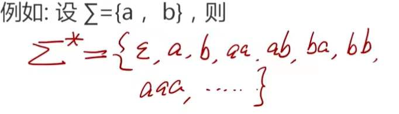

连接（积）：$UV = {\{\alpha\beta|\alpha\in U \&\beta\in V\}}$，这是有顺序的，UV与VU不一定相同。左运算量提供的字在前。但是(UV)W = U(VW)。

自身的n次积：$V^n = VVVVV...$，

$V^0 = \{\epsilon\}$

$V^* = V^0\cup V^1 \cup V^2....$，V的闭包

$V^+ = VV^*$，正则闭包。*怎么区分？*如果V原来没有空字，闭包中会包含空字，而正则闭包没有空字。

##### 上下文无关文法

四元组$G = (V_N, V_T,S,P)$

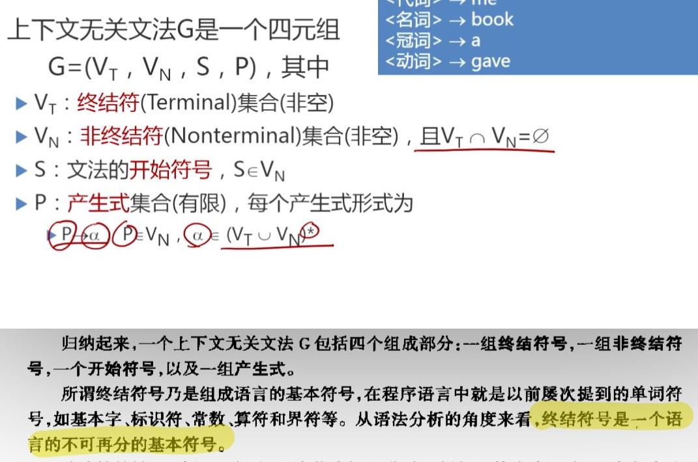

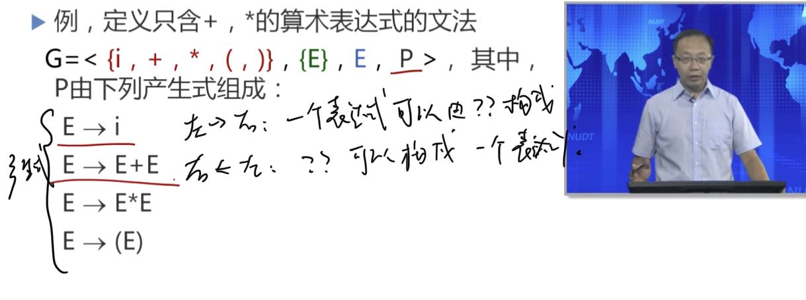

P可以缩写，右边的部分（产生式右部或候选式）用竖杠（|）隔开

约定非终结符用大写（比如E），终结符用小写（比如i）

简化表示文法：只写产生式部分、约定在第一个产生是的左部符号为初始符号（或者产生式前写个`G[A]`，A为初始符号）

##### 推导

单箭头表示定义，双箭头表示直接推导。

从一个串到另一个串的推导往往不唯一。

**直接推导**

如果$A\rightarrow\gamma$是一个产生式，且$\alpha, \beta\in (V_T\cup V_N)^*$，则$\alpha A \beta \Rightarrow \alpha \gamma \beta $。

**规约**

推导的逆过程，若存在$\alpha A \beta \Rightarrow \alpha \gamma \beta $，则$ \alpha \gamma \beta$能够直接规约成$\alpha A \beta$。

**黑话**

$\alpha_1 \Rightarrow ^+ \alpha_n $，经一步或若干步推导。

$\alpha_1 \Rightarrow ^* \alpha_n $，经零步或若干步推导。

$\alpha \Rightarrow ^* \beta $，则$\alpha = \beta $或$\alpha \Rightarrow ^+ \beta $

##### 句型、句子和语言

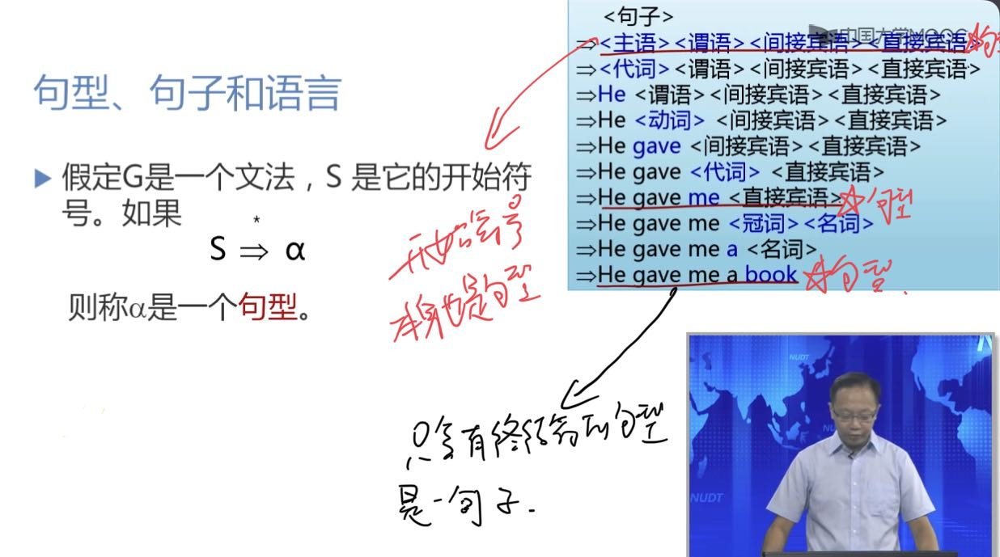

而文法G所产生句子的全体，就是语言。

##### 证明

证明一个字符串是文法XXX的一个句子：

而中间的那些，都是句型。

给文法，求语言

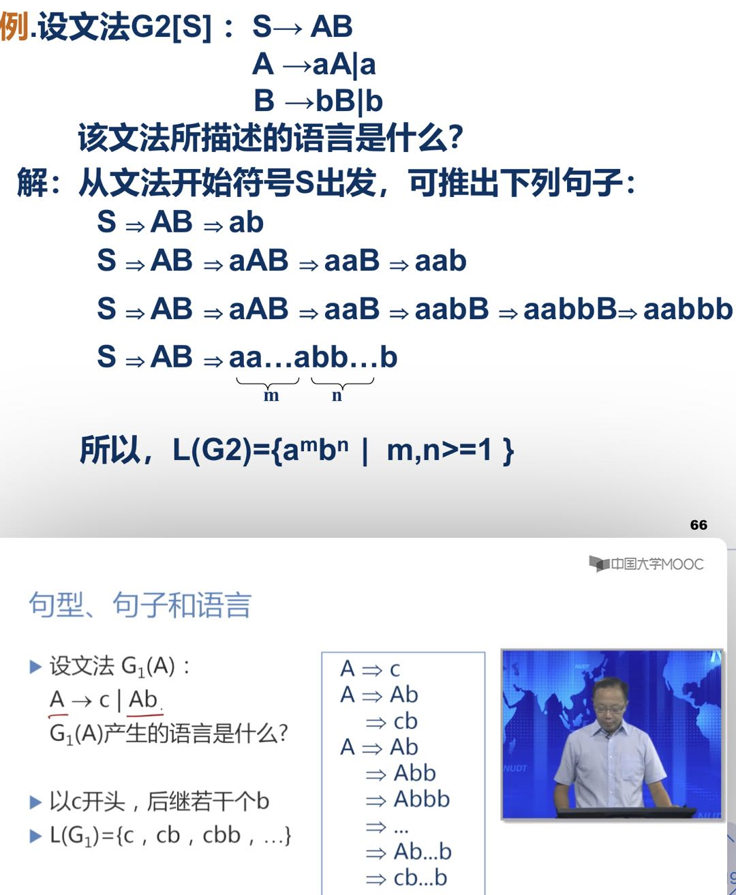

技巧就是，先都换成终结符，再不换终结符，枚举非终结符。

给语言，求文法

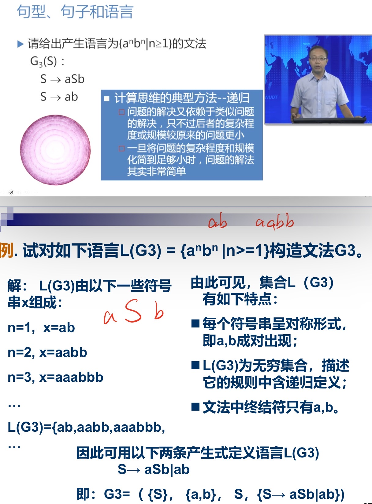

先写满足这个语言的最简单的句子，然后把这个句子看成S，对S加加减减看看满不满足条件。用递归的角度去理解它。

##### 最左推导

若在推导关系中，每次最先替换最左（右）的非终结符，则称为最左（右）推导；

任何一步推导都从串最左边的非终结符开始。

##### 最右推导

若在归约过程中，每次最先归约最左（右）的非终结符，则称为最左（右）归约。

任何一步推导都从串最右边的非终结符开始。

##### 语法树

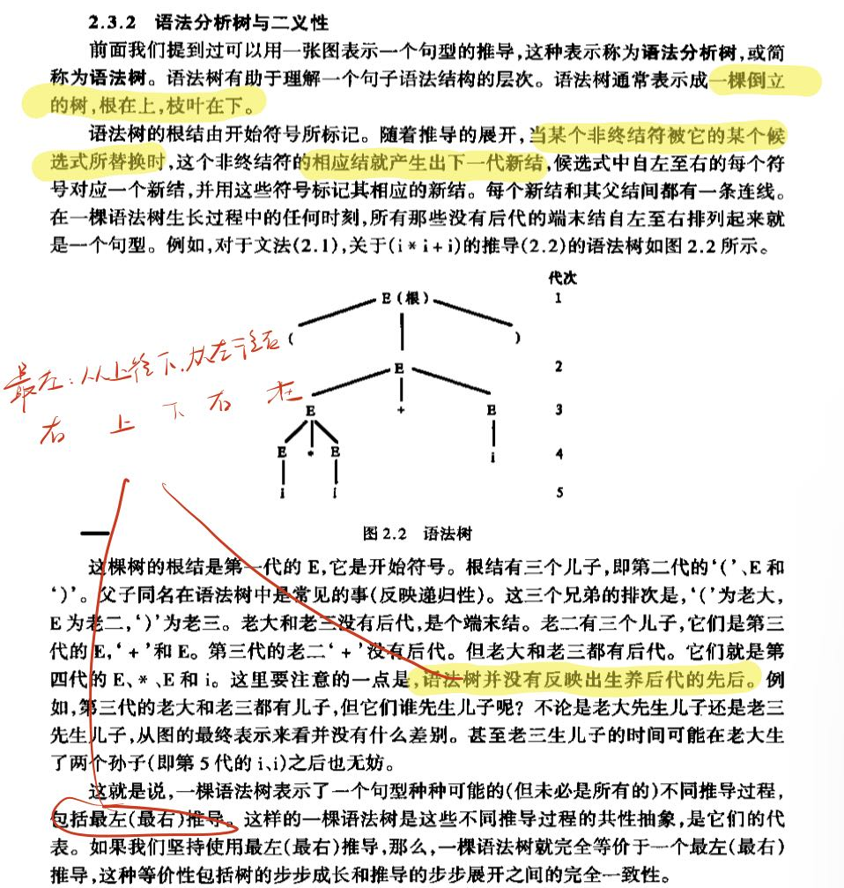

如果文法有二义性，那它的语法树不唯一

##### 二义性

如果某个文法存在句子对应两颗不同的语法树，则说这个文法是二义的。找到一个这样的句子，这个文法就是二义的。

如果一个语言不存在无二义的文法，则这个语言是二义的。可能存在两个文法G, G'都能产生语言L，可能有一个文法是二义的，有一个不是二义的。这种情况下这个语言就不是二义的。所有文法都必须无二义才可以。语言的二义性源自语言，而不是文法。

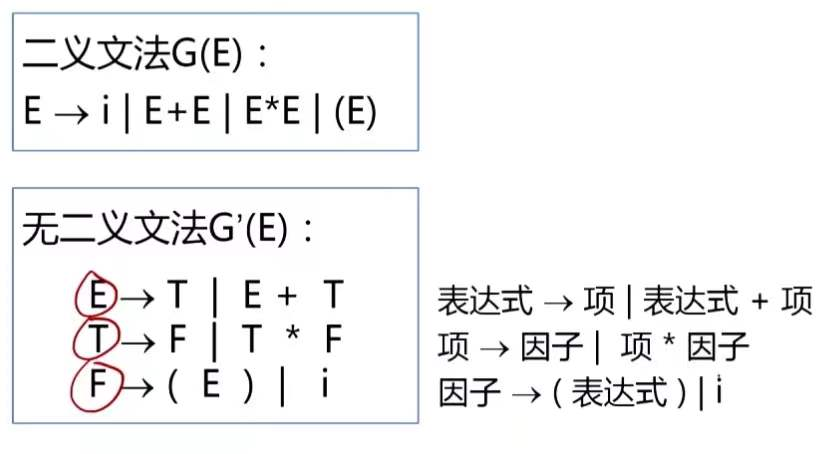

Expression, Term, Factor, i

二义性问题是不可判定问题

可以找到一组无二义文法的充分条件。如果一个文法满足某条件，就可以断定是无二义的。但是不满足也有可能是无二义的。

## 第三章：词法分析

词法分析器的设计

正规表达式与有限自动机

词法分析器的自动产生：LEX

#### 词法分析器的功能

输出的单词符号表示形式

每个单词表示为一个二元组

词法分析是独立的阶段，可以设计成单独的一遍扫描。当然你可以在这一遍把前端都做了。运行语法分析，调用词法分析来获得下一个单词（的二元组）。

#### 词法分析器的结构

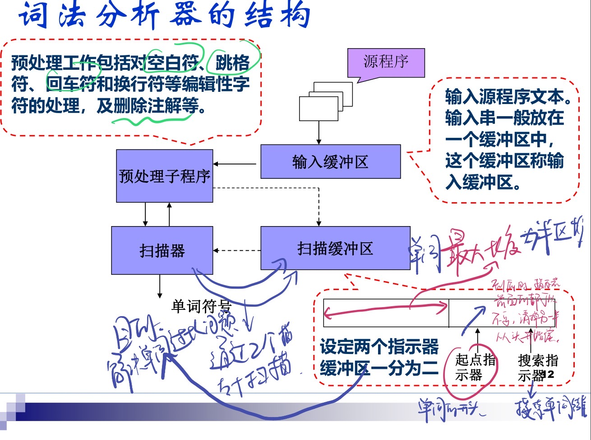

单词符号的识别：超前搜索

`DO99K = 1,10 -> DO 99 K = 1, 10`，`DO`是循环语句，`99`是循环体（当前语句到标号为99的语句构成），`K`是循环控制变量，从1变到10.

`DO99K = 1.10 -> 给变量DO99K赋值1.10`

要超前搜索到逗号/小数点才能判断。

一般，标识符、常数（`5.EQ.M`与`5.E08`的混淆，后者才是常数，前者是`equal exp`）、算符和界符的识别都需要超前搜索。

现在的语言加了几点限制以避免超前搜索。比如**所有基本字都是保留字**、基本字作为特殊的标识符处理、规定在基本字、标识符、常数之间必须**使用确定的间隔符**，比如空格、换行等等。

#### 状态转换图

- 有限方向图
- 圆圈性的结点表示状态。初态：通常有一个；终态：至少有一个，双圈。
- 只包含有限个状态

接受

如果存在从初到终得道路，这路上所有弧上的标记符连接成的字等于$\alpha$，则称$\alpha$被状态转换图所接受（识别）。

在终态上加入一个星号（*），意味着多读进了一个不属于标识符部分的字符，应该把它退还给输入串。

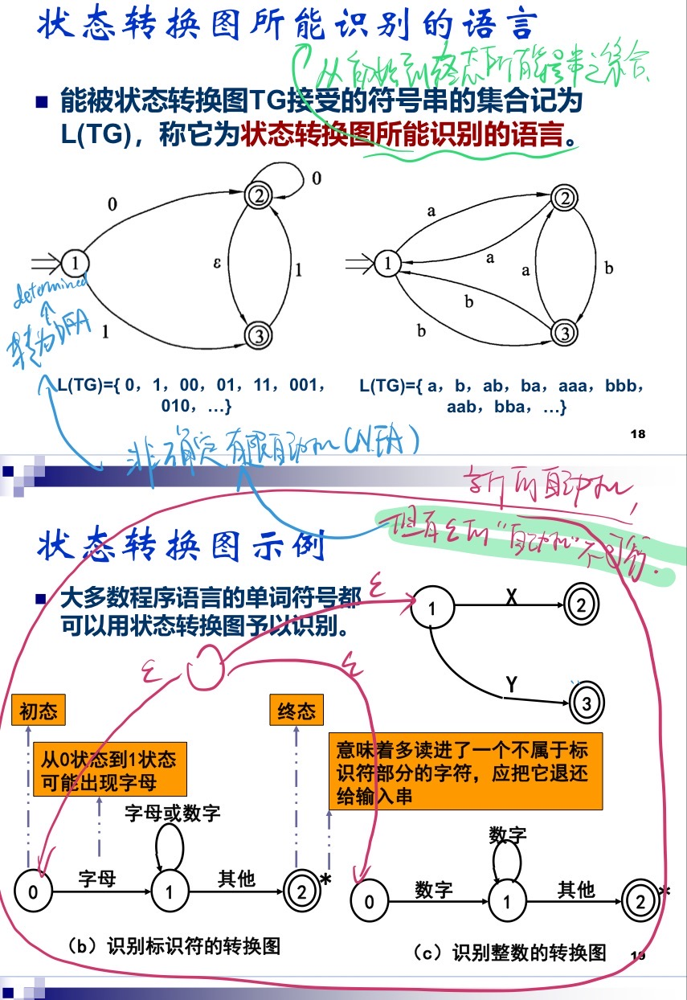

如果可以进两个状态，可以自己规定一下优先级。

#### 状态转换图的实现

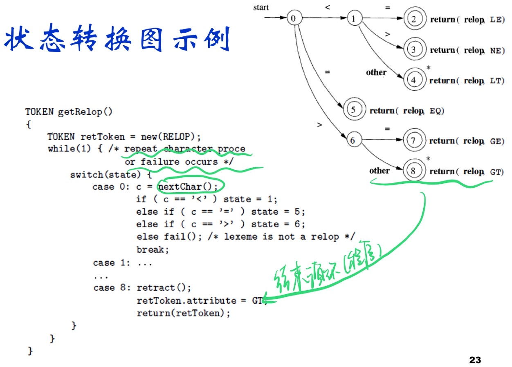

一般是`if-else`，还可以是`switch`。

**含有回路**的状态结点：

每个结点一个程序段。

终态结点：一个返回语句。

`Concat()`：连接当前符到strToken中；

`Retract()`：（因为后面有个星号）把刚刚读到的字符还给缓冲区。

`code := Reserve()`: 查保留字表，结果赋值给`code`，0的话就不是保留字，是单词。

`GetBC()`：check blank char

 词法分析器的设计和实现过程：先得到设计状态转换表，再得到设计状态转换图。

可以用二维数组表示状态图。`stateTrans[state][ch]`，前一个是状态，后一个是转换到该状态的字符。

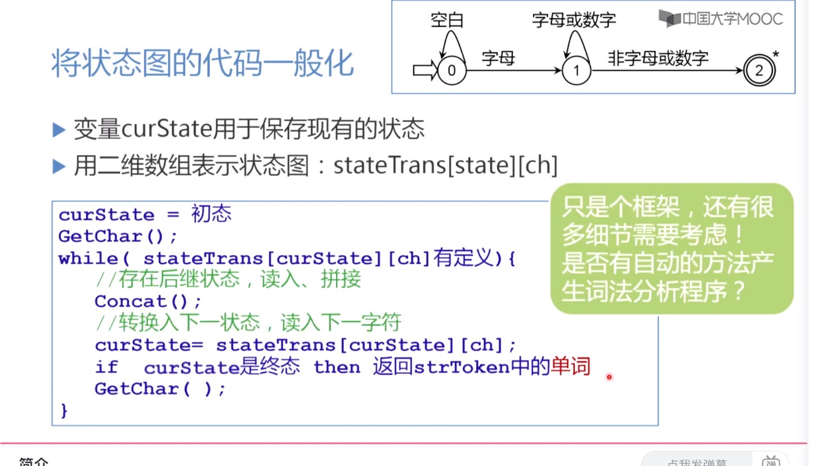

## 第六章：属性文法

属性计算的过程即是语义处理的过程对于文法的每一个产生式配备一组属性的计算规则，则称为语义规则。

S - 属性文法：只含有综合属性。

属性文法是对上下文无关文法做扩充。

综合属性依赖于子节点和自己。

继承属性依赖于父节点和兄弟节点以及自己。

### 基于属性文法的处理方法

”语法制导翻译方法“：翻译离不开语法结构。

依赖图：把每个属性都当作一个结点，画一张图，用实线表明依赖关系。

树遍历：在每个根递归之前把根能计算的属性都计算出来。

一遍扫描：在语法分析的同时计算属性值。

抽象语法树：没有中间符作为内部结点。（整个算术表达式结果由抽象语法树的根表示）

翻译模式这里感觉有些不知道在干什么。

——翻译模式比属性文法更明确地描述出各个属性应该在什么时候进行计算。翻译模式指导我们把语法分析程序改成语法制导的翻译程序

## 第七章：中间代码生成

### 语义分析

编译做的语义分析：静态语义检查。

中间语言：独立于机器；复杂性介于源语言和目标语言之间

常用的中间语言：DAG图、逆波兰表达式、三地址代码

后缀式：`POST[]`

DAG表示法：无循环有向图

### 三地址代码

`x := y op z` 

抽象语法树的线性表示。

`x := op y`

`x := y`

`goto L`

`if x relop y goto L`

`param x`, `call p, n`传参、转子

`return y` 返回语句

`x := y[i]` 索引赋值

`x := &y`, `x := *y`, `*x := y` 指针和地址赋值

四元式：`op, arg1, arg2, result`s

三元式：四元式去掉结果。三元式可以引用临时变量，计算获取某个语句的位置得到前面的结果。

三元式体积小，四元式容易优化。

间接三元式：三元式表+简介码表；简介码表是指示器表，按运算的先后次序列出有关三元式再三元式表中的位置

先用属性文法描述语义，再完善细节，构造翻译模式。

### 赋值语句

#### 简单算术表达式以及赋值语句

从最简单的到引入数组、类型等等。

简化成这样的模式：`id:=E`，左边标识符，右边是算术表达式

任何一个表达式都有计算的结果，存在放在一个临时变量`T`当中。

记号的解释（望右）

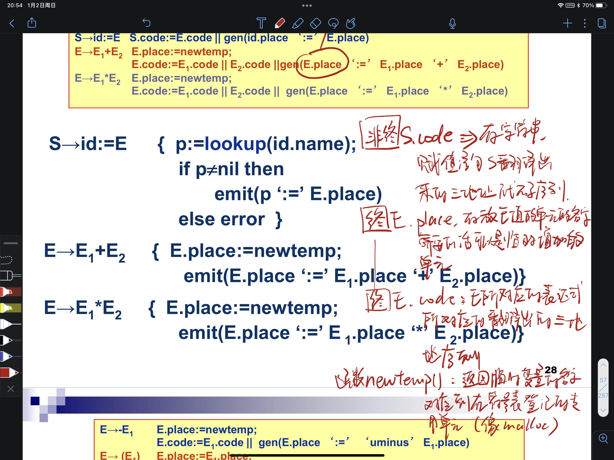

`gen`：返回一个三地址指令

更多的属性文法：

翻译模式，就是上上张图片的代码部分。

`emit`：把三地址代码输出到文件当中。

数组元素的翻译因为课上没有涉及就不在这里写了。

类型转换：

例子：`E = E1 + E2`，如果`E1`是整形，`E2`是浮点或者实型，就要把`E1`转换了；同时，用的加法也是实型加法。

解决方法：

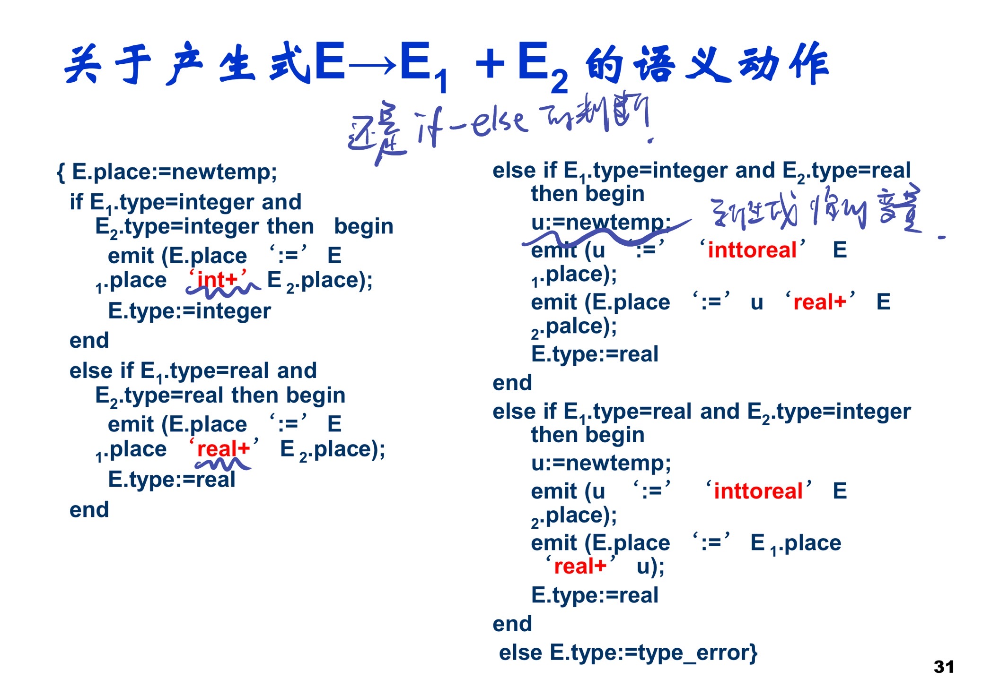

#### 布尔表达式的翻译

产生布尔表达式的文法：

`E -> E or E | E and E | not E | (E) | id rop id | id `， `rop`是关系运算，比如大于、小于、等等。

- 一步一步算
- 短路计算

在此附一个C语言的优先级表

| P    | 符号                                                         | 意义                                                         |
| ---- | ------------------------------------------------------------ | ------------------------------------------------------------ |
| 1    | ()  []  ->  .  ::                                            | Function call, scope, array/member access                    |
| 2    | !  ~  -  +  *  &  [sizeof](https://en.wikipedia.org/wiki/Sizeof)  *[type cast](https://en.wikipedia.org/wiki/Type_conversion)*  ++  -- | (most) unary operators, [sizeof](https://en.wikipedia.org/wiki/Sizeof) and [type casts](https://en.wikipedia.org/wiki/Type_conversion) (right to left) |
| 3    | *  /  % MOD                                                  | Multiplication, division, [modulo](https://en.wikipedia.org/wiki/Modular_arithmetic) |
| 4    | +  -                                                         | Addition and subtraction                                     |
| 5    | <<  >>                                                       | Bitwise shift left and right                                 |
| 6    | <  <=  >  >=                                                 | Comparisons: less-than and greater-than                      |
| 7    | ==  !=                                                       | Comparisons: equal and not equal                             |
| 8    | &                                                            | Bitwise AND                                                  |
| 9    | ^                                                            | Bitwise exclusive OR (XOR)                                   |
| 10   | \|                                                           | Bitwise inclusive (normal) OR                                |
| 11   | &&                                                           | Logical AND                                                  |
| 12   | \|\|                                                         | Logical OR                                                   |
| 13   | ? :                                                          | Conditional expression (ternary)                             |
| 14   | =  +=  -=  *=  /=  %=  &=  \|=  ^=  <<=  >>=                 | Assignment operators (right to left)                         |
| 15   | ,                                                            | [Comma operator](https://en.wikipedia.org/wiki/Comma_operator) |

短路计算这里比较复杂，但是只要思考一下被短路之后整个表达式为真的地方就可以了。

根据属性文法翻译布尔表达式：先自上而下把继承属性写好（表达式标号旁括号），再自下而上把所有E的综合属性算完。

一遍扫描的布尔表达式的翻译？

约定

| 四元式            | 表示              |
| ----------------- | ----------------- |
| `(jnz, a, -, p)`  | if a goto p       |
| `(jrop, x, y, p)` | if x rop y goto p |
| `(j, -, -, p)`    | goto p            |

产生四元式的时候，转移地址无法立即知道。扫描到特定位置才能回头过来确定。为未完成的四元式准备语义值，用于回填。

