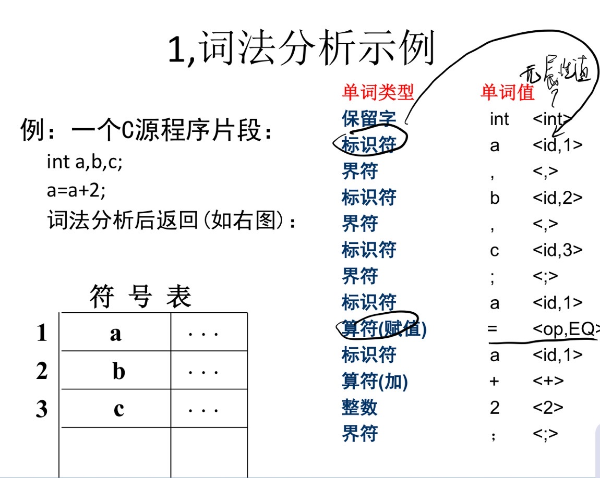
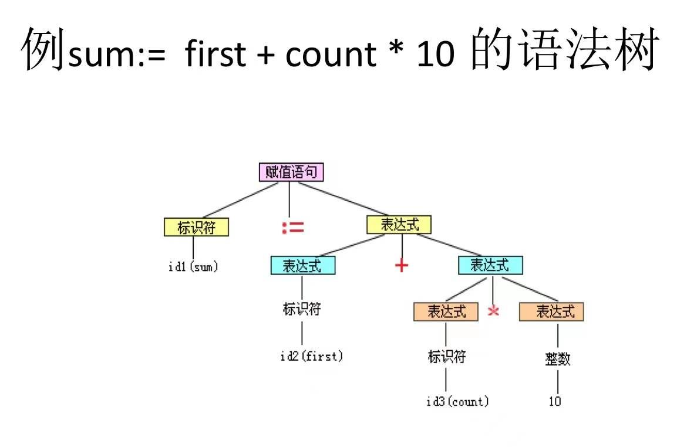
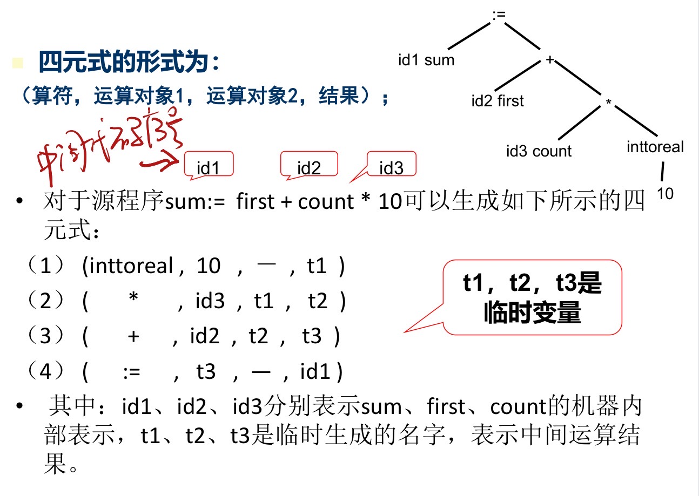
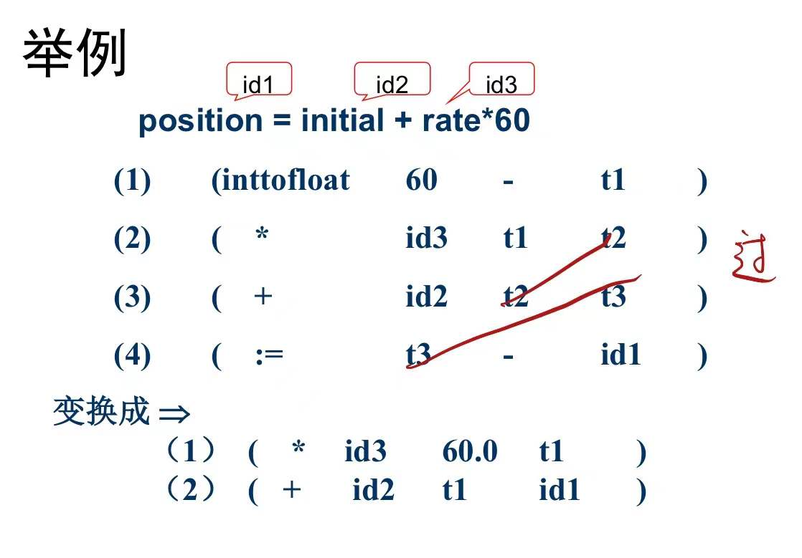
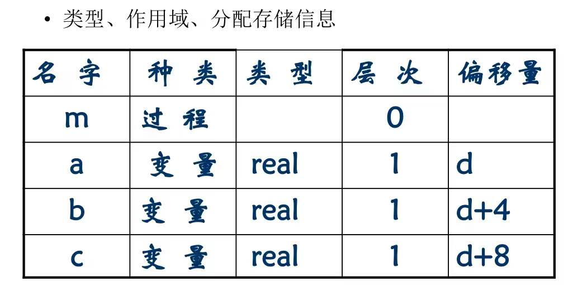
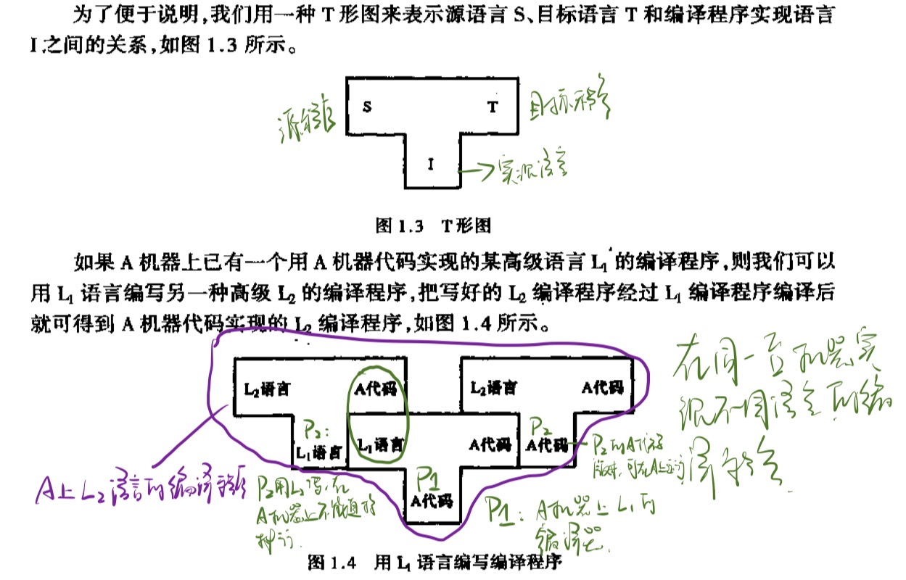
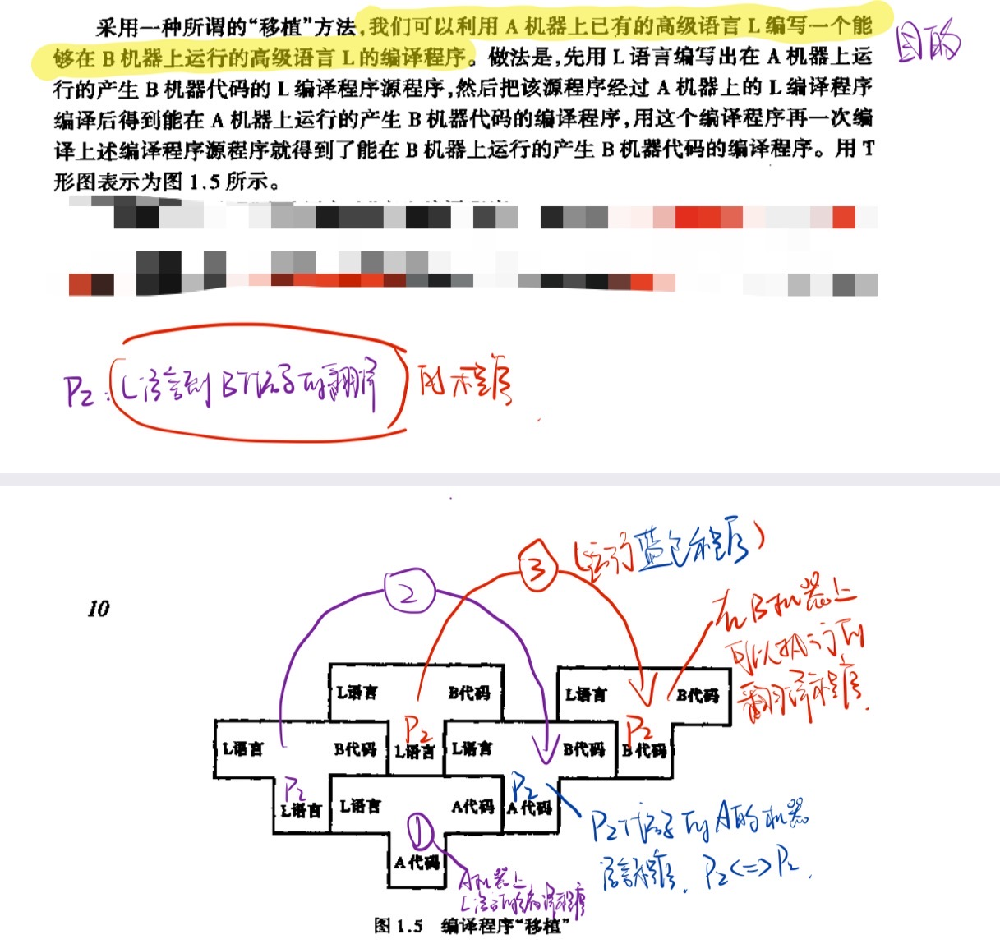

# 编译原理

## 第一章：引论

#### 何为编译程序

在宿主机上运行，把高级语言程序翻译成机器运行程序（在目标机上运行），最终得到结果

#### 程序的两种执行方式

1. 解释方式。边解释边执行元语言程序，不产生目标语言程序。
2. 编译方式。把某种语言的程序转换为另一种语言的程序。后者与前者在逻辑上等价。

`java`应该是编译和解释都有，`class`文件就是编译方式，`jvm`执行`BYTECODE`是解释方式。

#### 编译程序的进一步分类

- 诊断编译程序
- 优化编译程序
- 交叉编译程序（产生不同与其宿主机的机器代码）
- 可变目标编译程序（不用重写编译程序中与机器无关的部分）

#### 编译与计算思维

抽象、自动化、分解、递归、权衡

#### 编译过程概述

##### 词法分析

扫描程序，输入是字符流，输出是等长的内部形式（属性字）。也就是要识别出标识符、常量、关键字（基本字）等等。

依循语言的词法规则（构词规则），使用描述词法规则的有效工具：正规式、有限自动机。

方法：状态图、DFA、NFA

##### 语法分析

读入上述输出的符号，根据给定规则识别出各个语法单位（短语、子句、语句、程序段、程序），生成另一种内部表示

依据语法规则，使用上下文无关文法进行描述。

方法：递归子程序法、LR分析法、算符优先分析法

由小到大，逐步识别整个语句。得到一棵描述结构的分析树。

##### 语义分析与中间代码产生

**语义分析**

静态语义检查，审查算符是否符合语言规范。

**中间代码生成**

生成含义明确、便于处理的记号系统。比如四元式、三元式、树。输入句子，输出中间代码序列。

方法：语义子程序、DAG图、语法制导翻译

​	**四元式**：算符、左操作数、右操作数、结果

##### 优化

将中间代码进行加工，变换成功能相同、功效更高的中间代码。

依据程序的等价变换规则。

方法：公共子表达式的提取、循环优化、删除无用代码

##### 目标代码生成

中间代码变成目标机器上的低级语言代码。三种形式：汇编指令代码、绝对指令代码、可重新定位指令指令代码（地址是相对地址，需要链接。使用连接装配程序把各个目标模块连接在一起，确定程序变量在主存中的位置，装入内存指定的起始地址。）。

#### 编译程序的结构

##### **编译程序总框**

中间是自顶向下的五个阶段，左边是表格管理（符号表管理），右边是出错处理。

**表格与表格管理**

符号表：记录源程序中的名字（标识符），收集各个名字的属性。

**出错处理**

语法错误：保留字拼写、括号不配对等等

语义错误：标识符没有说明就使用、标号有引用而无定义、形式参数和实在参数结合是不一致等等

##### 遍

pass，对源程序或源程序的中间表示从头到尾扫描一次。

阶段与遍是不同的概念

一遍可以由若干段组成：一边扫描时同时做词法分析、语法分析、中间代码生成。

一段也可以由若干遍生成：优化可以有一遍局部、一遍全局。

##### 编译前端和后端

前端：与源语言有关。

后端：与目标机有关。比如与目标机有关的优化、目标代码产生。

#### 编译程序的生成

##### T型图

##### 移植

把一种机器上的编译程序移植到另一种机器上。

##### 自编译

用某种高级语言书写自己的编译程序。比如A机器上的C语言编译程序，借助原有的编译程序对新编写的C编译程序进行编译，从而得到一个能在A上运行功能更强的C编译程序。

##### 交叉编译

若x机器上己有C语言编译程序，则可用x机器中的C语
言书写一个编译程序，该编译程序的源程序是C语言程序,而产生的目标程序则是基于y机器的，即产生在y机器上执行的低级语言程序。

比如嵌入式系统、手机操作系统

## 第二章：高级语言及其语法描述

