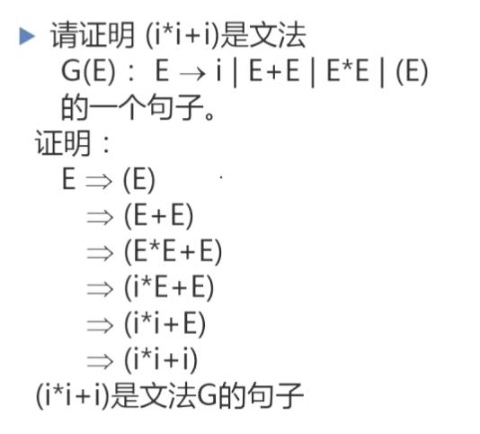

# 编译原理

## 第一章：引论

#### 何为编译程序

在宿主机上运行，把高级语言程序翻译成机器运行程序（在目标机上运行），最终得到结果

#### 程序的两种执行方式

1. 解释方式。边解释边执行元语言程序，不产生目标语言程序。
2. 编译方式。把某种语言的程序转换为另一种语言的程序。后者与前者在逻辑上等价。

`java`应该是编译和解释都有，`class`文件就是编译方式，`jvm`执行`BYTECODE`是解释方式。

#### 编译程序的进一步分类

- 诊断编译程序
- 优化编译程序
- 交叉编译程序（产生不同与其宿主机的机器代码）
- 可变目标编译程序（不用重写编译程序中与机器无关的部分）

#### 编译与计算思维

抽象、自动化、分解、递归、权衡

#### 编译过程概述

##### 词法分析

扫描程序，输入是字符流，输出是等长的内部形式（属性字）。也就是要识别出标识符、常量、关键字（基本字）等等。

依循语言的词法规则（构词规则），使用描述词法规则的有效工具：正规式、有限自动机。

方法：状态图、DFA、NFA

##### 语法分析

读入上述输出的符号，根据给定规则识别出各个语法单位（短语、子句、语句、程序段、程序），生成另一种内部表示

依据语法规则，使用上下文无关文法进行描述。

方法：递归子程序法、LR分析法、算符优先分析法

由小到大，逐步识别整个语句。得到一棵描述结构的分析树。

##### 语义分析与中间代码产生

**语义分析**

静态语义检查，审查算符是否符合语言规范。

**中间代码生成**

生成含义明确、便于处理的记号系统。比如四元式、三元式、树。输入句子，输出中间代码序列。

方法：语义子程序、DAG图、语法制导翻译

​	**四元式**：算符、左操作数、右操作数、结果

##### 优化

将中间代码进行加工，变换成功能相同、功效更高的中间代码。

依据程序的等价变换规则。

方法：公共子表达式的提取、循环优化、删除无用代码

##### 目标代码生成

中间代码变成目标机器上的低级语言代码。三种形式：汇编指令代码、绝对指令代码、可重新定位指令指令代码（地址是相对地址，需要链接。使用连接装配程序把各个目标模块连接在一起，确定程序变量在主存中的位置，装入内存指定的起始地址。）。

#### 编译程序的结构

##### **编译程序总框**

中间是自顶向下的五个阶段，左边是表格管理（符号表管理），右边是出错处理。

**表格与表格管理**

符号表：记录源程序中的名字（标识符），收集各个名字的属性。

**出错处理**

语法错误：保留字拼写、括号不配对等等

语义错误：标识符没有说明就使用、标号有引用而无定义、形式参数和实在参数结合是不一致等等

##### 遍

pass，对源程序或源程序的中间表示从头到尾扫描一次。

阶段与遍是不同的概念

一遍可以由若干段组成：一边扫描时同时做词法分析、语法分析、中间代码生成。

一段也可以由若干遍生成：优化可以有一遍局部、一遍全局。

##### 编译前端和后端

前端：与源语言有关。

后端：与目标机有关。比如与目标机有关的优化、目标代码产生。

#### 编译程序的生成

##### T型图

##### 移植

把一种机器上的编译程序移植到另一种机器上。

##### 自编译

用某种高级语言书写自己的编译程序。比如A机器上的C语言编译程序，借助原有的编译程序对新编写的C编译程序进行编译，从而得到一个能在A上运行功能更强的C编译程序。

##### 交叉编译

若x机器上己有C语言编译程序，则可用x机器中的C语言书写一个编译程序，该编译程序的源程序是C语言程序,而产生的目标程序则是基于y机器的，即产生在y机器上执行的低级语言程序。

比如嵌入式系统、手机操作系统

## 第二章：高级语言及其语法描述

#### 高级语言的分类

- 强制式
- 应用式：函数式语言，从前面已有的函数出发构造出更复杂的函数。
- 基于规则：检查一定的条件，满足时执行相应的动作。
- 面向对象

#### 几个有代表性的

**Fortran**, FORmula TRANslation

科学计算首选

**COBOL**, Common Business Oriented Language

第一个商用语言。只要大型机存在，COBOL就不会消失

**Ada**

结构化程序设计语言，美国军方软件开发

**Pascal**

强健数据类型概念、强制性数据类型声明。

**Prolog**, Programming in Logic

**Lisp**，List Processor

函数式语言

**C/C++**

系统程序设计语言

**Java**

#### 高级语言的程序结构

**单层结构**

主程序+若干个辅助程序段

**多层结构**

允许嵌套定义

**程序包**

数据和操作代码封装在一起，支持数据抽象。（Ada）

**面向对象**

类和继承的概念、多种特性

#### 程序语言的语法描述

##### 文法

描述语言的语法结构的形式规则，定义语言的一个数学模型。

##### 几个基本概念和记号

字母表：一个有穷字符集，Σ

字符：字母表中每个元素

Σ上的字（也叫字符串）是指由Σ中的字符所构成的一个有穷序列。

ε表示不包含任何字符的序列，称为空字。

Σ*表示Σ上所有字的全体，包括空字。

连接（积）：$UV = {\{\alpha\beta|\alpha\in U \&\beta\in V\}}$，这是有顺序的，UV与VU不一定相同。左运算量提供的字在前。但是(UV)W = U(VW)。

自身的n次积：$V^n = VVVVV...$，

$V^0 = \{\epsilon\}$

$V^* = V^0\cup V^1 \cup V^2....$，V的闭包

$V^+ = VV^*$，正则闭包。*怎么区分？*如果V原来没有空字，闭包中会包含空字，而正则闭包没有空字。

##### 上下文无关文法

四元组$G = (V_N, V_T,S,P)$

P可以缩写，右边的部分（产生式右部或候选式）用竖杠（|）隔开

约定非终结符用大写（比如E），终结符用小写（比如i）

简化表示文法：只写产生式部分、约定在第一个产生是的左部符号为初始符号（或者产生式前写个`G[A]`，A为初始符号）

##### 推导

单箭头表示定义，双箭头表示直接推导。

从一个串到另一个串的推导往往不唯一。

**直接推导**

如果$A\rightarrow\gamma$是一个产生式，且$\alpha, \beta\in (V_T\cup V_N)^*$，则$\alpha A \beta \Rightarrow \alpha \gamma \beta $。

**规约**

推导的逆过程，若存在$\alpha A \beta \Rightarrow \alpha \gamma \beta $，则$ \alpha \gamma \beta$能够直接规约成$\alpha A \beta$。

**黑话**

$\alpha_1 \Rightarrow ^+ \alpha_n $，经一步或若干步推导。

$\alpha_1 \Rightarrow ^* \alpha_n $，经零步或若干步推导。

$\alpha \Rightarrow ^* \beta $，则$\alpha = \beta $或$\alpha \Rightarrow ^+ \beta $

##### 句型、句子和语言

而文法G所产生句子的全体，就是语言。

##### 证明

证明一个字符串是文法XXX的一个句子：

而中间的那些，都是句型。

给文法，求语言

技巧就是，先都换成终结符，再不换终结符，枚举非终结符。

给语言，求文法

先写满足这个语言的最简单的句子，然后把这个句子看成S，对S加加减减看看满不满足条件。用递归的角度去理解它。

##### 最左推导

若在推导关系中，每次最先替换最左（右）的非终结符，则称为最左（右）推导；

任何一步推导都从串最左边的非终结符开始。

##### 最右推导

若在归约过程中，每次最先归约最左（右）的非终结符，则称为最左（右）归约。

任何一步推导都从串最右边的非终结符开始。

##### 语法树

如果文法有二义性，那它的语法树不唯一

##### 二义性

如果某个文法存在句子对应两颗不同的语法树，则说这个文法是二义的。找到一个这样的句子，这个文法就是二义的。

如果一个语言不存在无二义的文法，则这个语言是二义的。可能存在两个文法G, G'都能产生语言L，可能有一个文法是二义的，有一个不是二义的。这种情况下这个语言就不是二义的。所有文法都必须无二义才可以。语言的二义性源自语言，而不是文法。

Expression, Term, Factor, i

二义性问题是不可判定问题

可以找到一组无二义文法的充分条件。如果一个文法满足某条件，就可以断定是无二义的。但是不满足也有可能是无二义的。

## 第三章：词法分析

词法分析器的设计

正规表达式与有限自动机

词法分析器的自动产生：LEX

#### 词法分析器的功能

输出的单词符号表示形式

每个单词表示为一个二元组

词法分析是独立的阶段，可以设计成单独的一遍扫描。当然你可以在这一遍把前端都做了。运行语法分析，调用词法分析来获得下一个单词（的二元组）。

#### 词法分析器的结构

单词符号的识别：超前搜索

`DO99K = 1,10 -> DO 99 K = 1, 10`，`DO`是循环语句，`99`是循环体（当前语句到标号为99的语句构成），`K`是循环控制变量，从1变到10.

`DO99K = 1.10 -> 给变量DO99K赋值1.10`

要超前搜索到逗号/小数点才能判断。

一般，标识符、常数（`5.EQ.M`与`5.E08`的混淆，后者才是常数，前者是`equal exp`）、算符和界符的识别都需要超前搜索。

现在的语言加了几点限制以避免超前搜索。比如**所有基本字都是保留字**、基本字作为特殊的标识符处理、规定在基本字、标识符、常数之间必须**使用确定的间隔符**，比如空格、换行等等。

#### 状态转换图

- 有限方向图
- 圆圈性的结点表示状态。初态：通常有一个；终态：至少有一个，双圈。
- 只包含有限个状态

接受

如果存在从初到终得道路，这路上所有弧上的标记符连接成的字等于$\alpha$，则称$\alpha$被状态转换图所接受（识别）。

在终态上加入一个星号（*），意味着多读进了一个不属于标识符部分的字符，应该把它退还给输入串。

如果可以进两个状态，可以自己规定一下优先级。

#### 状态转换图的实现

一般是`if-else`，还可以是`switch`。

含有回路的状态结点：

每个结点一个程序段。

终态结点：一个返回语句。

`Concat()`：连接当前符到strToken中；

`Retract()`：（因为后面有个星号）把刚刚读到的字符还给缓冲区。

`code := Reserve()`: 查保留字表，结果赋值给`code`，0的话就不是保留字，是单词。

`GetBC()`：check blank char

 
