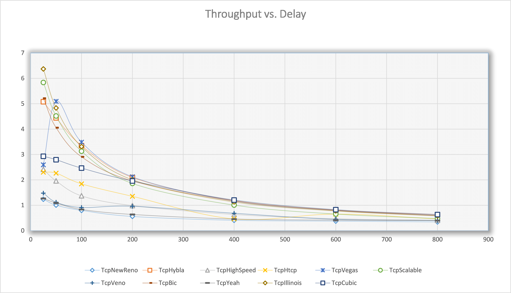
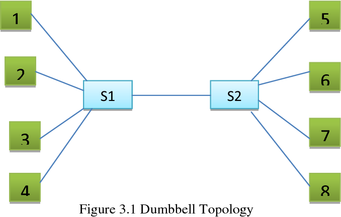
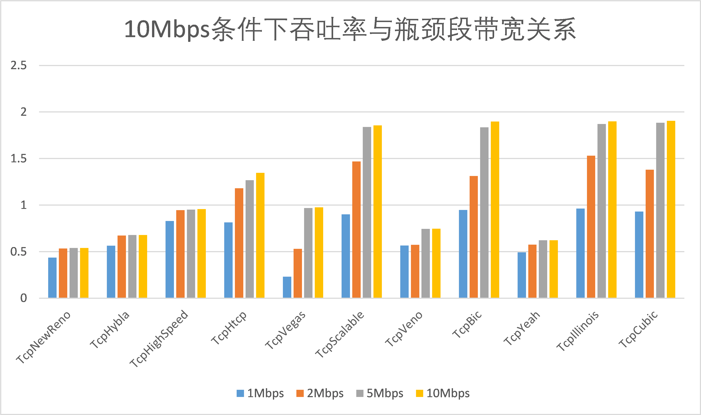
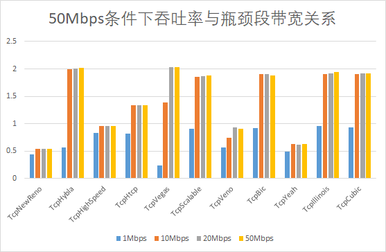
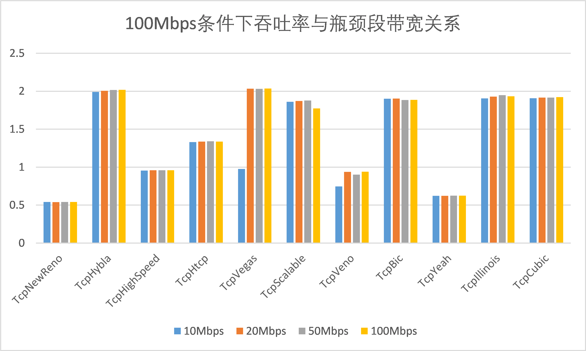

### 3.3.2 Process

```cpp
sudo ./waf --run "scratch/main2 --prot=TcpNewReno --delay=25ms --error_p=0.000001 --bandwidth=100Mbps"
*** Flow monitor statistics ***
  Tx Packets:   26112
  Tx Bytes:   15325036
  Offered Load: 1.23771 Mbps
  Rx Packets:   26098
  Rx Bytes:   15316804
  Throughput: 1.23704 Mbps
  Mean delay:   0.085204
  Mean jitter:   4.70804e-05

sudo ./waf --run "scratch/main2 --prot=TcpNewReno --delay=50ms --error_p=0.000001 --bandwidth=100Mbps"
*** Flow monitor statistics ***
  Tx Packets:   21210
  Tx Bytes:   12442660
  Offered Load: 1.00457 Mbps
  Rx Packets:   21154
  Rx Bytes:   12409732
  Throughput: 1.00414 Mbps
  Mean delay:   0.110205
  Mean jitter:   4.70003e-05
  
...
```

Results：

| TCP/delay    | 25      | 50      | 100      | 200      | 400      | 600      | 800      |
| ------------ | ------- | ------- | -------- | -------- | -------- | -------- | -------- |
| TcpNewReno   | 1.23704 | 1.00414 | 0.799237 | 0.5602   | 0.409294 | 0.377274 | 0.345317 |
| TcpHybla     | 5.08005 | 4.44376 | 3.34912  | 2.09447  | 1.18072  | 0.805236 | 0.632212 |
| TcpHighSpeed | 2.41617 | 1.96177 | 1.37284  | 0.987666 | 0.639978 | 0.471821 | 0.409701 |
| TcpHtcp      | 2.30365 | 2.26469 | 1.84389  | 1.35201  | 0.460301 | 0.652116 | 0.461916 |
| TcpVegas     | 2.5927  | 5.09471 | 3.48288  | 2.11967  | 1.16811  | 0.796956 | 0.596481 |
| TcpScalable  | 5.83859 | 4.51883 | 3.12885  | 1.86148  | 1.00738  | 0.654242 | 0.477797 |
| TcpVeno      | 1.47583 | 1.11854 | 0.911728 | 0.959777 | 0.684963 | 0.444475 | 0.402582 |
| TcpBic       | 5.21579 | 4.05786 | 2.90804  | 1.95832  | 1.16897  | 0.796956 | 0.596481 |
| TcpYeah      | 1.265   | 1.08841 | 0.832526 | 0.636217 | 0.455126 | 0.412436 | 0.395693 |
| TcpIllinois  | 6.37158 | 4.83361 | 3.31296  | 2.00533  | 1.13121  | 0.776247 | 0.581232 |
| TcpCubic     | 2.92852 | 2.79542 | 2.46377  | 1.95717  | 1.20591  | 0.825626 | 0.634099 |

### 3.3.3 Summary



From the graph, it can be seen that the performance of Cubic, Illinois, Vegas, Hybla is ahead of other algorithms.

## 3.4 Performance of different algorithms under different bandwidths

In the original paper, the author explored the performance of different algorithms under various bandwidths. Here, we replicate the experiments from the original paper.
In the experiments, we employed a dumbbell topology:



Experimental conditions: The bit error rate is 1e-6, the latency from hosts 1-4 to S1 and from S2 to hosts 5-8 is 1000 ns, **the latency between S1 and S2 is 270 ms, which is a typical latency value for satellite links.
**

### 3.4.1 First set of experiments:
The bandwidth from hosts 1-4 to S1 and from S2 to hosts 5-8 is 10Mbps. The bandwidth between S1 and S2 is varied, and the performance of different algorithms under these conditions is tested.
The results are as follows:

| TCP\bandwidth | 1Mbps    | 2Mbps    | 5Mbps    | 10Mbps   |
|---------------|----------|----------|----------|----------|
| TcpNewReno    | 0.436445 | 0.533044 | 0.53906  | 0.539272 |
| TcpHybla      | 0.56376  | 0.671913 | 0.677965 | 0.678194 |
| TcpHighSpeed  | 0.827794 | 0.945412 | 0.951723 | 0.95574  |
| TcpHtcp       | 0.812725 | 1.18054  | 1.26685  | 1.34673  |
| TcpVegas      | 0.230227 | 0.529625 | 0.967266 | 0.975473 |
| TcpScalable   | 0.900588 | 1.46756  | 1.83812  | 1.85539  |
| TcpVeno       | 0.565643 | 0.57288  | 0.743902 | 0.745075 |
| TcpBic        | 0.947753 | 1.31218  | 1.83594  | 1.89716  |
| TcpYeah       | 0.491511 | 0.574066 | 0.621287 | 0.621654 |
| TcpIllinois   | 0.962549 | 1.52964  | 1.87162  | 1.89962  |
| TcpCubic      | 0.929389 | 1.3799   | 1.88336  | 1.90519  |



t can be seen that under these conditions, TCP Hybla and TCP Vegas perform poorly, while TCP Scalable, TCP Bic, TCP Illinois, and TCP Cubic show better performance.

"### 3.4.2 Second set of experiments:
The bandwidth from hosts 1-4 to S1 and from S2 to hosts 5-8 is 50Mbps. The bandwidth between S1 and S2 is varied, and the performance of different algorithms under these conditions is tested.
The results are as follows:

| TCP\bandwidth | 1Mbps    | 10Mbps   | 20Mbps   | 50Mbps   |
|---------------|----------|----------|----------|----------|
| TcpNewReno    | 0.437102 | 0.540092 | 0.539658 | 0.541459 |
| TcpHybla      | 0.564285 | 1.98804  | 2.00265  | 2.01477  |
| TcpHighSpeed  | 0.828509 | 0.95554  | 0.958854 | 0.957481 |
| TcpHtcp       | 0.812065 | 1.33053  | 1.33713  | 1.34046  |
| TcpVegas      | 0.231273 | 1.3916   | 2.03716  | 2.03099  |
| TcpScalable   | 0.900766 | 1.86092  | 1.87112  | 1.87681  |
| TcpVeno       | 0.566201 | 0.746485 | 0.937769 | 0.900686 |
| TcpBic        | 0.92411  | 1.90003  | 1.90089  | 1.88312  |
| TcpYeah       | 0.492469 | 0.622599 | 0.622103 | 0.623091 |
| TcpIllinois   | 0.962615 | 1.91131  | 1.91871  | 1.93732  |
| TcpCubic      | 0.929288 | 1.90798  | 1.9161   | 1.91607  |



It can be seen that under these conditions, TCP Hybla, TCP Vegas, TCP Scalable, TCP Bic, TCP Illinois, and TCP Cubic perform well.

### 3.4.3 Third set of experiments:
The bandwidth from hosts 1-4 to S1 and from S2 to hosts 5-8 is 100Mbps. The bandwidth between S1 and S2 is varied, and the performance of different algorithms under these conditions is tested.
The results are as follows:

| TCP\bandwidth | 10Mbps   | 20Mbps   | 50Mbps   | 100Mbps  |
|---------------|----------|----------|----------|----------|
| TcpNewReno    | 0.540194 | 0.53976  | 0.541563 | 0.541676 |
| TcpHybla      | 1.98975  | 2.00631  | 2.01516  | 2.0176   |
| TcpHighSpeed  | 0.95572  | 0.959037 | 0.95808  | 0.958023 |
| TcpHtcp       | 1.3308   | 1.33709  | 1.34072  | 1.33657  |
| TcpVegas      | 0.975801 | 2.03256  | 2.03139  | 2.03439  |
| TcpScalable   | 1.86126  | 1.87148  | 1.87717  | 1.77385  |
| TcpVeno       | 0.746624 | 0.937946 | 0.902036 | 0.939938 |
| TcpBic        | 1.90037  | 1.90208  | 1.88349  | 1.88563  |
| TcpYeah       | 0.622717 | 0.622221 | 0.623305 | 0.623434 |
| TcpIllinois   | 1.90514  | 1.92901  | 1.94802  | 1.93216  |
| TcpCubic      | 1.90831  | 1.91649  | 1.91644  | 1.92273  |



It can be seen that under these conditions, TCP Hybla, TCP Vegas, TCP Scalable, TCP Bic, TCP Illinois, and TCP Cubic perform well.
