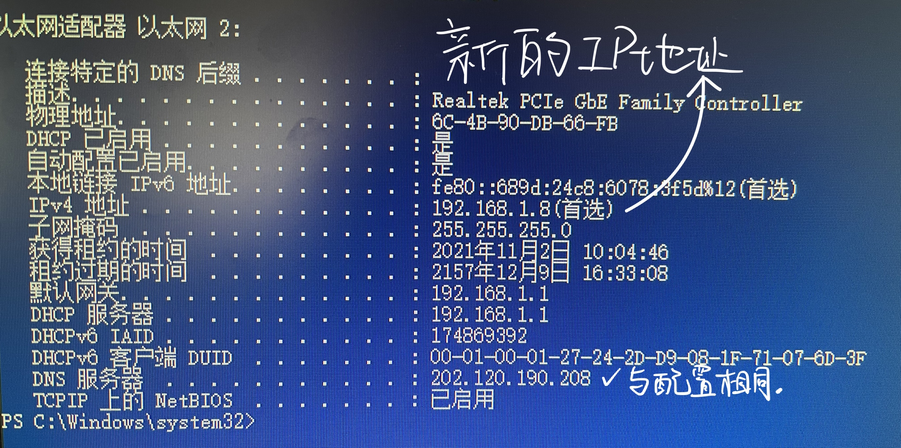
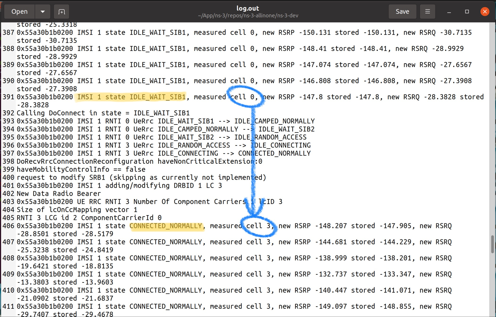

# 1952060 张佰一 计算机网络实验报告 2021-2022学年秋季学期

[toc]

# 实验1 - 进程运行原理实验

## 实验目标

计算机网络交互主体是计算机进程，了解进程运行的基本原理，对于理解端与进程关系十分重要。本实验利用操作系统的进程管理软件来展示进程的生命周期。

- 了解进程的基本概念。
- 了解进程的基本运行原理，掌握基本进程管理技能。

## 实验原理

计算机程序是指用计算机语言开发的代码文件，一般需要编译成可执行代码。程序以文件方式存储在操作系统的文件系统中。进程指程序装载到内存中进行运行的代码段。现代操作系统可以对进程实施管理。

### 任务管理进程（Windows）
操作系统的任务管理器提供了用户计算机上正在运行的程序和进程的相关信息，也显示了最常用的度量进程性能的单位。使用任务管理器，可以打开监视计算机性能的关键指示器， 快速查看正在运行的程序的状态，或者终止已停止响应的程序。也可以使用多个参数评估干在运行的进程的活动， 以及CPU 和内存使用情况的图形和数据。任务管理器中，“应用程序”选项卡显示正在运行程序的状态，用户能够结束、切换或者启动桯序。”进程”选项卡显示正在运行的进程信息。

### 进程运行原理

1. 进程创建。程序一旦运行就成为进程，每个进程都分配一个唯一的进程编号，但其进程编号并不固定。
2. 进程运行。现代操作系统允许同时运行多个进程，每个进程运行时需要使用多种计算机部件资源，其中 CPU 资源必不可少，当 CPU 核数量小于并发进程数量时，操作系统会对CPU 实施共享，将CPU 运行时间划分成多个时间片，分配给各个进程提供运行，使所有进程都能同时运行，进程的并发运行并不是真正意义上的并发。
3. 进程终止。一般通过程序提供的退出按钮终止进程，也可以通过进程管理命令或软件结束进程

### 操作进程

1. Tasklist 命令：用于显示运行在本地或远程计符机上的所有任务的应用程序和服务列表，带有过程TO ; 可以监控川户操作。
2. Taskkill命令：用于结束一个或多个任务或进程。可以根据进程ID 或图像名来结束进程。（简写：Tskill）

备注：**这两个命令需要管理员身份的权限。**

### 网络进程

网络进程与一般进程具有基本相同的属性，唯一不同的特性是网络进程需要开启一到多个传输端口号（传输层：0-65535，其中0-1023 为保留端口号或系统端口）。一般来说，对于C/S 或B/S 架构的网络，客户端网络进程至少开启一个端口号，用于接收数据或发送数据。服务端网络进程则可能至少开启两个端口号，一个用于接收客户端的数据，一个用于发送数据给客户端。在Windows 系统中，可以使用相关命令查看正在使用的端口号。

## 实验环境

实验由一台安装 Windows 10 企业版操作系统的计算机担当，使用其任务管理器软件实施进程管理实验，也可以使用其他操作系统作为操作平台。

## 实验内容

实验将围绕进程的管理内容展开，使用任务管理器软件进行进程管理，通过鼠标进行操作，从屏幕观看操作结果。

1. 多次运行同一个特定应用程序，看到该程序可以以多个不同的进程同时运行，每次运行，进程号会不一样。
2. 通过应用程序界面关闭程序，看到其进程被结束
3. 通过任务管理器关闭进程，终止应用程序的运行。

## 实验步骤

1. 打开任务管理器（`ctrl`+`alt`+`delete`）
2. 观察任务管理器窗口，可见名称、PID、状态、用户名、CPU、内存、描述的字段，用以描述一个进程。
3. 打开命令提示符（`cmd`），打开浏览器。
4. 查看刚刚打开的程序进程信息。可见`cmd`创建了一个进程，Chrome则创建了许多进程。
5. `> Taskkill 20900`命令，将该进程结束

## 实验小结

通过OS的学习，易知计算机处理任务其实是在进程和线程上工作，为了便于管理员用户管理，操作系统给用户提供了查看正在运行的程序和进程的相关信息。我们实验就通过这个入口查看所需信息。

## 实验图片


# 实验2 - 网络端地址实验

## 实验目标

网络端地址用于标识计算机网络进程，网络进程是计算机网络传输主体，由于语言表达上问题，容易误将计算机作为计算机网络的传输主体。明确了网络传输主体，就容易理解计算机网络各项具体功能处理的基本原理。本实验利用浏览器上网这个最为熟悉的应用，呈现网络端地址作用。

1. 明确计算机网络交互的主体是进程。计算机网络两台计算机之间的交互，实质上是两个进程之间的交互。
2. 了解网络端地址构成及使用。端地址是用于标识网络上任意一台计算机上的任意个网络进程，具有唯一性和不变性，只有通过访问网络端地址才能通过网络同该进程交互。但在日常使用应用协议时，常常忽略端口地址，自动采用该应用协议缺省端口地址作为网络端地址。

## 实验原理

计算机网络正如其名字所揭示的一样，就是用于计算机之间的交互，但只是宽泛的表述，现代计算机中真正执行主体实际上是各个进程。所谓两台计算机交互，按照计算机网络通信交互模型，必然是某两个进程之间的交互。网络进程的识别是通过网络端地址来实施。端地
址格式如下：`IP:PORT`。用于标识互联网任意一个节点上的任意一个网络进程，IP指主机 IP 地址，也可以使用域名，域名会被域名系统自动转换成 IP 地址；PORT 指该进程的网络端口号，进程运行时会被注册并建立与进程号的映射关系，通过端口号，可以访问到对应进程，进行网络交互。

### 网络端口地址的划分

| 端口范围   | 作用                                                         |
| ---------- | ------------------------------------------------------------ |
| 0~1023     | 【系统端口】这些端口只有系统特许的进程才能使用。             |
| 1024~5000  | 【用户端口】临时端口，一般的应用程序使用1024到4999来进行通讯。 |
| 5001~65535 | 【用户端口】服务器端口，用来给用户自定义端口。               |

### 常见的端口号（TCP/UDP）

| 服务名称 | 端口号                                                       |
| -------- | ------------------------------------------------------------ |
| FTP      | FTP使用的端口号是20和21。20端口用于数据传输，21端口用于控制信息的传输，控制信息和数据能够同时传输，这是FTP的特殊之处 |
| TFTP     | 端口号69，使用UDP的连接TFTP（Trivial File Transfer Protocol,简单文件传输协议）是TCP/IP协议族中的一个用来在客户机与服务器之间进行简单文件传输的协议，提供不复杂、开销不大的文件传输服务。 |
| UDP      | 端口53：DNS 域名解析服务；                                   |
| TCP      | 端口80：HTTP 超文本传输服务；                                |
| TCP      | 端口443：HTTPS 加密的超文本传输。                            |
| DHCP     | 服务器端的端口号是67                                         |
| DHCP     | 客户机端的端口号是68                                         |
| POP3     | POP3接收协议，POP3客户端使用SMTP向服务器发送邮件。POP3使用的端口号是110。 |
| SMTP     | 端口号是25，SMTP真正关心的不是邮件如何被传送，而只关心邮件是否能顺利到达目的地。 |
| Telnet   | 端口号23：测试端口号，可以使用telnet命令来测试端口号是否正常打开还是关闭。 |

## 实验环境

由一台计算机担当实验设备，计算机必须连接互联网。使用Chrome浏览器。

## 实验内容

任何开放的互联网 Web 网站按照业界习惯，都使用`80`端口地址作为 HTTP 协议的端地址。浏览器地址栏支持端地址使用，当没有输入端地址时，就会自动采用应用协议的缺省端地址，HTTP 协议的缺省端地址是`80`。实验使用 Chrome浏览器访问互联网上任意一个网站，通过设置网络端地址，来验证其作用。主要实验内容：

1. 端地址设置成`81`端口时，浏览器无法浏览网页。
2. 端地址设置成`80`端口时，浏览器可以正常浏览网页。

## 实验步骤

*由于学校门户网站已经升级为`HTTPS`协议，所以本实验在`HTTPS`版本中的门户网站环境下进行。*

访问`https://www.tongji.edu.cn:81`：

```
无法访问此网站
www.tongji.edu.cn 拒绝了我们的连接请求。
请试试以下办法：

检查网络连接
检查代理服务器和防火墙
ERR_CONNECTION_REFUSED
```

访问`https://www.tongji.edu.cn:80`：

```
此网站无法提供安全连接
www.tongji.edu.cn 发送的响应无效。
尝试运行 Windows 网络诊断。
ERR_SSL_PROTOCOL_ERROR
```

*这是因为`HTTPS`默认的端口号是`443`而不是`80`。*

访问`http://www.tongji.edu.cn:80`：

可以访问，但跳转到了`HTTPS`协议的网站。

访问`https://www.tongji.edu.cn:443`：

可以访问。

## 实验小结

本次实验，主要是要学习到计算机网络的思考方式：进程和进程之间交互、端口和进程的联系。

计算机上网是怎么上的？这个问题我目前的理解是：计算机连接到互联网会被分配一个公网IP，这个IP相当于计算机的身份证。但是根据网络连接实际上是网络进程之间的连接这一知识，只用一个身份证是不够的，还需要一个端口号来区分不同的进程。当我们访问一个网页，就是用我们的`IP:PORT`这个进程唯一的标识符去访问服务器的`IP:443`的进程，两个进程如此完成交互。

## 实验图片


# 实验3 - 网络线的制作和测试实验项目

## 实验目标

- 了解局域网组网原理
- 理解掌握以太网组网步骤
- 了解双绞线网线的制作过程

## 实验原理

有三种形式的导线的能帮助减小电气噪声的干扰，其中除了同轴电缆就是双绞线。双绞线有两根绞在一起的导线构成。每一根导线都有一层起绝缘作用的塑料包裹，防止导线之间短路。屏蔽双绞线（STP）使用更细更柔韧的金属屏蔽层包裹一对或多对双绞线，其优点是柔韧性比同轴电缆要好，同时其抗电磁噪声干扰的能力要比非屏蔽双绞线强。

本实验中使用的**五类双绞线**是用于网络的无屏蔽双绞线，数据速率在`100Mbps`左右。

## 实验材料

两个**TJ45水晶头**，一段五类双绞线。

## 实验内容

使用工具和材料制作双绞线直通线，并用测试设备测试。

## 实验步骤

1. 用压线钳将网线一段的套管皮剪掉`2cm`
2. 按照**白橙、橙、白绿、蓝、白蓝、绿、白棕、棕**的线序将网线排列好
3. 把网线摆平拉直，剪齐留下`1.5cm`
4. 水晶头弹簧片一面向下，将线插入其中，使线紧紧地顶在顶端
5. 将水晶头插入压线钳套住水晶头用力压，使网线和水晶头卡在一起
6. 使用以太网测试工具，将网线线两端头插入网线测试仪。可以观察到**表示八个通路的指示灯依次闪烁**，测试通过，说明制作成功。

## 实验小结

本次实验动手为主。一直以来我对于双绞线的认识都是即插即用，此次实验带给我一个从横截面观察双绞线内部构造的机会。双绞线按照严格的角度和力度绞在一起，末端和水晶头连接的时候牵扯到不同颜色的顺序和压紧的工艺，所以人工可能比机器要靠谱。但是我的第一次尝试却失败了，原因是剪齐线的环节没有把握好，某根线的长短和其他线不一样，导致这根线的指示灯没有亮。一方面感叹测试器相当好用，可以迅速知晓错误原因；另一方面感叹这个工作确实需要相当的耐心。

最后用自制的网线完成了另一个组网的实验，非常有成就感。

## 实验图片


# 实验4 - IOS基本操作实验（选做）

## 实验目标

- 了解IOS基本知识
- 理解实验网络物理组网原理
- 登录路由器
- 熟悉IOS中的各种命令的用途
- 熟悉IOS命令的使用方法

## 实验原理

### IOS操作系统简介

IOS(Internetwork Operating System)，全称是网际操作系统，由思科公司(CISCO) 首先提出和使用，主要运行在思科网络设备上，包括路由器、交换机和防火墙等，本书（《计算机网络实验教程》）实验中网络设备均使用了IOS操作系统。IOS和主机上操作系统一样，是网络设备管理操作的灵魂，所有配置是通过 IOS完成的。因为使用方便高效，随后网络设备的操作系统基本采用了该种操作模式，通用性很强。IOS采用命令行界面(Command Line Interface, CLD。因为网络设备没有专门的屏幕和键盘，必须借助于虛拟终端实施操作，一般有两种途径：一是使用超级终端。通过串口线连接路由器的 CONSOLE 口，进行本地访问；二是Telnet远程终端，可以通过网络访问，但首次必须使用超级终端配置好网络地址，才能进行远程访问。IOS 操作系统分设置模式和操作模式两种运行模式。

### 接线原理


将计算机与交换机连接（计算机：RS232；交换机：RJ45）；

再将交换机与路由器相连（双绞线）

### 路由器的操作模式

1. 用户模式
网络设备启动后，如果已经进行了初始化设置，就自动进入用户模式，用户模式操作提示符采用符号“>”。以路由器为例，如router>，提示符前是路由器名(hostname），路由器名可以通过 hostname命令设置，具体名宇不作规定。用户模式下，操作以查询为主，一般不能对参数进行修改和设定，也查询不到主要参数。使用**enable 命令**，可以从用户模式切换到特权模式。退出用户模式，使用**logout 命令**，
2. 特权模式
    特权模式允许对配置进行修改和重要参数查看，特权模式使用受到口令保护，只有通过口令验证才能从用户模式切换到特权模式，特权模式操作提示符采用**符号“#”**。使用 **disable 命令**，可以从特权模式返回到用户模式；参数修改，则需要使用 **configure terminal 命令**，切换到配置模式。
3. 配置模式
    有时也称全局配置模式，全局配置模式操作提示符采用字符串提示符(config)。使用**exit命令**，可以从配置模式退回到特权模式；对于物理网络端口配置，还必须使用 interface 命令，切换到端口配置模式。
4. 端口配置模式
    端口配置模式主要对物理网络端口进行配置，常见对以太网端口和串行端口进行配置，端口配置模式采用**字符串提示符(config-if)**，端口配置完成后，使用 exit 命令，退回到配置模式，注意一定要退回到特权模式，配置参数才能生效。

| Command Mode                    | Access Method | Password      | Prompt Displayed | Exit Method |
| ------------------------------- | ------------- | ------------- | ---------------- | ----------- |
| User Exec用户                   | Log in        | Virtual       | >                | Logout      |
| Privileges Exec特权             | enable        | Enable Secret | #                | disable     |
| Global Configuration配置        | Config t      |               | (config)#        | Exit/ctrl+z |
| Interface Configuration端口配置 | Inter         |               | (config-if)#     | Exit/ctrl+z |

## 实验材料

1. 计算机，运行Windows操作系统
2. 超级终端 HyperTerminal
3. RS232转RJ45连接线、网线

## 实验内容

接线，测试不同的IOS操作模式，了解不同命令的区别和用法。

## 实验步骤

建立HyperTerminal：超级终端：`名称=router；连接=com1；Baud Rate=9600；8，no parity，1 stop bit`；呼叫

测试以下命令：

1. **?**
   操作帮助：代替符合命令格式的任何余项
   --寻求帮助：router01> ?
   --寻求帮助：router01> sh ?
2.  **show**
   --寻求帮助：router01> sh ?
   --查看系统配置：router01> sh version
   --查看（静态）路由表：router01>sh ip route
   --寻求帮助：router01> sh ?
   --寻求帮助：router01> sh in ?
   --寻求帮助：router01> sh int g ?
   --查看以太网口配置：router01> sh int gt 0/0
   --寻求帮助：router01> sh int ser ?
   --查看串口配置：router01> sh int serial 0/0
   --查看路由表配置信息：router01> sh running-config  #权限不够
3. **enable**
   --进入特权模式：router01>en(able) ，Enable Secret Password=**cisco**
   --查看路由表配置信息：router01# sh running-config 
   --寻求帮助：router01# sh int g ?
   --查看以太网口配置：router01# sh in g 0/0
   --寻求帮助：router01# sh int ser ?
   --查看串口配置：router01# sh int serial 0/0
4. **config**
   --进入配置模式：router01#config t
   --寻求帮助：router01(config)# ?
5. **interface**
   --寻求帮助：router01# inter fast ?
   --进入以太口：router01(config)#int g 0/0
   --修改IP地址： router01(config-if)#ip address 192.168.x.2
6. **end**
   --退到特权模式：router01(config-if)#end(ctrl+z), exit
   --查看以太网口配置：router01# sh int g 0/0
7. **ping** 
   --连通测试命令: router01# ping 192.168.x.254
8. **shut**
      关闭端口
   --进入配置模式：router01#config t
   --进入以太口：router01(config)#int g 0/0
   --关闭端口功能：router01(config-if)#no shut
   --退到特权模式：router01(config-if)#end(ctrl+z), exit
   --查看以太网口配置：router01# sh int g 0/0
9. **no**
   反命令
   --进入配置模式：router01#config t
   --进入以太口：router01(config)#int g 0/0
   --打开端口功能：router01(config-if)#no shut
   --退到特权模式：router01(config-if)#end(ctrl+z), exit
   --查看以太网口配置：router01# sh int gt 0/0
   --进入以太口：router01(config)#int g 0/0
   --删除IP地址： router01(config-if)#no ip address <ipaddress><subnet mask>

## 实验小结

本次实验初识路由器、交换机这一类耳熟能详但队其运作原理又非常陌生的设备。

对于路由器和交换机，我在网上了解到相关的资料如下：

路由器就是连接两个以上个别网络的设备。

由于位于两个或更多个网络的交汇处，从而可在它们之间传递分组（一种数据的组织形式）。路由器与交换机在概念上有一定重叠但也有不同：交换机泛指工作于任何网络层次的数据中继设备（尽管多指网桥），而路由器则更专注于网络层。

路由器与交换机的差别，路由器是属于OSI第三层的产品，交换机是OSI第二层的产品。第二层的产品功能在于，将网络上各个电脑的MAC地址记在MAC地址表中，当局域网中的电脑要经过交換机去交换传递资料时，就查询交换机上的MAC地址表中的信息，将数据包发送给指定的电脑，而不会像第一层的产品（如集线器）每台在网络中的电脑都发送。而路由器除了有交换机的功能外，更拥有路由表作为发送数据包时的依据，在有多种选择的路径中选择最佳的路径。此外，并可以连接两个以上不同网段的网络，而交换机只能连接两个。

了解IOS的操作，对于之后的实验应该也是一个基础。


# 实验5 - UDP协议网络编程实验

## 实验目标

- 理解客户机/服务器模型，了解端口在网络传输中的作用
- 了解无连接通信方式以及编程方式
- 了解掌握基于Socket的UDP应用编程的基本步骤
- 了解并发服务原理及编程方式

## 实验原理

### Socket 概况

Socket套接字是基于TCP/IP传输层的网络编程标准。套接字已实现了TCP/IP协议的各种基础功能，并提供了高层的编程接口。使用者只用调用高层接口，就能实现相应功能。

### UDP编程原理

UDP 是**User Datagram Protocol**的简称， 中文名是用户数据报协议，是OSI（**Open System Interconnection**，开放式系统互联） 参考模型中一种无连接的传输层协议，提供面向事务的简单不可靠信息传送服务。

- `DatagramPacket`类，代表UDP数据对象。
- `DatagramSocket`类，代表UDP协议对象，对象包含了代表UDP端口的属性，两个主要方法：`send(DatagramPacket)`和`receiver(DatagramPacket)`。采用无连接的传输服务，直接通对方进行数据发送和接收。

## 实验代码

`UDPServer.java`

```java
		DatagramSocket server=new DatagramSocket(5555); //创建Socket
		request=new DatagramPacket(buffer, buffer.length); //创建Socket数据包缓冲区
//...
		while(true){
            //receive message
			server.receive(request);
			String req=new String(request.getData()).trim();
            System.out.println("Request:"+req);
			//send message
			server.send(request);
		}
```

`UDPClient.java`

```java
	String serverIP = "";
		try {
            //获取UDP服务器地址对象
			serverIP = this.textFieldIP.getText();
			server = InetAddress.getByName(serverIP);
            
			System.out.println("Server:" + server.getHostAddress());
			
			byte[] bufferReceived = new byte[101];
			response = new DatagramPacket(bufferReceived, bufferReceived.length);
			this.btnSend.setEnabled(true);

		}

//...

	client = new DatagramSocket(); //创建Socket，但无需指定端口号。

//...

	//创建UDP数据包缓冲区request，存放应用数据，需要制定服务器地址和端口号。
	bufferSended = this.textMessage.getText().getBytes();
	client = new DatagramSocket();// client
	request = new DatagramPacket(bufferSended, bufferSended.length, server, 5555);
	// send
	client.send(request);   
	this.textMessage.setText("");
	// receive
	client.receive(response);
	this.textChat.setText(this.textChat.getText() + "\r\n" + new String(response.getData()).trim());	

```

## 实验内容

在Eclipse中开发上述`UDPServer`和`UDPClient`两个类。

先运行服务器，后运行客户机，进行即时通信。

## 实验结果


# 实验6- TCP协议与并发编程

## 实验目标

- 理解客户机/服务器模型，了解端口在网络传输中的作用
- 了解无连接通信方式以及编程方式
- 了解基于TCP网络应用服务器的基本编程架构
- 了解面向连接和无连接的区别，了解TCP编程基本步骤
- 了解并发服务原理及编程方式

## 实验原理

传输控制协议（TCP，**Transmission Control Protocol**）是一种面向连接的、可靠的、基于字节流的传输层通信协议。

### 并发服务

UDP 采用无连接服务，可同时接待多个客户访问。TCP 采用面向连接方式，服务器一旦同一个客户机建立了会话，就无法同其他客户再建立会话，严重影响用户体验。并发服务能力是指服务器具有同时建立多个会话，允许多个客户访问的能力，日常使用的TCP 服务器均是并发服务器。但并发服务不属于网络技术而属于编程技术研究范畴，并发服务器程序有着特殊的编程架构，典型架构由两部分代码组成，第一部分是主进程，负责请求调度，按受客户请求申请，建立会话并为每个请求创建服务处理线程；第二部分是服务处理线程，负责具体会话处理，为客户请求提供服务，可以被主进程不断创建。

假定有两个客户访问同一个TCP 服务器。TCP 服务器启动后，只有主进程在运行，开启服务端口 PORT,等待客户端访问。第一个客户访问 PORT端口，主进程接收到请求 1，**创建一个服务线程** 1负责处理请求 1，随后的会话发生在客户机 1和服务线程 1之间，主进程等待下一次请求到来；第二个客户访问 PORT 端口，主进程接收到请求 2，再创建另一个服务线程 2负责处理请求，随后的会话发生在客户机 2和服务线程 2之间，主进程继续等待下一个请求。如果同时有 N个客户访问服务器，这时候，就有N+1个线程（进程）在运行；主进程永远
等待客户访问。并发处理的数量理论上没限制，主要取决于计算机处理能力，涉及 CPU 核数量和内存大小。

### TCP实验程序编程

综上所述，除了需要客户机和服务器之外，还需要让服务器具备并发能力。所以需要创建三个类：客户机、服务器的主进程和服务器的服务线程。基本功能同UDP编程实验类似。

## 实验代码

`MainServer.java`

```java
ServerSocket server = new ServerSocket(5588); //创建TCP服务Socket，Java提供ServerSocket专门作为TCP服务Socket

//...等待来自客户机的请求

	while (true) {
        //一旦成功就会创建Socket会话对象
		Socket client = server.accept();
        //接着创建ServiceServer服务进程，将Socket会话对象传递过去。
		ServiceServer service = new ServiceServer(client);
        //启动线程运行，负责同客户机的数据传输及处理。
		Thread thread=new Thread(service);
		thread.start();
		threadList.add(service);			
	}

```

`ServiceServer.java`作为服务线程负责实际数据处理和服务。

```java
//从会话对象Socket获得数据流，发送是输出流，接收为输入流。
public ServiceServer(Socket c)throws IOException{
		this.client=c;
		is=new ObjectInputStream(client.getInputStream());
		os=new ObjectOutputStream(client.getOutputStream());
	}
//利用输入输出流同客户端进行数据交互
Object obj=is.readObject();

BufferedReader in = new BufferedReader(new InputStreamReader(client.getInputStream()));
out = new PrintWriter(client.getOutputStream());//PrintWriter打印接收到的客户端数据

//交互结束，关闭会话对象
in.close();
out.close();
client.close();
```

`TcpClient.java`

```java
//请求同TCP服务器建立会话，指定服务器的地址和端口。
serviceSocket = new Socket(this.txtFieldIP.getText(), 5588);
//从会话对象Socket获得数据流。接收到消息就PrintWriter，反之写输入流。
out = new PrintWriter(serviceSocket.getOutputStream());
in = new BufferedReader(new InputStreamReader(serviceSocket.getInputStream()));
//交互结束，关闭会话对象。
serviceSocket.close();
```

## 实验内容

开发服务器程序，创建实现`MainServer`类和`ServiceServer`类，再开发客户机程序`TcpClient`类，最后测试交互。可以在`main()`中双剑两个测试客户访问。

## 实验结果

运行`MainServer`：


运行客户机并测试


## 实验小结 - Socket网络实验

TCP是面向连接的协议，在收发数据前必须和对方建立可靠的连接，建立连接的3次握手、断开连接的4次挥手，为数据传输打下可靠基础;UDP是一个面向无连接的协议，数据传输前，源端和终端不建立连接，发送端尽可能快的将数据扔到网络上，接收端从消息队列中读取消息段。

从上面TCP、UDP编程步骤可以看出，UDP 服务器端不需要调用监听(listen)和接收(accept)客户端连接，而客户端也不需要连接服务器端(connect)。UDP协议中，任何一方建立Socket后，都可以发送数据、接收数据，不必关心对方是否存在，是否发送了数据。

为了实现TCP网络通信的可靠性，增加校验和、序号标识、滑动窗口、确认应答、拥塞控制等复杂的机制，建立了繁琐的握手过程，增加了TCP对系统资源的消耗；TCP的重传机制、顺序控制机制等对数据传输有一定延时影响，降低了传输效率。TCP适合对传输效率要求低，但准确率要求高的应用场景，比如万维网(HTTP)、文件传输(FTP)、电子邮件(SMTP)等。

UDP是无连接的，不可靠传输，尽最大努力交付数据，协议简单、资源要求少、传输速度快、实时性高的特点，适用于对传输效率要求高，但准确率要求低的应用场景，比如域名转换(DNS)、远程文件服务器(NFS)等。

本次实验可以很好地展示两种协议的建立方法的不同，为今后的网络编程学习打下基础。

# 实验7 - 异步串行（物理层）通信实验

## 实验目标

- 理解异步串行通信基本原理
- 熟悉掌握RS-232通信标准以及RS-232帧格式
- 了解波特率等主要通信参数的作用和使用

## 实验原理

### 串行传输模式

串行传输模式是指任何通信用户单独只能占用一条通信信道，对二进制数据按照顺序依次发送，每次只能传输一个数位，0或1。串行传输模式被广泛应用在远程通信中。串行传输模式在实际运用中，又分为同步串行传输模式和异步串行传输模式。同步串行传输模式要求通信的收发双方在时间基准上保持一致。异步串行传输模式，接发两端使用不固定的时间模式，传输前也不需要协调，只要直接发送，不需要对方作为应答，但必须在传输两个数据包之间加入间隔符号作为分隔。常用的串行通信接口标准包括 RS-232，RS-449，V.24，V.35 等。其中，RS-232 是最常用的串行通信接口标准。

图为串行传输模式结构示意图。注意到并不是每一位都用来传输数据，还需要起始位、检验位相配合才能保证数据完整、准确运达。


### RS-232接口
RS-232 接口是 1970年由美国电子工业协会（EIA）联合贝尔实验室、调制解调器厂家及计算机终端生产厂家共同制定的用于异步串行传输模式的标准。主要内容就是定义数据终端设备 DTE 和数据通信设备 DCE之间的接口标准。RS-232 传输对象是宇符，每次传输一个宇
符，可持续传输多个字符。RS-232 异步串行传输模式，其物理信号采用电压作为传输信号，电压处于士15V之间，其信号状态标准：空闲状态信号，用负电压来表示；数位 0，用正电压来表示；数位1，用负电压表示。

### 波特率

波特率也称调制速率，指单位时间内通信信号变化的次数。波特率决定着每个数位的传输速率，显然，涉及接发两端的两个设备配置，为保证两者在发送信号和检测信号时的时间同步，就必须设置成相同的波特率。发送设备和接收设备采用相同波特率称为波特率匹配。如
果接发双方波特率不匹配，就会发生传输错误，称为帧错误。

### 循环冗余校验

循环冗余校验（英语：Cyclic redundancy check，通称“CRC”）是一种根据网络数据数据包或电脑文件等数据产生简短固定位数校验码的一种散列函數，主要用来检测或校验数据传输或者保存后可能出现的错误。生成的数字在传输或者存储之前计算出来并且附加到数据后面，然后接收方进行检验确定数据是否发生变化。

一般来说，循环冗余校验的值都是32位的整数。由于本函数易于用二进制的电脑硬件使用、容易进行数学分析并且尤其善于检测传输通道干扰引起的错误，因此获得广泛应用。此方是由W. Wesley Peterson于1961年发表。

CRC为校验和的一种，是两个字节数据流采用二进制除法（没有借位和进位，使用异或来代替减法）相除所得到的余数。其中被除数是需要计算校验和的信息数据流的二进制表示；除数是一个长度为(n+1)的预定义二进制数，通常用多项式的系数来表示。在做除法之前，要在信息数据之后先加上n个0. 冗余码的位数是n位。

冗余码的计算方法是，先将信息码后面补0，补0的个数是生成多项式最高次幂；将补零之后的信息码用模二除法（非二进制除法）除以G(X)对应的2进制码，注意除法过程中所用的减法是模2减法，即没有借位的减法，也就是异或运算。当被除数逐位除完时，得到比除数少一位的余数。此余数即为冗余位，将其添加在信息位后便构成CRC码字。

例如，假设信息码字为`11100011`，生成多项式`G(X)=X^5+X^4+X+1`，计算CRC码字。`G(X) = X^5+X^4+X+1`，也就是`110011`，因为最高次是5，所以，在信息码字后补5个0，变为`1110001100000`。用`1110001100000`模二除法除以`110011`，余数为`11010`，即为所求的冗余位。

因此发送出去的CRC码字为原始码字`11100011`末尾加上冗余位`11010`，即 `1110001111010`。接收端收到码字后，采用同样的方法验证，即将收到的码字用模二除法除以`110011`（是G(X)对应的二进制生成码），发现余数是0，则认为码字在传输过程中没有出错。

尽管在错误检测中非常有用，CRC并不能可靠地校验数据完整性（即数据没有发生任何变化），这是因为CRC多项式是线性结构，可以非常容易地故意改变量据而维持CRC不变。

### 奇偶校验位

奇偶校验位（英语：parity bit）或校验比特（英语：check bit）是一个表示给定位数的二进制数中1的个数是奇数还是偶数的二进制数。奇偶校验位是最简单的错误检测码。

奇偶校验位有两种类型：偶校验位与奇校验位。

以偶校验位来说，如果一组给定数据位中`1`的个数是奇数，补一个bit为`1`，使得总的1的个数是偶数。例：`0000001`， 补一个bit为`1`， `00000011`；以奇校验位来说，如果给定一组数据位中`1`的个数是奇数，补一个bit为`0`，使得总的`1`的个数是奇数。例：`0000001`， 补一个bit为`0`，即 `00000010`。

偶校验实际上是循环冗余校验的一个特例，通过多项式 `x + 1` 得到1位CRC。

### 并行传输与串行传输模式之区别

并行传输：字符编码的各位（比特）同时传输，也就是使用多根并行的数据线一次同时传输多个比特。

串行传输：将组成字符的各位串行依次地传输，使用一根数据线传输数据，一次传输1个比特，多个比特需要一个接一个依次传输；在串行传输中又分为同步传输和异步传输。

## 实验环境

实验环境由两台带串口的计算机组成，一根串行交叉线用于连接两个计算机的串口。使用“友善串口调试助手”作为串口调试软件。

## 实验内容

进行两台计算机之间的异步串行通信，一端从键盘输入字符发送，另一端观看接收到的内容。

1. 异步串行通信实验。相同通信参数下的通信，进行相互间的字符接发送。
2. 波特率通信实验。不同波特率条件下的通信，其他参数保持相同，进行相互间的字符接发送。
3. 不同校验方式通信实验。一方使用奇校验，一方不使用校验。
4. 相同校验方式实验。双方使用偶校验的通信情况。

## 实验步骤

首先，将两台计算机的`COM`口用串口反接连接线连接起来。

【实验一：异步串行通信实验】

1. 建立异步串行连接
2. 两台主机向对方发送消息。

观察到可以接收到完整的消息，且即时发送。

【实验二：波特率通信实验】

1. 重新设置通信参数，将波特率、校验位、数据位、停止位更改成不相同，再次实验。

观察到接收到的信息存在乱码，且乱码的出现**没有规律**，**不可逆**。

【实验三：不同校验方式通信实验】

1. 设置主机一方为偶校验，另一方为无校验。其他参数不变。

观察到对于采用了无校验位的一方，可以接收到另一方发来的有校验位的数据，但发送的数据并没有被另一方正确接收，显示为乱码。

这是因为接收端采用无校验位，不影响接受有校验位的数据；采用偶校验位，将对接收到的数据进行校验。

【实验四：相同校验方式通信实验】

1. 设置两台主机的校验方式相同，再进行上述实验。

观察到可以接收到完整且正确的数据。

## 实验小结

在物理层，数据的传输需要考虑的问题是：准确性、完整性和高效率。首先，采取相同的波特率可以让串口在同一频率上通信；其次，采取相同的奇偶校验位可以使传输的准确性大大增强。在串行通信中，常用的格式是7个数据位、1个校验位、1到2个停止位。这种格式用方便的8位字节巧妙地适应了所有的7位ASCII字符。也可以用其它的格式表示，8位数据加上1个校验位可以传输任意的8位字节数据。

## 实验图片

正常通信：


无校验位，可以正常接收到信息：


更改停止位为2，接收到数据被从中间分隔开来：


更改波特率出现乱码：


# 实验8 - 以太网（局域网）组网实验

## 实验目的

物理网络是计算机网络的基本组织单元,其各个节点之间可以进行数据通信。物理网络是互联网的基础架构，无论对于理解网络基本原理还是网际互联原理都非常关键。实验利用以太网交换机组成一个独立的双绞线以太网物理网络，实现网络节点之间的互通。

1. 理解局域网组网原理
2. 理解掌握以太网组网步骤
3. 了解以太网网络地址格式

## 实验原理

### 以太网

以太网（英语：Ethernet）是一种计算机局域网技术。IEEE组织的IEEE 802.3标准制定了以太网的技术标准，它规定了包括物理层的连线、电子信号和介质访问控制的内容。以太网是目前应用最普遍的局域网技术，取代了其他局域网标准如令牌环、FDDI和ARCNET。

以太网是当今有线局域网主体，目前家庭和企业安装的有线局域网全部采用以太网，即使使用无线网络连接主机，无线网络最终还是要借助以太网连接互联网才能上网。以太网主要由以太网网络设备、以太网卡以及双绞线组成。

加入以太网的主机，必须拥有一块以太网卡，现在的计算机一般在主板上都已集成了以太网网卡。集线器和交换机是基于双绞线的以太网网络设备，一般会提供多个以太网端口，使用双绞线网线可以将主机网卡同交换机端口连接起来,构成一个独立的物理网络，加入网络的节点可以相互通信。

## 实验环境

两台计算机和一台交换机担当实验设备，使用两根双绞线网线，将两台计算机以太网网卡同交换机连接起来。计算机 Host1 作为操作平台和测试操作平台，另一台计算机 Host2 作为测试平台.

## 实验内容

- 双绞线直通线制作实验。使用工具和材料制作双绞线直通线。（见实验3）
- 以太网组网实验
  1. 将两台计算机和交换机连接成一个局域网。需要用双绞线网线将网卡和交换机端口连接起来。现有操作系统都使用TCP/IP 协议为网络协议，不直接支持物理网络通信，需要通过TCP/IP 协议使用网卡，必须为网卡配置IP地址，为处理方便，所有子网掩码设置为`255.255.255. 0`，计算机 Host1 网卡IP地址设置为`192.168.0.12`；计算机 Host2 网卡IP地址设置为`192.168.0.10`
  2. 利用 ping 命令对两台计算机间的连通进行测试
- 以太网网卡地址查看实验。使用`ipconfig`命令查看网卡物理地址，了解以太网地址格式

## 实验步骤

1. 用两根双绞线网线分别将两台计算机网卡同交换机端口连接起来,这样就形成了局域网。

2. 为主机配置IP地址如下

   ```
   Host1:IP 地址=192.168.0.12，子网掩码=255.255.255.0
   Host2:IP 地址=192.168.0.10，子网掩码=255.255.255.0
   ```

3. 使用`ping`命令测试连通性

## 实验小结

本次实验结果容易得到。以太网影响世界相当深远，至今仍在大量投入使用。私以为本实验的目的是要证明我们动手制作的网络线是可以进行信息传输的，为今后更高层技术的应用实验打下基础。

# 实验9 - 交换机VLAN配置实验

## 实验目的

对于企业而言，可能含有许多部门，为便于管理，常常以部门为单位，构建多个物理子网传统网络工程，只有相近的办公室才可以组成同一个物理子网，鉴于种种原因，很可能同个部门的两个办公室位于不同楼层，甚至不同大楼。

虚拟局域网 ( Virtual Local Area Network, VLAN)，标准编号为 IEEE 802.1Q,可以实现将两个相距较远的办公室组成同一个物理子网。实验利用交换机提供虚拟局域网功能，实现VLAN划分。

1. 了解虚拟局域网基本概念
2. 掌握交换机实施虚拟局域网技术

## 实验原理

### VLAN虚拟局域网

为实现交换机以太网的广播隔离，一种理想的解决方案就是采用虚拟局域网技术。这种对连接到第2层交换机端口的网络用户的逻辑分段技术实现非常灵活，它可以不受用户物理位置限制，根据用户需求进行VLAN划分；可在一个交换机上实现，也可跨交换机实现；可以根据网络用户的位置、作用、部门或根据使用的应用程序、上层协议或者以太网连接端口硬件地址来进行划分。

一个VLAN相当于OSI模型第2层的广播域，它能将广播控制在一个VLAN内部。而不同VLAN之间或VLAN与LAN / WAN的数据通信必须通过第3层（网络层）完成。否则，即便是同一交换机上的连接端口，假如它们不处于同一个VLAN，正常情况下也无法进行数据通信。特例是由于思科生产的交换机带有VLAN穿越漏洞，外来分组以广播进到该交换机时，它仍然会流入所有连至交换机上的电脑，而导致信息可能外泄的潜藏风险。

以太网交换机是网桥的一种产品形态，原本用于扩展物理网络覆盖区域,利用交换机内部软件，可以将交换机网络上的端口进行逻辑分组，一个逻辑端口组构成虚拟网络成为一个独立的物理网络。一个VLAN 就是一个广播域，不同 VLAN之间的通信是隔离的，必须通过第3层的路由功能才能进行通信。VLAN 设置比较灵活，具有多种划分方法。

## 实验环境


由一台 CISCO 交换机和两台计算机担当实验设备，使用两根双绞线网线，将两台计算机以太网网卡同交换机连接起来；通过串行线将计算机 Host1 串口 `com1` 同交换机 `Console` 口连接起来，使用超级终端作为交换机的操作平台。（图中三个交换机图标表示要构建多个 VLAN,物理上它们仍属于同一个交换机。）

## 实验内容

使用 CISCO 交换机作为实验设备，将交换机将划分成三个VLAN，VLAN1包含1~8端口，VLAN2 包含9~16 端口，VLAN3 包含其余端口；

两台计算机作为测试平台，设置成同一个子网I地址，

1. 使用 Host1 超级终端为交换机配置 VLAN
2. 为 Host1 和 Host2以太网卡配置同子网IP地址，分别是 `192.168.0.12` 和 `192.168.0.10`
3. 然后用双绞线将两个网卡连接到交换机端口上，不断变换交换机的端口，测试连通状况。位于同一个 VLAN 时，两个主机将会连通；位于不同 VLAN 时，两个主机将无法连通。

主要命令：

```
1. vlan database, 配置模式
2. vlan NO name NAME，创建VLAN。其中，NO 代表 VLAN 组编号数字，可以任意，但必须保持唯一，NAME 表示 VLAN 别名。每个交换机都缺省包含一个编号为 1 的 VLAN，该 VLAN 不能删除，缺省情况下所有交换机端口都属于该 VLAN.
3. switchport access vlan NO，物理端口划归指定VLAN，NO 代表 VLAN 组编号。
```

## 实验步骤

1. 根据实验环境设置IP地址

2. 交换机配置

   ```
   switch>en
   switch# vlan database
   switch(vlan)# vlan 2 name vlan2
   switch(vlan)# exit
   switch# config t;
   switch(config)# in f0/1;
   vlan2: switch(config-if)# switchport access vlan，将f0/9分配给vlan2
   switch(config-if)# exit;
   (仿照操作，将f0/10—f0/16 端口分配给 vlan2)
   switch# sh vlan name vlan2。
   ```

3. 将Host1插到端口1，Host2插到端口9。发现无法连通。

## 实验小结

本次实验可能是唯一一个与交换机进行命令行交互的实验。不难发现交换机这里也可以进行网络安全的应用。由于实验经验少，我直到这次课才知道实验室的交换机长得什么样子。纸上得来终觉浅，绝知此事要躬行。

# 实验10 - 物理地址解析实验

## 实验目标

IP网络不具有实际通信能力，需要将IP数据包封装在物理帧中进行运输，封装前需要对下一跳IP地址进行物理地址解析。物理地址解析是理解IP封装的关键知识点，但物理地址解析行为非常隐蔽，难以察觉。实验利用 ARP 协议的缓存机制来间接证明物理地址解析行为的发生：

1. 理解 IP网络和物理网络之间的功能关系。
2. 了解 ARP 地址解析原理。
3. 掌握 ARP 工具软件使用。

## 实验原理

### ARP

ARP 协议的全称是 `Address Resolution Protocol(地址解析协议)`，它是一个通过**用于实现从 IP 地址到 MAC 地址的映射，即询问目标 IP 对应的 MAC 地址** 的一种协议。ARP 协议在 IPv4 中极其重要。简而言之，ARP 就是一种解决地址问题的协议，它以 IP 地址为线索，定位下一个应该接收数据分包的主机 MAC 地址。如果目标主机不在同一个链路上，那么会查找下一跳路由器的 MAC 地址。

### ARP 地址解析协议

物理地址解析指由 IP 地址获取物理地址的过程。IP网络是虛拟网络，需要将IP数据包封装在物理帧中进行传输，在构造物理帧的过程中，需要使用物理地址作为源节点和目的节点的标识。

ARP 协议是IP协议的辅助协议，负责完成IP 地址解析。在IP协议传输前，将调用 ARP 协议获取下一跳节点物理地址。ARP 数据包称为 ARP 消息，ARP 是底层协议，ARP 消息本身也是直接封装在物理帧中进行传输的。


ARP 协议采用消息交互方式来实施。假如第二台主机需要解析第三台主机的网卡物理地址，知道其IP地址为`IP3`。协议实施分两次通信：

1. 第二台主机对地址解析请求消息进行**广播**。构建 ARP 解析请求消息，`ARP REQ:IP3` 表示请求解析 IP3 主机物理地址的 ARP 请求消息，请求消息被直接封装到物理帧中，并设置目标物理地址为以太网广播地址 `FF: FF:FF:FF:FF:FF`，然后发送该物理帧。

2. 网络广播域内的所有主机，即第一、三和四主机，均将接收到该广播的 ARP 请求消息，并检查其解析请求消息中存放的目标IP地址；最终处理结果：其他主机因 IP 地址不是`IP3 `则丢弃 ARP 请求消息，只有第三台主机的IP 地址才是` IP3`，负责解析其物理地址，构建 ARP 响应消息，`ARP RESP: IP3/MAC3` 表示 ARP 响应消息中填写了自身的物理地址 `MAC3`，并依据请求中源物理地址` MAC2 `直接给该地址返回 ARP 响应消息；第二台主机接收 ARP 响应消息，从 ARP 响应消息中取出` MAC3`，就得到了解析的物理地址。

### MAC地址

MAC 地址的全称是 `Media Access Control Address`，译为媒体访问控制地址，它是网络上以太网或网络适配器的唯一标识符。MAC 地址能够区分不同的网络接口，并用于多种网络技术，尤其是大多数 IEEE 802 网络。MAC 地址也称为物理地址，硬件地址和老化地址。

MAC 地址主要用于识别数据链路中互联的节点，MAC 地址长 48 bit，在使用`网卡(NIC)` 的情况下，MAC 地址一般都会烧入 ROM 中。因此，任何一个网卡的 MAC 地址都是唯一的。

MAC 地址中的 3 - 24 位表示厂商识别码，每个 NIC 厂商都有特定唯一的识别数字。25 - 48 位是厂商内部为识别每个网卡而用。因此，可以保证全世界不会有相同 MAC 地址的网卡。

MAC 地址也有例外情况，即 MAC 地址也会有重复的时候，但是问题不大，**只要两个 MAC 地址是属于不同的数据链路层**就不会出现问题。

### ARP缓存

ARP 高效运行的关键就是维护每个主机和路由器上的 `ARP 缓存(或表)`。这个缓存维护着每个 IP 到 MAC 地址的映射关系。通过把第一次 ARP 获取到的 MAC 地址作为 IP 对 MAC 的映射关系到一个 ARP 缓存表中，下一次再向这个地址发送数据报时就不再需要重新发送 ARP 请求了，而是直接使用这个缓存表中的 MAC 地址进行数据报的发送。每发送一次 ARP 请求，缓存表中对应的映射关系都会被清除。

通过 ARP 缓存，降低了网络流量的使用，在一定程度上防止了 ARP 的大量广播。

两台主机往往需要连续传输多个IP数据包，为避免重复进行地址解析，ARP 协议软件引进了缓存机制，一旦收到响应消息，解析地址取出使用后还要缓存起来。每当 ARP 需要解析时，首先查询 ARP 缓存表；一旦在缓存中找到解析地址，就不再发送解析请求，而是直接使用
缓存中保存的解析地址，只有在找不到解析地址时，才利用网络进行地址解析。缓存表填满时，则将最长久未被使用的解析项替代出来。

另外，还设定了缓存超时长度，超时未被使用的项，都将会被自动删除，以消除长时间缓存带来的副作用，ARP 协议实施的物理网络需要具有广播传输方式，不是所有物理网络都可以实施 ARP 协议，目前主要应用于以太网。

## 实验环境

两台计算机和一台交换机担当实验设备。使用两根以太网络线，将两台计算机网卡都用网线直接连接交换机。主机Host1作为地址解析源节点，另一台主机Host2作为地址解析目标节点。

使用Windows操作系统自带的ARP工具软件作为实验工具。

## 实验内容

- 实验概况
  在一个子网内，地址解析源节点先删除 ARP 缓存表，然后向地址解析目标节点发出 ping
  测试命令，就会触发 ARP 协议去解析目标节点的网卡物理地址，解析后，解析地址会存放到
  其 ARP 协议缓存表内。通过前后对比 ARP 缓存表的解析地址变化，就可以间接证明目标节
  点的物理地址得到了解析。
  1. 配置主机 IP 地址，使得地址解析源节点和日标节点处于相同子网。
  2. 地址解析源节点删除 ARP 缓存表。
  3. 地址解析源节点用 ping 命令测试目标节点是否连通。
  4. 地址解析源节点查看 ARP 缓存表的目标地址解析信息。

- ARP 软件工具命令
  ARP 软件工具用来管理 ARP 缓存表，在命令行窗口下使用，常用命令
  1. 显示 ARP 缓冲区解析条目：`ARP -a`
  2. 删除 ARP 缓冲区解析条目：`ARP -d`

## 实验步骤

按照实验环境要求，完成实验拓扑结构连接，并打开相关设备电源。

1. 为 Host1 和 Host2 设置IP地址。设置IP地址，可不设网关地址。主机网卡IP地址设置如下：
   - Host1：IP 地址=192.168.0.12，子网掩码=255.255.255.0，网关空缺
   - Host2：IP 地址=192.168.0.10，子网掩码=255.255.255.0，网关空缺
2. Host2 触发对 Host1 的地址解析。
   - Host2 清除ARP缓存表：输入`arp -d`，再输入`arp -a`，发现没有出现`192.168.0.12`（Host1的IP地址）
   - Host2 发出ping连通测试命令：`ping 192.168.10.12`。结果为连通，时间`<1ms`
   - Host2 再次查看缓存表`arp -a`
   - 发现了`192.168.0.12`条目，其物理地址显示在后。
   - 核实物理地址：Host1 命令行输入`ipconfig /all`，发现该IP地址对应的物理地址与Host 2解析的物理地址完全一致。

## 实验小结

本次实验为我展现了网络层的一个很重要的事情：如何真实地定位到物理的网卡。IP地址是动态分配的（比如DHCP技术），这显然不能满足一个“唯一”的概念，将数据传送到相应的物理介质中。这时就要考虑到怎样将IP地址与物理地址形成映射的问题，于是引出了这个新的协议。

七层结构其实是一个得到数据，翻译、封装成邻接的下一层的数据的过程。这个系统相当复杂，需要许多协议，但是把握住这些协议的目的，学习起来应该就不会特别困难。

## 实验图片

实验结果：成功连通到另一台主机，并且可以见到。


# 实验11 - 主机路由实验

## 实验目标

按照网际网组网原理，IP网络是个多跳网络，两个节点之间的传输将穿越多个IP子网，经过多个路由器，才能到达目标主机，而这一切均有赖于路由机制完成。

一般认为，路由是路由器的专利。实际上，主机上也设置了路由表，只是较为隐蔽。主机路由表是理解主机和路由器建立转发关系的
关键所在。实验构建两个 IP 子网，利用单路由器实现子网互联，验证主机缺省网关作用。

1. 深入了解主机路由机制。
2. 了解和掌握主机路由配置方法。

## 实验原理

### 路由器

路由器就是连接两个以上个别网络的设备。

路由器（英语：Router，又称路径器）是一种电讯网络设备，提供路由与转送两种重要机制，可以决定数据包从来源端到目的端所经过的路径（host到host之间的传输路径），这个过程称为路由；将路由器输入端的数据包移送至适当的路由器输出端（在路由器内部进行），这称为转送。路由工作在OSI模型的第三层——即网络层，例如网际协议（IP）。

### 主机路由原理

IP网络模型中，不存在孤立的IP子网络，所有子网都应通过路由器连在一起，因此每个IP子网对外均有一个进出口，称之为网关，网关相连就是路由器。根据源主机节点和目标节点所在子网关系，主机存在两种传输目标：子网内或子网外。


图中`IP.S` 表示源主机节点地址，`IP2` 和`IP4` 是两个目标主机节点地址。`IP.R`是路由器1接入节点地址，`IP.S`，`IP2` 和`IP.R`同属一个IP子网，其网络地址为 `Network1`；`IP4` 在子网外，其网络地址为 `NetworkN`。为表述方便，用变量 `IP.NP`表示当前目标主机地址，变量`IP.NP` 表示下一跳地址；变量`M.S`表示源节点的网络掩码。

1. 源节点所在网络地址为`N.S-Network1`。目标节点所在网络地址`N.T=IP.T&&&M.S`。
2. 路由策略：
   如果 `N.S=N.T`，则`IP.NP=IP.T`；否则`IP.NP=IP.R`。
   对于目标主机 `IP2`， `N.T=Network1`，即`N.S=N.T`，则下一跳地址`IP.NP=IP2`。
   对于目标主机是`IP4`，`N.T= NetworkN`，即`N.S!=N.T`，则下一跳地址`IP.NP=IP.R`，应先把IP数据包发给路由器1，再通过路由器1转发出去，最终由路由器N发送给节点`IP4`。

主机路由表比较简单，只有两条条目，第一条以本机网络地址为目标，就直接访问该目标节点，用 Deliver direct 表示；第二条是缺省路由，即除本机网络外的其他网络地址，就转发到路由器接口地址。

下面用一个具体例子说明。

假定源主机网卡配置为：`IP. S=192.168.1.254`，`IP.R=192.168.1.1, M.S=255.255.255.0`；目标网卡一配置为：`IP2 =192.168. 1.2, M.S=255.255.255.0`；目标网卡二配置为`IP4=192.168.3.254, M. S=255.255.255.0`。

| Destination   | Mask            | Next hop       |
| ------------- | --------------- | -------------- |
| `192.168.1.0` | `255.255.255.0` | Deliver direct |
| `0.0.0.0`     | `0.0.0.0`       | `192.168.1.1`  |

子网`192.168.1.0/24` 是其自身所在的子网地址。

1. 当目标节点为`IP2`时，即`192.168.1.2`，计算其所属网络地址为`IP.T&&M.S = 192.168.1.2&&.255.255.255.0=192.168.1.0`，查表，符合第一条条目，就是直接发送给`192.168.1.2`。
2. 当目标节点是`IP4`时，即`192.168.3.254`，计算其所属网络地址为`IP.T&&M.S=192.168.3.254 &&255.255.255.0=192.168.3.0`，查表 ，不符合第一条条目，就只能执行缺省路由，直接发送给网关地址`192.168.1.1`。

## 实验环境

实验环境由一台路由器、两台计算机和一台交换机组成。由交换机担当网络连接设备，将路由器两个以太网端口和两台计算机网卡都用网线直接连接到交换机；通过串行线将主机`Host1` 串口`com`同路由器 `Console` 口连接起来，启用其超级终端作为路由器管理的操作平台。

主机 `Host2` 则使用命令行窗口用于连通测试。为处理方便，所有 IP 子网掩码都设置成 `255.255.255.0`，配置参数如下：

1. 路由器 A 设置：以太网接入端口`f0/0`，其IP地址设置为`192.168.1.1`；以太网接入端口`f0/1`，IP 地址设置为 `192.168.3.1`。
2. 主机 `Host1` 网卡地址设置为 `192.168.1.254`，网关地址设置成 `192.168.1.1`。
3. 主机 `Host2` 网卡地址设置为 `192.168.3.254`，网关地址设置成 `192.168.3.1`。

```
Router(config)#interface f0/0
Router(config-if)#ip address 192.168.1.1 255.255.255.0 （
Router(config-if)#no shutdown
Router(config)#interface f0/1
Router(config-if)#ip address 192.168.2.1 255.255.255.0
Router(config-if)#no shutdown
Router(config)#ip route 192.168.3.0 255.255.255.0 192.168.2.2 （目标网段IP地址、目标子网掩码、下一路由器接口IP地址）
Router(config)#ip route 192.168.3.0 255.255.255.0 f0/1（目标网段IP地址、目标子网掩码、送出接口）
```

## 实验内容

设置两个子网，子网间无法连通。用路由器直接连接这两个子网，为子网连通进行路由。但前提是主机设置IP地址时，必领将缺省网关设置为路由器以太网端口地址，以便通过路由器实现路由。

1. 主机路由实验
   - 配置主机 IP 地址，并将缺省网关地址设置为路由器以太网端口地址。
   - 配置路由器各个以太网端口地址，并启用路由功能。
   - 验证子网互通。测试两台主机是否连通.
2. 主机网关缺失实验
   - 在上述连通基础上，取消主机缺省网关，再测试两台主机是否连通。

## 实验步骤

【实验1：主机路由实验】

1. 配置`Host1`和`Host2`地址：

   `Host1`：`IP: 192.168.1.254; SubnetMask: 255.255.255.0; Gateway: 192.169.1.1` 

   `Host2`：`IP: 192.168.3.254; SubnetMask: 255.255.255.0; Gateway: 192.169.3.1` 

2. 测试子网连通性

   用`Host1`去`ping 192.168.3.254`，没有连通，原因是处于不同的网络地址，即使有网关地址，但网关节点不存在，设置无法起作用。

3. 查看`Host1`的主机路由表（`Route print`）发现缺省路由是`192.168.1.1`。

4. 配置路由器

   ```
   Router(config)#interface f0/0
   Router(config-if)#ip address 192.168.1.1 255.255.255.0 
   Router(config-if)#no shutdown
   Router(config-if)#exit
   Router(config)#interface f0/1
   Router(config-if)#ip address 192.168.2.1 255.255.255.0 ;分别为路由器（网关）的IP地址和子网掩码
   Router(config-if)#no shut
   Router(config-if)#exit
   Router(config)#ip routing ;启用路由功能
   Router(config)#exit
   ```

5. 测试子网连通性

   用`Host1`去`ping 192.168.3.254`，连通。路由器正在发挥路由转发功能。

【实验2：主机网关缺失实验】

1. 将`Host1`的默认网关地址删除，保存。
2. 测试子网连通性。发现无法`ping`，报错为`PING: 传输失败。常见故障。`

这是因为虽然存在网关，但是主机并不知道网关在何处，所以对于主机来说，网关也是不存在的。

## 实验小结

本次实验尝试了许多次都没有成功，最终发现是接线过程出了问题。再一次提醒自己，要非常细心才能做好这里的实验。

本次实验相当于做了一个简易的通信网络，初步使用了路由器，学习到了路由器的工作方式，受益匪浅。在传统TCP/IP术语中，网络设备只分成两种，一种为网关（gateway），另一种为主机（host）。网关能在网络间转递数据包，但主机不能转送数据包。在主机中，数据包需经过TCP/IP四层协议处理，但是在网关只需要到达网际层，决定路径之后就可以转送。在当时，网关与路由器还没有区别。在现代网络术语中，网关与路由器的定义不同。网关能在不同协议间传输资料，而路由器是在不同网络间传输资料，相当于传统所说的IP网关（IP gateway）。

然而，真实的网络比我们想象的都要复杂。如果这样穷举地去寻找目标网络，不知要找到猴年马月。所以现实中还有各种路由算法，比如距离向量算法中的Bellman-Ford的应用，再比如连接状态算法中的Dijkstra的应用等等。

互联网是人类最伟大的发明。它是工程、数学、计算机科学的结晶。

## 实验图片

路由器的接线：


连通成功：


# 实验12 - 静态路由实验

## 实验目标

静态路由，是指由人工根据网络拓扑结构来创建路由表。路由器需要依靠路由表来转发IP数据包，该实验是路由器实验中最基础的实验，后续的几个实验都以静态路由为基础。静态路由也是理解路由原理最直观的途径。

实验模仿两个远程子网的互联，两个子网在本地各接一个路由器，路由器之间用远程网络相连，使用静态路由实现远程子网互联。

1. 深入了解IP路由基本原理。
2. 了解和掌握配置静态路由配置方法。

## 实验原理

### 静态路由的原理

静态路由是指由手工配置的路由信息。当网络的拓扑结构或链路的状态发生变化时，需要手工去修改路由表中相关的静态路由信息。

- 静态路由信息在缺省情况下是私有的，不会传递给其他的路由器。当然，网管员也可以通过对路由器进行设置使之成为共享的。
- 静态路由一般适用于比较简单的网络环境，在这样的环境中，网络管理员易于清楚地了解网络的拓扑结构，便于设置正确的路由信息。

静态路由通过人工编辑方法，在路由器中直接设置路由表。静态路由表可以由多条路由条目组成。例如：

| 目标网络     | 掩码 | 下一跳         |
| ------------ | ---- | -------------- |
| 本地网络地址 | M.S  | Deliver direct |
| 非本地网络   | M.S  | IP.R           |

如上一节所介绍，路由表分为两类路由条目：第一类目标网络是本地网络地址(Local Network Address)，指直接跟路由器端口相连的IP 子网网络地址，M.S是网络掩码。路由器就会直接发送IP数据包给该目标节点；第二类目标网络是非本地网络(Network Address），路由器会转发到IP.R地址，该地址往往是通往目标节点的邻居路由器接入地址。

静态路由最大的优点是能

### 子网与掩码

子网掩码也称为网络掩码，地址掩码和子网遮罩。 它用于指示IP地址的哪些位标识主机所在的子网，哪些位标识为主机的位掩码。 子网掩码不能单独存在，必须与IP地址一起使用。 子网掩码仅具有一项功能，即将IP地址分为两部分，即网络地址和主机地址。子网掩码是一个32位地址，用于屏蔽IP地址的一部分，以区分网络ID和主机ID，并指示IP地址是在局域网上还是在广域网上。

#### 子网掩码的功能

子网掩码是一个32位地址，这是一种与IP地址结合使用的技术。 它具有两个主要功能。 一种是屏蔽IP地址的一部分，以区分网络ID和主机ID，并指示IP地址是在局域网上还是在远程网络上。 第二个是将大型IP网络划分为若干个小型子网。

子网的使用是为了减少IP的浪费。 因为随着Internet的发展，创建了越来越多的网络，有些网络多达数百个，而有些只有少数，这浪费了大量IP地址，因此必须划分子网。 使用子网可以提高网络应用程序的效率。

通过计算机的子网掩码**判断两台计算机是否属于同一网段的方法**是将计算机的十进制IP地址和子网掩码转换为二进制形式，然后执行二进制AND计算（全1则得1，不全1则得0）。 如果结果相同，则两台计算机属于同一网段。

在本实验中，两个主机的网关四段IP地址的第三段是不同的，因此用上述方法得到的结果也是不同的，故不属于同一网段。实验8与实验9都在不同的子网也就是不同的网段中，前者是通过同一个路由器，后者是通过不同的路由器。

### 静态路由的优缺点

**优点**：

- 网络安全保密性高。动态路由因为需要路由器之间频繁地交换各自的路由表，而对路由表的分析可以揭示网络的拓扑结构和网络地址等信息。因此，网络出于安全方面的考虑也可以采用静态路由。
- 揭示路由的基本原理，因为路由由手工配置出来，一般适用于比较简单的网络环境，**工程实践采用动态路由为主**。

**缺点**：

大型和复杂的网络环境通常不宜采用静态路由。一方面，网络管理员难以全面地了解整个网络的拓扑结构；另一方面，当网络的拓扑结构和链路状态发生变化时，路由器中的静态路由信息需要大范围地调整，这一工作的难度和复杂程度非常高。

### 路由器串口连接配置

虽然本实验中采用默认配置即插即用，但正常情况下串行连接两路由器应当考虑到串口的配置。

1. 在全局模式下键入命令`interface serial 0`进入到串行接口配置模式下。
2. 每一个连接的串行接口都必须有一个IP地址和子网掩码来**转发**IP数据包，我们可以在接口配置模式下键入`ip address <IP address> <netmask>`的命令来配置串行接口的IP地址。
3. 如果串行接口连接的是一个DCE设备，我们还需要为串行接口配置一个时钟频率，如果是DTE设备则不需要。默认情况下，cisco路由器是一个DTE设备，但是我们可以通过使用命令来将其配置成DCE设备。

### DCE与DTE

DCE：数据通信设备

DTE：数据终端设备

- 只有在同步通信方式的线路上才会有时钟速率，同步通信时需要线路两端进行信号发送频率的同步，也就是同步的时钟，在实际工程中由协议转换器、modem等线路控制设备来提供，而实验环境中没有专门的线路控制设备，所以由其中的一台路由器的`serial`接口来提供。DCE一端的确定是由路由器之间的cable的线序来 决定的，所以`back to back`的线缆都标明DCE和DTE。
- 只有标明DCE一端的才需要设置clock rate
- 同步时钟的频率和带宽没有直接的联系，64000指的是以**64000比特率时间间隔添加发送同步位**。
- 可以设置其他数值，只要是两端都能达到那个标准即可，对通信没有影响

对于标准的串行端口，通常从外观就能判断是DTE还是DCE，DTE是针头（俗称公头），DCE是孔头（俗称母头），这样两种接口才能接在一起。

### 命令：`Tracert`

`Tracert`或`Traceroute`是测试报文从发送端到目的地所经过的路由的方法。它能够直观展现报文在转发的时候所经过的路径。

`Tracert`基于ICMP协议来实现。当网络出现故障时，用户可以使用`Tracert`确定出现故障的网络节点。

> 1、源端（`SwitchA`）向目的端（日志主机）发送一个UDP报文，TTL值为1，目的UDP端口号是大于30000的一个数，因为在大多数情况下，大于30000的UDP端口号是任何一个应用程序都不可能使用的端口号。
>
> 2、第一跳（`SwitchB`）收到源端发出的UDP报文后，判断出报文的目的IP地址不是本机IP地址，将TTL值减1后，判断出TTL值等于0，则丢弃报文并向源端发送一个ICMP超时（Time Exceeded）报文（该报文中含有第一跳的IP地址`10.1.1.2`），这样源端就得到了`SwitchB`的地址。
>
> 3、源端收到`SwitchB`的ICMP超时报文后，再次向目的端发送一个UDP报文，TTL值为2。
>
> 4、第二跳（`SwitchC`）收到源端发出的UDP报文后，回应一个ICMP超时报文，这样源端就得到了`SwitchC`的地址（10.1.2.2）。
>
> 5、以上过程不断进行，直到目的端收到源端发送的UDP报文后，判断出目的IP地址是本机IP地址，则处理此报文。根据报文中的目的UDP端口号寻找占用此端口号的上层协议，因目的端没有应用程序使用该UDP端口号，则向源端返回一个ICMP端口不可达（Destination Unreachable）报文（该报文含有目的端的IP地址10.1.3.2）。
>
> 6、源端收到ICMP端口不可达报文后，判断出UDP报文已经到达目的端，则停止`Tracert`程序，从而得到数据报文从源端到目的端所经历的路径（`10.1.1.2`；`10.1.2.2`；`10.1.3.2`）。

## 实验环境

本次实验的拓扑结构如图所示：


实验环境由两台路由器、两台计算机和一台交换机组成，模拟两个远程子网互联。使用单根串行交叉线将两个路由器的串口对接起来，代表路由器之间的远程网络;将路由器以太网端口和两台计算机网卡都用网线直接连接到交换机，由交换机担当网络连接；通过串行线将计算机串口 `com` 同路由器 `console` 口连接起来，两台计算机超级终端将作为路由器管理的操作平台。

为处理方便，所有IP子网掩码都设置成255.255.255.0；其他配置参数如下：

1. 路由器A配置。以太网端口 `g0/1`，IP 地址设置为`192.168.1.1`；串口 `s0/0/1`，IP 地址设置为 `202.168.1.1`。
2. 路由器B配置。以太网端口 `f0/1`，IP 地址设置为`192.168.2.1`；串口 `s0/0/1`，IP 地址设置为 `202.168.1.2`。
3. 主机 host1 网卡地址设置为`192.168.1.254`，网关地址设置成`192.168.1.1`。
4. 主机 host2 网卡地址设置为`192.168.2.254`，网关地址设置成 `192.168.2.1`。

## 实验内容

1. 按照实验拓扑图连接线路。
   - 两个以太网子网各自在本地连接一个路由器，然后将两个路由器的串口连接起来配置成远程连接子网，使得两个以太网子网经过该连接子网实现互通。

2. 进行端口配置
3. 验证子网是否互连互通。

## 实验步骤

1. 配置主机 Host1 和 Host2网卡地址，测试连通性

   - 配置主机网卡地址。
     `Host1`：IP 地址：`192.168.1.254`，子网掩码：`255.255.255.0`，网关：`192.168.1.1`

     `Host2`：IP 地址：`192.168.2.254`，子网掩码：`255.255.255.0`，网关：`192.168.2.1`

   - 测试子网连通。

     Host1 打开命令行窗口，测试 Host2是否连通.
     输入`ping 192.168.2.1`，没有连通，因为两个节点在不同两个子网中，网关节点还不存在。

2. 配置路由器A与路由器B

   ```
   
   routerA(config)#int g0/1
   routerA(config-if)#ip addr 192 168.1.1 255.255.255.0
   routerA(config-if)#no shut
   routerA(config-if)#exit
   routerA(config)#int s0/0/1
   routerA(config-if)#ip addr 202.168.1.1 255.255.255.0
   routerA(config-if)#no shut
   routerA(config-if)#exit
   ; 以上为接口配置，以下为路由配置
   routerA(config)#ip route 192.168.2.0 255.255.255.0 202.168.1.2 <Dest. addr.><subnet mask><NextHop add.>
   routerA(config)#exit
   
   ; 可以通过`routerA#sh ip route`查看配置结果。
   ; 路由器B的配置方法相同，在此处省略。
   ```

3. 测试子网连通性（Host1）

   `ping 192.168.2.254 `：连通

   `tracert 192.168.2.254`：经过`192.168.1.1`和`202.168.1.2`两个中间节点，分别是Host1的网关地址和路由器B的串口地址。

## 实验小结

本次实验是实验7、实验8的升级版本，具有工程实践的价值。目前对于在实验室接线，已经比之前的实验都有了经验，大概率不会被接线所困扰。实验原理因为符合对于因特网的常识性的认识，也比较好理解。实验中出现了`ping`命令的比较出乎意料的回复，`ping 192.168.2.254`，居然收到了`169.254.253.114`的回复，这是自动地址。重新配置Host1的网关后，才解决了问题。

总而言之，动手做和学习原理是两码事。接线的环境有时会非常复杂，调试错误的方法也多种多样。需要多多积累实践经验，才能更好地学习理论知识。

## 实验图片

实验结果：


路由器接线：


路由器接口配置：


# 实验13 - 蓝牙（个域网）通信实验（选做）

## 实验目标

随着IT技术广泛应用，各类智能设备层出不群，蓝牙（Bluetooth）能耗比 Wi-Fi 要低，更为普遍地使用在嵌入式智能设备中，用于软件更新和数据通信。熟练掌握蓝牙技术，具有很强的实用价值。实验利用智能手机具有的蓝牙模块，同笔记本电脑进行通信，展现个域网通信特点。

- 了解个域网组网原理
- 熟练掌握蓝牙组网使用步骤

## 实验原理

### 蓝牙技术

蓝牙，一种无线通讯技术标准，用来让固定与移动设备，在短距离间交换资料，以形成个人局域网（PAN）。其使用短波特高频（UHF）无线电波，经由2.4至2.485 GHz的ISM频段来进行通信。1994年由电信商爱立信（Ericsson）发展出这个技术。它最初的设计，是希望创建一个RS-232数据线的无线通信替代版本。它能够链接多个设备，克服同步的问题。

蓝牙技术目前由蓝牙技术联盟（SIG）来负责维护其技术标准，其成员已超过三万，分布在电信、电脑、网络与消费性电子产品等领域。IEEE曾经将蓝牙技术标准化为IEEE 802.15.1，但是这个标准已经不再继续使用。

个域网主要用途为智能设备提供近距离的通信，代替有线电缆，实现智能设备之间，以及智能设备与计算机系统之间的数据交换。无线网络技术种类繁多，蓝牙作为一种无线个域网技术，被广泛地安装在各类智能设备上，应用前景十分广阔。

蓝牙采用一对一的通信模式，只能在两个设备之间进行通信。为避免非许可访问，采用主从安全模式，一台蓝牙设备作为主设备，为访问者设置口令，另一台蓝牙设备作为从设备，向主设备发起通信连接，输入预设口令后，通过建立连接，然后才能进行数据通信。

## 实验环境

本次实验采用手机和电脑进行蓝牙文件互传进行。由于苹果手机不开放蓝牙给文件传输之用途且实验室台式机不支持蓝牙，仅可以使用安卓智能手机与笔记本电脑完成实验。

## 实验内容

实施手机和计算机蓝牙部件的配对，通过无线蓝牙相连组成一个个域网络，建立后进行文件传输。

1. 设置智能手机为蓝牙模块主设备，在主设备上设置访问口令。
2. 建立蓝牙通信连接，以计算机蓝牙模块作为从设备，向主设备发起通信连接，输入预设口令，通过后建立网络连接。
3. 文件传输，借助蓝牙连接在计算机和手机之间进行文件传输。
4. 解除蓝牙通信连接，删除个域网。

## 实验步骤

1. 开启智能手机蓝牙，置状态为开，记录手机的蓝牙设备名
2. 建立蓝牙通信连接
   - 笔记本创建蓝牙通信连接配对请求。
   - 选择添加蓝牙设备，后在搜索列表中选择手机的蓝牙设备名。
   - 在手机上点击“配对”。
   - 在笔记本中确认配对。
3. 文件传输
   - 在蓝牙设置页的下方，点击“使用蓝牙传输文件”。
   - 在设备列表中选择实验手机，下一步。
   - 选择文件。
   - 手机端接收文件：对话框点击“接收”。
   - 验证文件确实为所选文件。
4. 删除蓝牙通信连接

## 实验小结

本次实验虽然简单，但是在生活中有很多的应用场景。现在经常会碰到手机和电脑无法很方便地传输文件的问题，影响工作效率。虽然蓝牙建立个域网很方便，但是使用起来也有诸多限制，如苹果手机与Windows电脑不能互传文件、配对时间长、步骤复杂等等。现在在诸多设备间传输文件、信息，多用微信的“文件传输助手”了。这种方式把自己的文件先发送到微信的服务器上，再在另外一个设备上从服务器中下载下来。虽然有些南辕北辙，但当今的5G、千兆宽带早已将这些问题解决，使用起来也很方便。当然，这就不是直接使用数据链路层传输数据了。

## 实验图片


# 实验14 - 动态IP地址分配DHCP实验

## 实验目标

IP 地址在人工配置中极易造成重复，从而发生冲突，动态主机配置协议 (Dynamic Host Configuration Protocol,DHCP)，将自动为子网内的节点网卡分配IP地址。DHCP 可以简化网络地址配置，适合非专业人员使用，目前很多网络设备都具备 DHCP 服务功能，如家庭无线猫也使用 DHCP。实验通过开启路由器的 DHCP 功能，对连接同一个交换机的主机开展动态地址分配。

- 深入了解动态主机配置协议原理。
- 了解和掌握 DHCP 服务的配置步骤。

## 实验原理

### DHCP工作原理

IP地址是网络节点网卡在 I网络中的唯—标识，任何网络节点网卡都必须配置IP地址才能使用 TCP/IP 协议。人工配置IP地址，必须事先分配好子网地址和主机地址，企业中往往设立网管人员负责地址分配工作。尽管如此，因为地址易于遗忘，地址配置时常发生重复冲突。

**DHCP 将为每个新接入交换机的主机节点网卡自动分配一个未使用的IP地址**。DHCP属于**应用层协议**，采用客户机/服务器模式，但客户机并不需要知道 DHCP 服务器 IP 地址，DHCP 客户机会利用物理广播地址发送 IP 地址分配请求消息，DHCP服务器管理着一段 IP 地址区间作为分配地址，收到 IP 地址分配请求消息后，会将一个 IP 地址分配响应消息返回给客户机。

这是DHCP的工作示意图：


1. 假定第二台主机网卡需要分配IP地址。其 DHCP 客户机就会广播一个 DHCP 地址分配请求消息，图中用`DHCP REQ`来表示，DHCP 地址分配请求消息被封装在一个物理帧内，源地址是`MAC2`，目标地址为以太网广播地址 `FF:FF:FF:FF:FF:FF`。
2. 网络内其他三台计算机均收到了该 DHCP REQ 消息的广播，但经过判断，只有DHCP 服务器才会响应地址分配请求消息。
3.  DHCP 服务器会按照请求中包含的源物理地址`MAC2`，在已分配地址数据库中查询；如果查询到，就返回已分配过的 IP 地址；如果未查询到，服务器则从未分配地址池中按顺序选择一个 IP 地址分配给`MAC2`，并在数据库增加这一项。然后，**以 `MAC2`为目标地址**，返回 DHCP 地址分配响应消息，`DHCP RESP:IP2`表示分配地址为`IP2`。
4. 第二台主机收到 DHCP 地址分配响应消息，取出地址`IP2`，对网卡进行设置。

### DHCP的应用

DHCP使用了租约的概念，或称为计算机IP地址的有效期。租用时间是不定的，主要取决于用户在某地连接Internet需要多久，这对于教育行业和其它用户频繁改变的环境是很实用的。透过较短的租期，DHCP能够在一个计算机比可用IP地址多的环境中动态地重新配置网络。DHCP支持为计算机分配静态地址，如需要永久性IP地址的Web服务器。

观察到本校校园网`TJ-GUEST-WIFI`的IP地址分配方式就是DHCP服务器。


### 技术细节

DHCP运行分为四个基本过程，分别为请求IP租约、提供IP租约、选择IP租约和确认IP租约。客户在获得了一个IP地址以后，就可以发送一个ARP请求来避免由于DHCP服务器地址池重叠而引发的IP冲突。

DHCP发现（DISCOVER）`client`在物理子网上发送广播来寻找可用的服务器。

DHCP提供（OFFER）当DHCP服务器收到一个来自客户的IP租约请求时，它会提供一个IP租约。

DHCP请求（REQUEST）当客户PC收到一个IP租约提供时，它必须告诉所有其他的DHCP服务器它已经接受了一个租约提供。因此，该客户会发送一个`DHCPREQUEST`消息，其中包含提供租约的服务器的IP。

DHCP确认（Acknowledge，ACK）当DHCP服务器收到来自客户的`REQUEST`消息后，它就开始了配置过程的最后阶段。这个响应阶段包括发送一个`DHCPACK`包给客户。这个包包含租期和客户可能请求的其他所有配置信息。这时候，TCP/IP配置过程就完成了。

## 实验环境

实验环境主要由一台路由器、两台计算机和一台交换机组成。路由器将担当 DHCP 服务器；将路由器以太网端口和两台计算机网卡都用网线直接连接到交换机，由交换机担当网络连接；通过串行线将计算机 Host1 串口 `com` 同路由器 `console` 口连接起来，使用超级终端作为路由器管理的操作平台，两台计算机都作为地址分配实验主机。假如没有路由器和交换机设备，也可以用家用无线路由器来代替。为处理方便，所有 IP 子网掩码都设置成255.255.255.0，配置参数如下：

```
RouterA f0/1 192.168.1.1
Host1, Host2: 自动分配 
```

## 实验内容

1. 配置 DHCP 服务器。在路由器上配置DHCP 服务。
2. 设置主机地址配置方式为自动获取。重启网卡，查看获取的 IP 地址。

路由器主要涉及命令

- 进入 DHCP 服务配置模式：`ip dhcp pool <NAME>`，其中`NAME` 表示地址池名。
- 设置待分配网络地址和掩码：`network <NETWORK_ADDRESS> <SUBMASK>`，其中`NETWORK_ADDRESS`表示待分配网络地址；`SUBMASK`表示待分配网络地址掩码。
- 域名设置：`domain-name <DOMAIN_ NAME>`，`DOMAIN NAME`指域名。
- 默认网关地址分配设置：`default-router <IP_ADDRESS>`，`IP ADDRESS`指缺省网关地址。
- 本地 DNS 服务器地址分配设置：`dns-server <DNS_ADDRESS>`，DNS ADDRESS 指本地 DNS 服务器地址。
- 设置租期：`lease infinite`
- 启动 DHCP 服务：`service dhcp`

## 实验步骤

1. 按照拓扑结构完成接线，打开相关设备的电源。
2. 进行以下路由器配置。

```
routerA(config-if)#ip addr 192.168.1.1 255.255.255.0
routerA(config-if)#no shut
routerA(config-if)#exit
routerA(config)#ip dhcp pool mydhcp ; 进入DHCP配置模式
routerA(dhcp-config)#network 192.168.1.0 255.255.255.0 
routerA(dhcp-config)#default-router 192.168.1.1
routerA(dhcp-config)#dns-server 202.120.190.208
routerA(dhcp-config)#lease infinite
routerA(config)#ip dhcp excluded-address 192.168.1.1 192.168.1.7
routerA(config)#no ip dhcp conflict logging ; 关闭DHCP冲突日志，以免影响显示操作。
routerA(config)#service dhcp ; 启动DHCP服务
routerA(config)#exit
```

3. 查看Host1的IP地址分配状态

```
ipconfig /release
ipconfig /renew
ipconfig /all
```

发现IP地址得到了分配，IP地址为`192.168.1.8`，子网掩码为`255.255.255.0`，默认网关为`192.168.1.1`，DHCP服务器为`192.168.1.1`，与我们的配置相吻合。

## 实验小结

本次实验所做的事情，实质上我们每天都会遇到。分配IP地址上网是现在的手机、电脑等设备上网的主要方式。DHCP在这里也有很广泛的应用。互联网的协议、解决方案，也许是用例驱动。可能最初只有一个动态分配的设想，将注册分配IP这件事自动化。但随着科技发展，就出现了网卡设备多于路由器可分配IP地址的情况，这时就有了租约制的升级。由于`DHCP服务器`数量的增多，后来又采取了多种机制来防止重复分配地址。

总之，互联网的协议在不断地发展和优化。

## 实验图片

配置DHCP：


重新获取的 IP 地址：



# 实验15 - 组播路由实验

## 实验目标

组播是一对多的传输模式，即一个节点向组播地址发送一个IP数据包，所有该组播的成员都将接收这个 IP数据包，具有较高传输效率。组播应用非常广泛，视频会议就是组播的典型应用，正确使用组播对于提高网络传输效率非常有价值。

但组播不会自动跨域子网，需要对路由器进行适当设置。实验模仿两个远程子网的互联，两个子网各接一个路由器，路由器之间用远程网络相连，安排一个组播发送节点和两个组播接收节点，配置路由器使得组播能跨越子网。

- 了解组播协议基本原理
- 掌握路由器组播配置技能

## 实验原理

### 组播是什么

组播是一种通过使用一个多播地址将数据在同一时间以高效的方式发往处于TCP/IP网络上的多个接收者的协议。此外，它还常用来与RTP等音视频协议相结合。

通常，在传统的网络通讯中，有两种方式，一种是源主机和目标主机两台主机之间进行的“一对一”的通讯方式，即单播，第二种是一台源主机与网络中所有其他主机之间进行的通讯，即广播。那么，如果需要将信息从源主机发送到网络中的多个目标主机，要么采用广播方式，这样网络中所有主机都会收到信息，要么，采用单播方式，由源主机分别向各个不同目标主机发送信息。可以看出来，在广播方式下，信息会发送到不需要该信息的主机从而浪费带宽资源，甚至引起广播风暴：而单播方式下，会因为数据包的多次重复而浪费带宽资源，同时，源主机的负荷会因为多次的数据复制而加大，所以，单播与广播对于多点发送问题有缺陷。

在此情况下，组播技术就应用而生了。组播又称多目标广播、多播。网络中使用的一种传输方式，它允许把所发消息传送给所有可能目的地中的一个**经过选择的子集**，即向明确指出的多种地址输送信息。是一种在一个发送者和多个接收者之间进行通信的方法。

### 互联网组播协议

IP 组播地址指位于 224.0.0.0到 239.255.255.255 之间的IP地址段。组播在一个IP子网内部使用没任何问题，只要直接使用以太网组播地址，其成员均能接收IP数据包。

但当组播跨越IP子网时，路由器并不会自动支持组播路由。组播地址使用始终处于动态变化中，不断有成员加入，也不断有成员离开，无法像单播地址那样事先在路由器中设置组播路由。

组播协议包括组成员管理协议和组播路由协议。组成员管理协议用于管理组播组成员的加入和离开。互联网组播协议（IGMP） 是组成员管理协议，运行在主机和组播路由器之间。路由器为建立组播路由必须了解每个组员在网络中的分布，当新成员加入某个组播时，通知路由器，由路由器设置该组播地址，一旦接收到该组播地址数据包就予以转发；日常会定时主动查询组播成员，以维护组播成员构成状况，适应组播成员的动态变化。

### IGMP运行原理

1. 当主机上的一个进程加入组播组时，就必须发送
   一个IGMP请求消息给路由器，让该主机加入组播组。IGMP 协议以主机身份方式而非进程方式加入组播组，多个进程加入同一组播，只需要发送一条 IGVP 请求消息。进程退出组播组时，则主机不需要发送 IGMP 诮求消息。
2. 组播路由器收到 IGMP 请求消息。路由器为每个组播维护一个组播组成员表。将发送请求的主机加入组播组成员表中。
3. 组播数据报转发。当路由器收到组播数据报时，就会将该数据报转发到属于组播组成员的主机所连接的端口上。
4. 组播路由器定时发送 IGMP 查询消息来维护组播组成员表。

### 协议无关组播（PIM）

PIM（Protocol Independent Multicast）称为协议无关组播。这里的协议无关指的是与单播路由协议无关，即PIM不需要维护专门的单播路由信息。作为组播路由解决方案，它直接利用单播路由表的路由信息，对组播报文执行RPF（Reverse Path Forwarding，逆向路径转发）检查，检查通过后创建组播路由表项，从而转发组播报文。

- 稀疏模式：此协议使用以下假设：在多播组中，所有接收者将稀疏分布在环境中。 它主要用于广域使用。 该协议支持共享树的使用，共享树只是植根于特定节点的多播分发树。 它还支持基于源树的使用，对于每个将数据传输到多播组的源，它都有一个单独的多播分发树。 在稀疏模式下，重要的是具有一种机制来发现根节点或集合点。
- 密集模式：此协议做出与稀疏模式相反的假设。 假定在多播组中，所有接收者都在环境中密集分布。 通过泛洪多播流量，它可以构建最短路径树，并且当不存在接收方时，也可以在树枝上进行修剪。 与稀疏模式不同，该协议仅基于基于源的树，因此不依赖于会合点。 这使得密集模式更易于实现和部署。 但是，密集模式的缩放特性很差。

## 实验环境

实验环境主要由两台路由器、三台计算机和两台交换机组成。使用单根串行交叉线将路由器A同路由器B的串口对接起来，模拟远程传输网络；将路由器 A 以太网端口和主机Host1 用网线直接连接到一个交换机 Switch1；将路由器B以太网端口和主机 Host2 和 Host3
用网线直接连接到另一个交换机 Switch2；通过串行线将主机 Host1 和 Host2 串口`com`同路由器`console`口连接起来，使用超级终端充当路由器管理的操作平台。运行**组播测试工具软件**用于组播测试。

也即，在静态路由实验的基础上增加一个Host3，模拟与组播组中的信号发送者在同一个子网中的情况。

实验拓扑图如图所示：


为处理方便，所有IP子网掩码都设置成255.255.255.0，配置参数如下：

```
路由器 A：以太网端口 f0/1, IP地址设置为192.168.1.1; 串口 s0/0/1, IP 地址设置为 202.168.1.1

路由器 B：以太网端口 f0/1, IP地址设置为192.168.2.1; 串口 s0/0/1, IP 地址设置为 202.168.1.2

hostl: 网卡地址设置为192.168.1.254, 网关地址设置成192.168.1.1; 运行组播接收器 McastReceiver。

host2: 网卡地址设置为192.168.2.254, 网关地址设置成192.168.2.1; 运行组播发送器 McastSender。

host3: 网卡地址设置为192.168.2.10, 网关地址设置成192.168.2.1; 运行组播接收器 McastReceiver。
```

此外，还需要使用组播测试工具`MCastSender`与`MCastReceiver`。

## 实验内容

1. 先建立两个远程子网的互联，也即《实验9 - 静态路由实验》。
2. 按照本次实验拓扑加入Host3.
3. 在三台主机上在三台主机上运行组播软件，Host2 运行组播发送器以发送组播数据包，Host1 和 Host3运行组播接收器以接收组播数据包。预期效果：可以看到 Host3 可以接收包，它和Host2 同处一个交换机；而Host1 不能收到，尽管通信是连通的，主要是组播被路由器阻隔，路由器没配置转发组播。
4. 配置路由器支持组播转发。是路由器的每个端口都采用PIM组播路由协议。

## 实验步骤

**按照《静态路由实验》将Host1与Host2的两个子网连通。**

1. 将Host3接入交换机，配置网卡如下：

```
Host3： IP addr 192.168.2.10 S.M. 255.255.255.0 Gateway 192.168.2.1 (same as Host2's Gateway)
```

2. 启动组播发送器。Host2 打开`MCastSender`，开始发送组播数据。

```
组播地址: 224.1.1.1 ; 端口: 9000 ; 发送速度: 512 ; 包尺寸: 1024 
```

3. 启动Host3组播接收器。Host3 打开`MCastReceiver`，开始接收组播数据。观察到正在接受组播数据，且注明为从`192.168.2.254`主机获得。
4. 启动Host1组播接收器。无数据接收，这是因为还没有配置路由器进行组播转发。
5. 配置路由器进行组播转发。

```
在路由器A、路由器B的所有端口配置模式，采取以下的设置：
ip multicast-routing
ip pim sparse-dense-mode
```

此处是本次实验的难点所在。根据实验指导书上的`ip pim dense-mode`来做，会频繁出现提醒`WARNING: "ip multicast-routing" is not configured`。起初云里雾里，没有尝试先配置`ip multicast-routing`，反而是不断尝试后面的`ip pim dense-mode`，结果总是报错。

后来在[思科的在线说明书](https://www.cisco.com/en/US/docs/switches/lan/catalyst3850/software/release/3se/consolidated_guide/b_consolidated_3850_3se_cg_chapter_0101000.html#)中找到了解决方法：

```
SUMMARY STEPS
1.    enable
2.    configure terminal
3.    ip multicast-routing
4.    interface interface-id
5.    ip pim {dense-mode | sparse-mode | sparse-dense-mode}
6.    end
7.    show running-config
8.    copy running-config startup-config
```

此处的`sparse-dense-mode`是说`dense-mode`或者`sparse-mode`，根据实际情况来调整。

至此组播路由转发功能已经配置结束。

6. 查看Host1组播接受情况。发现可以接收到组播数据，且注明由`192.168.2.254`（Host2）获得，组播实验成功。

## 实验小结

## 实验图片

Host3 接收组播数据：


Host1 接收组播数据：


# 实验16 - 访问控制列表ACL实验

## 实验目标

包过滤机制是路由器基本处理机制，加入过滤规则，可以实施基本的网络安全控制。阻隔访问敏感网站和关键主机，均可以使用访问控制列表作为过滤规则实施。学习访问控制列表，不但可以了解基本网络安全知识，而且还可以提高路由器使用水平。

本实验利用路由器的访问控制列表功能，使得特定的 IP 地址不能访问，实现网络安全管理任务。

1. 了解路由器包过滤基本原理
2. 了解访问控制列表实施原理
3. 利用控制列表实施网络安全

## 实验原理

### 访问控制列表简介

路由器包过滤机制是指路由器在转发 IP数据包时，需要对每一个 IP 数据包头部进行分析，检查头部是否损坏并用于计算路由，为转发服务。访问控制列表(Access Control Lists, ACL)，是指路由器在包过滤时，以 IP 数据包头部中的信息，诸如以源地址和目的地址等数据域作为规则条件，制订访问控制规则，只允许让满足条件的 IP 数据包通过，达到访问控制的目的，从而提高网络可管理性和安全性。

在工程应用中，可以设置规则不允许访问某些网站。也可以对自身网络中某段地址进行保护，比如保护网站服务器。典型的 Web应用，一般有 Web 服务器和数据库两种服务器，Web 服务器必须让外界直接访问，但数据库服务器就不应让外部直接访问，避免遭受攻击。通过访问控制列表，可以允许外部网能访问 Web 服务器地址，但不允许访问数据库服务器地址。

### 访问控制列表工作方式

当一个数据报进入一个端口，路由器检查这个数据报是否可路由。如果是可以路由的，路由器检查这个端口是否有ACL控制进入数据报。如果有，根据ACL中的条件指令，检查这个数据报。如果数据报是被允许的，就查询路由表，决定数据报的目标端口。

路由器检查目标端口是否存在ACL控制流出的数据报。若不存在，这个数据报就直接发送到目标端口。若存在，就再根据ACL进行取舍。然后在转发到目的端口。

总之，一入站数据包，由路由器处理器调入内存，读取数据包的包头信息，如目标IP地址，并搜索路由器的路由表，查看是否在路由表项中，如果有，则从路由表的选择接口转发（如果无，则丢弃该数据包），数据进入该接口的访问控制列表（如果无访问控制规则，直接转发），然后按条件进行筛选。

当ACL处理数据包时，一旦数据包与某条ACL语句匹配，则会跳过列表中剩余的其他语句，根据该条匹配的语句内容决定允许或者拒绝该数据包。如果数据包内容与ACL语句不匹配，那么将依次使用ACL列表中的下一条语句测试数据包。该匹配过程会一直继续，直到抵达列表末尾。最后一条隐含的语句适用于不满足之前任何条件的所有数据包。这条最后的测试条件与这些数据包匹配，通常会隐含拒绝一切数据包的指令。此时路由器不会让这些数据进入或送出接口，而是直接丢弃。最后这条语句通常称为隐式的`deny any`语句。由于该语句的存在，所以在ACL中应该至少包含一条`permit`语句，否则，默认情况下，ACL将阻止所有流量。

### 访问控制列表配置

包过滤机制是在路由器各个端口上实施，实验中必须具体指定实施端口和实施过滤方向，过滤方向决定了使用源地址还是目标地址作为过滤条件，两者性质完全不同。

过滤端口则只要选择一个端口就可，既可以使用以太网端口也可以使用串行端口，只要造成一个方向上的传输失败就能达成控制目的。访问控制列表实验中，要特别注意以下两个概念。

- 通配符掩码。

  一个 32 数位的数字字符串，它规定了 IP 地址中哪些位应该被保留和忽略。其含义十分类似于地址掩码，为示区别，改变了通配符数字含义。通配符掩码中的`1`表示忽略IP地址中对应的位，而`0`则表示该位必须保留。

- 数据流方向。

  网络传输往往涉及两个方向的数据流，为标识数据流方向，以路由器为中心，进入端口的数据流称为入站，用 in 表示；离开端口的数据流称为出站，用out 表示。

## 实验环境

两台路由器、两台主机、一台交换机，与静态路由实验相同。

```
路由器A: 以太网端口f0/1, IP地址设置为 192.168.1.1, 串口地址设置为 202.168.1.1
路由器B: 以太网端日f0/1, IP地址设置为 192.168.2.1, 串口地址设置为 202.168.1.2
host1: 承担测试任务，网卡地址设置在 192.168.1.0/24 网段，网卡地址将根据实验要求，在192.168.1.15 和 192.168.1.17 之间进行切换，网关地址设置成 192.168.1.1
host2: 网卡地址设置为 192.168.2.254，网关地址设置成192.168.2.1
```

## 实验内容

1. 建立两个远程子网的互联，也即复现静态路由实验。
2. 单个路由器配置访问组（access group）
3. 访问控制测试

## 实验步骤

1. 完成静态路由实验，此时 Host1 的 IP 地址为`192.168.1.254`，`ping 192.168.2.254`是可以连通的。

2. 重新配置Host1的网卡地址。

   `ip addr: 192.168.1.15 ; sm: 255.255.255.0 ; gateway: 192.168.1.1`

   `ip addr: 192.168.1.17 ; sm: 255.255.255.0 ; gateway: 192.168.1.1`

   发现以上两个IP地址都可以成功连通Host2

3. 配置路由器ACL。

   ```
   Router(config)#access-list 1 permit 192.168.1.0 0.0.0.15
   Router(config)#int f0/1
   Router(config-if)#ip access-group 1 in
   Router(config-if)#end
   ```

   此处，通配符掩码为`0.0.0.15`，应用到该 IP 地址中，结果为

   ```
   192.168.  1.  0 | 11000000.10101000.00000001.00000000
     0.  0.  0. 15 | 00000000.00000000.00000000.00001111
   192.168.  1. 15 | 11000000.10101000.00000001.00001111
   ```

   意味着从`192.168.1.1`到`192.168.1.15`的地址进行包过滤时都会被允许`permit`。

4. 重新测试连通。

   发现以`192.168.1.15`的 IP 地址`ping 192.168.2.254`时，结果与前面无异。但以`192.168.1.17`的 IP 地址`ping 192.168.2.254`时，有如下回复：`来自192.168.1.1的回复：无法访问目标网`，实验结果符合预期。

## 实验小结

本次实验的结果很清晰，原理也不难理解。因为不能一端不让出、一段不让进，对于进站控制只是了解了原理。关键是要清除目前配置的对象是路由器，对于路由器来说的`in`是指进入路由器的数据包，所以将自身的 IP 地址加入列表可以实现“不让出”；将对方的 IP 地址加入列表可以实现“不让进”。

实验的第一步遇到了许多问题，之前做得非常顺利的静态路由实验，今天一直都做不成功。Host1能够`ping`到对方的路由器以太网口，对方的路由器也能`ping`到对方的主机，但双方主机`ping`对方主机总是提示`请求超时`，用`tracert`什么反应都没有。最后终于解决问题，才发现Host2连的路由器没有开启路由功能，这就解释了为什么能`ping`到对方路由器，但是找不到主机了。还以为是什么设置污染，没想到是这样的失误，浪费了不少时间。再次证明了做实验一定要细心。

## 实验图片

配置ACL前：


配置ACL后：


# 实验17 - RIP动态路配置实验

## 实验目标

1. 了解和掌握路由信息协议RIP概念；
2. 配置RIP动态路由，实现网际通信。

## 实验原理

路由信息协议（Routing Information Protocol）是一种内部网关协议（IGP），为最早出现的**距离向量路由协议**。属于网络层，其主要应用于规模较小的、可靠性要求较低的网络，可以通过不断的交换信息让路由器动态的适应网络连接的变化，这些信息包括每个路由器可以到达哪些网络，这些网络有多远等。

虽然RIP仍然经常被使用，但是由于收敛慢和支持的广播网络规模有限等缺点，许多人认为它将会而且正在被诸如OSPF和IS-IS这样的路由协议所取代。

RIP协议跳数做为衡量路径开销的，RIP协议里规定最大跳数为15；

### RIP工作原理

每隔30秒会与相邻的路由器交换子消息，以动态地创建路由表。RIP所使用的路由算法是Bellman-Ford算法。

### RIPv1

RIPv1使用分类路由。在它的路由更新中并不带有子网的信息，因此它无法支持可变长度子网掩码。这个限制造成在RIPv1的网络中，在同级网络下无法使用不同的子网掩码。换句话说，在同一个网络下所有的子网数目都是相同的。另外，RIPv1的协议报文中没有验证字段，所以RIPv1不支持验证。

RIPv1是一个基于UDP的路由协议，并且RIPv1的数据包不能超过512字节（RIP报文头部占用4个字节，而每个路由条目占用20个八位组字节。因此，RIP消息最大为`4+(25*20)=504个字节`，再加上8个字节的UDP头部，所以RIP数据报的大小（不含IP包的头部)最大可达512个字节）。

### RIPv2

RIPv2在RIPv1的基础上改进如下几点：

- 支持外部路由标记，可以在路由策略中根据Tag对路由进行灵活的控制。实际上不同RIP进程间相互引入路由也可以使用Tag。 
- 报文中携带掩码信息，支持路由聚合和CIDR。
- 支持指定下一跳，在广播网上可以选择到目的网段最优下一跳地址。
- 支持以组播方式发送更新报文，只有运行RIPv2的设备才能收到协议报文，减少资源消耗。
- 支持对协议报文进行验证，增强安全性。

## 实验环境

两台路由器，使用串行线将两个`0`串口对接；两台计算机作为操作平台；一台交换机担当网络连接。

按照以下拓扑图进行连接。


## 实验内容

1. 完成拓扑图接线并配置端口信息
2. 配置RIP动态路由
3. 测试

## 实验步骤

1. 配置端口如下

   ```
   router01#config t
   router01(config)#in f0/0
   router01(config-if)#ip address <ipaddress><subnet mask>
   router01(config-if)#no shut
   router01(config-if)#exit
   
   router01(config)#in s0/0
   router01(config-if)#ip addr 202.168.1.1 255.255.255.0
   router01(config-if)#exit
   
   router01(config)#in s0/1
   router01(config-if)#ip addr 202.168.2.1 255.255.255.0
   router01(config-if)#band 256
   router01(config-if)#exit
   ```

2. 配置RIP动态路由

   ```
   router01(config)#router rip #如果路由功能关闭，rip必须重新配置；
   #指定邻居网络
   router01(config-router)# network 192.168.1.0 
   router01(config-router)# network 202.168.1.0 
   router01(config-router)# network 202.168.2.0
   router01# sh ip route rip #查看RIP路由表
   ```

3. 测试

   ```
   router01#no ip domain-lookup
   router01#trace ip 192.168.2.250
   router01#debug ip rip #查看信息发送端口
   #被动接口设置
   router01(config)#router rip
   router01(config-router)#passive-interface f0/0 #以太网端口配置成被动模式
   ```

## 实验小结

RIP的设定，最简单只需要一行指令，也即`network`指令。该指令是用来宣告哪个网络会参与 RIP，所谓参与，就表示该网络所在的 `Interface` 要发放 RIP 封包，封包内包括了该 Router 参与的网络讯息。在本实验中，路由器会给对方路由器不断地发送这个RIP封包以告知某网络怎样到达。

这种方式的开销比较大，在实际的环境中，并不是所有的路由器都会参加RIP，这时设置端口为被动模式，这样当某个端口知道该端口不参与RIP，就不会发送RIP封包，可以节省一部分资源。

# 实验18 - OSPF动态路由配置实验

## 实验目标

动态路由是指由软件根据网络拓扑结构自动构建路由表，适合于较大规模网络的路由配置。最难能可贵的是动态路由能自动适应网络故障，一旦发生网络故障，会根据网络故障发生情况重新生成路由表，及时消除故障的影响。

动态路由配置技能是路由器管理的主要工程技能，必须熟悉和掌握。实验模仿两个远程子网的互联，两个子网各接一个路由器，路由器之间用远程网络相连，使用开放式最短路径优先协议（OSPF）实现远程子网互联。

1. 了解动态路由表生成基本原理。
2. 了解最短路径优先算法基本思想。
3. 了解掌握 OSPF 动态路由技能。

## 实验原理

### OSPF协议简介

开放式最短路径优先（Open Shortest Path First）是一种基于IP协议的路由协议。它是大中型网络上使用较为广泛的IGP协议。OSPF是对链路状态路由协议的一种实现，运作于自治系统内部。

它采用**Dijkstra算法**来计算最短路径树。它使用“代价（Cost）”作为路由度量。链路状态数据库（LSDB）用来保存当前网络拓扑结构，路由器上属于同一区域的链路状态数据库是相同的（属于多个区域的路由器会为每个区域维护一份链路状态数据库）。

OSPF提出了“区域（Area）”的概念，一个网络可以由单一区域或者多个区域组成。其中，一个特别的区域被称为骨干区域（Backbone Area），该区域是整个OSPF网络的核心区域，并且所有其他的区域都与之直接连接。所有的内部路由都通过骨干区域传递到其他非骨干区域。所有的区域都必须直接连接到骨干区域，如果不能创建直接连接，那么可以通过虚链路（virtual link）和骨干区域创建虚拟连接。

### 链路状态信息

链接状态信息是指两个路由器之间连通性，利用链接状态信息可以方便地构建网络拓扑图，以便进行最短路径计算。因此 OSPF 路由协议也称链路状态协议，其处理步骤如下：

1. 广播链接状态信息。每个路由器生成各自同相邻路由器之间的链接状态信息，然后通过广播方式将链接状态信息发送给所有其他路由器。
2. 每台路由器使用 SPF 算法计算路由表。路由器一旦收到从其他路由器发送过来的最新链接状态信息，就需要重新构建整个网络拓扑图，并用 SPF 重新计算并更新各自的动态路由表。以自身为源点，寻找其他节点为目标节点的最短路径并生成路由表。
3. 路由器将定时监测链接状态。一旦发生改变如发生故障，就会重新生成链接状态信息并广播。

## 实验环境

两台路由器、两台计算机和一台交换机。

使用两根串行交叉线将两个路由器的串口对接起来，创建两个远程传输子网，便于动态路由选择；将路由器以太网端口和两台计算机网卡都用网线直接连接交换机，由交换机担当网络连接；通过串行线将计算机串口` com `同路由器` console `口连接起来，两台计算机超级终端作为路由器管理的操作平台。

```
RouterA: 以太网端口f0/1, IP 地址设置为 192.168.1.1; 串口 s0/0/0，IP 地址设置为202.168.1.1; 串口 s0/0/1, IP 地址设置为 202.168.2.1。
RouterB: 以太网端口f0/1, IP 地址设置为 192.168.2.1; 串口 s0/0/0，IP 地址设置为202.168.1.2; 串口 s0/0/1, IP 地址设置为 202.168.2.2。
host1: 网卡地址设置为 192.168.1.254, 网关地址设置成 192.168.1.1。
host2: 网卡地址设置为 192.168.2.254, 网关地址设置成 192.168.2.1。
```

## 实验内容

1. 配置OSPF动态路由使子网连通

2. 体会OSPF路由的层次性

   就像个缩小规模的外部网关协议，OSPF 允许自治系统划分成多个区域，进一步限制路由信息广播，以控制网络上的广播；OSPF 还允许区域之间进行通信，以保证自治系统的通信畅通；区域中的一个路由器必须配置成同其他区域的路由器进行通信。

3. OSPF主要涉及到的命令

   ```
   OSPF动态路由设置命令:router ospf <AREA>，其中AREA表示区域号。
   指定邻居子网命令。本命令是OSPF动态路由设置命令的子命令，用于设置OSPF网络链接状态：
   network <NETWORK ADDRESS> <MASK> area <AREA>
   其中，NETWORK ADDRESS 表示邻居网络地址；MASK 表示通配符掩码；AREA是区域号
   查看 OSPF ID 命令：sh ip ospf int
   查看 OSPF 路由表：sh ip route ospf
   查看 OSPF 邻居命令：sh ip ospf nei
   跟踪调试命令：debug ip ospf [packet]
   ```

## 实验步骤

1. 按照以下拓扑图进行接线和端口配置。

   

2. 配置OSPF动态路由

   ````
   进入OSPF动态路由配置模式
   routerA(config)#router ospf 100
   
   设置网络链路状态
   routerA(config-router)#network 192.168.2.0 0.0.0.255 area 0
   routerA(config-router)#network 202.168.1.0 0.0.0.255 area 0
   routerA(config-router)#network 202.168.2.0 0.0.0.255 area 0
   routerA(config-router)#end
   ````

3. 测试子网连通

   ```
   Host1> ping 192.168.2.1，结果为连通
   Host1> tracert 192.168.2.254，结果为通过202.168.1.2与Host2连通
   ```

4. 查看动态路由配置

   ```
   routerA# sh ip ospf nei
   
   可以看到在 area 0 中的两个邻居子网（请见下方图片） 
   ```

## 实验小结

本次实验的内容应该也算是一个日前仍然被广泛使用的技术。OSPF协议让路由器变得和计算机一样，需要不断地去计算数据维护这个路由表，联想到世界上数量相当庞大的互联网接入设备，就能知道这是一项怎样重要且关键的技术。这个协议我认为能够反映出互联网的去中心化，也能反映互联网的平等性和开放性。

理解OSPF，应当从区域这个概念入手。OSPF 是设计给一个大型的网络使用的，为了解决管理上的问题，OSPF 用了分层系统，把大型的OSPF 分割成多个区域做设定。Area 0 或 0.0.0.0 是一个特别的区域，称为骨干，所有其他区域必需与骨干连接。这样做的话，无论区域外的路由如何变化，都不会影响到区域内路由器这个简单的路由表。否则Dijkstra的算法面对的就是数十亿的问题规模，解决不了这个问题。

为什么OSPF是一个协议而不是一个简单的算法？我认为这也是为了安全考虑，要求所有设备都要遵守规则用算法生成路由表，否则如果恶意地污染路由表，这个去中心化的系统会制造许多`bug`，难以确保Internet的服务稳定。

## 实验图片


# 实验19 - 帧中继（广域网）实验

## 实验目标

广域网是另一类主要有线物理网络，可以实现跨地域的网络连接承担着骨干传输网络作用，只有 ISP（Internet Service Provider，互联网服务提供商）才会拥有，普通企业很难见到此类设备。了解广域网网络和局域网互联，有助于深入理解网际网的异构特性。本实验利用路由器模拟帧中继交换机，用于远程连接两个以太网，实现网络互联。

1. 了解广城网基本概念
2. 区分二层路由和三层路由基本概念
3. 熟悉帧中继交换机永久虚电路及配置步骤

## 实验原理

### 广域网

在一个区域范围里超过集线器所连接的距离时，必须要透过路由器来连接，这种网络类型称为广域网。如果有北、中、南等分公司，甚至海外分公司，把这些分公司以专线方式连接起来，即称为“广域网”。

广域网的发送介质主要是利用电话线或光纤，由ISP业者将企业间做连线，这些线是ISP业者预先埋在马路下的线路，因为工程浩大，维修不易，而且带宽是可以被保证的，所以在成本上就会比较为昂贵。

一般所指的互联网是属于一种公共型的广域网，公共型的广域网的成本会较低，为一种较便宜的网络环境，但跟广域网比较来说，是没办法管理带宽，走公共型网络系统，任何一段的带宽都无法被保证。

### 广域网路由原理

广域网跨越地域，由多个包交换机（Packet Switch）组成，包交换机分布在各个地域上，相互之间用高速通信线路直接相连，具有远距离、高性能，承担骨干网络作用。

包交换机是广域网组成核心，控制着数据的传输。物理网络分一跳网络和多跳网络。跳网络就是数据从源节点直接到达目标节点，以太网就是典型的一跳网络。多跳网是指数据从源节点发送给目标节点的途中，需要经过其他网络节点才能到达，中间节点称为路由节点广域网是典型的多跳网络。

广域网路由算法和IP路由算法是完全一样，但两者实现细节不同，基于所属网络协议层的层次不同，业界将物理网络路由称为**二层路由**， IP 网络路由则称为**三层路由**。

广域网连接到互联网，也需要进行类似以太网的地址解析，但方式不同，广域网采用面向连接通信，使用电路号作为通信标识，因此需要将电路号同 IP 地址建立映射，IP数据包封装时就可以通过映射表进行转换。

帧中继（Frame Relay, FR）是一种广域网技术，在功能上只实现了物理层和链路层两层功能。帧中继利用数字电话进行传输，不进行差错纠正，依靠高层协议纠错，如果帧包含误码，或者输入缓冲区满，就简单地丢弃到来的帧。帧中继采用面向连接服务，在两个节点之间进行数据通信之前，必须先建立数据链路，然后利用连接标识进行数据交换。

### DLCI

DLCI 是一种电路号，用于标识帧中继源和目的设备间的逻辑链路。DLCI是帧中继网络中的第2层地址。路由器将 IP 数据包通过帧中继网络转发到下一跳路由器时，必须知道 IP 地址和 DLCI 的映射关系才能进行帧的封装。有两种方法可以获得该映射，一种是静态映射，由管理员手工输入；另一种是动态映射。默认时，路由器帧中继接口开启动态映射功能。

### PVC

永久虚电路是指人工建立的链路，通过设置帧中继交换机静态路由表实现。一对进出的链路可以配置成一条永久虚电路。

### LMI

一种信令标志，负责设备管理，实现帧中继设备之间的连接管理，本地管理接口类型分cisco、ansi 和 g939a三种，配置时需要将帧中继交换机和路由器相连端口设置成同一种接口类型。

## 实验环境

实验环境主要由三台路由器、三台计算机和一台交换机组成，模拟一个由局城网和广域网组成的网际网。路由器（模拟帧中继交换机）使用单根串行交叉线将路由器 A 和路由器 C 的广域网串口连接起来，路由器 B 和路由器 C 的广域网串口连接起来（构建帧中继网络专线以连接两个远程子网），并使得同路由器C（模拟帧中继交换机的路由器）相连的电缆连接线类型均为**DCE**（关于DCE和DTE的介绍，可以在静态路由实验中找到），将路由器A和路由器B的以太网端口和两台计算机网卡都用网线直接连接到交换机，由交换机担当网络连接；通过串行线将各个计算机串口` com `同路由器` console `口连接起来，使用各自超级终端作为路由器管理的操作平台。为处理方便，所有子网掩码设置成`255.255.255.0`，配置参数如下。

```
路由器 A：以太网端口地址：192.168.1.1,串口地址 202.168.1.1
路由器 B：以太网端口地址：192.168.2.1,串口地址 202.168.1.2
路由器 C：帧中继设备，不用配置IP地址
host1：网卡配置：192.168.1.254，网关地址设置成 192.168.1.1
host2：网卡配置：192.168.2.254，网关地址设置成 192.168.2.1
host3：配置平台
```

本实验的拓扑图如下。


## 实验内容

1. 实验概况
   两个以太网子网各自在本地分别连接一个路由器，然后用一个帧中继交换机将两个路由器连接起来，使两个以太网子网经过帧中继交换机实现互通。
   - 以太网子网配置。使得主机和所连接路由器的以太网端口节点同处一个子网，RouterA 和 Host1 为一组，RouterB 和 Host2 为另一组。主机的缺省网关设置成路由器以太网端口节点地址。
   - 配置帧中继交换机。将中间一台路由器 C 作为帧中继交换机使用，分别用串行线同另两个路由器串口对接，配置成两条帧中继通信链路，形成单条永久虚电路。
   - 配置静态路由。路由器 A 和路由器 B 使用帧中继永久虚电路作为连接网络，实现网际互连，需要将连接端口设置成帧中继类型，以便正确封装；路由表配置还是按照静态路由设置。
2. 主要路由器命令
   - 启用作为帧中继交换机命令：`frame switching`
   - 设置端口为帧中继封装方式命令：`encap frame`
   - 设置帧封装类型命令：`fram intf-type dce`
   - 设置`lmi`管理类型命令：`fram Imi-type cisco`
   - 配置广域路由命令：`fram route <IN DLCI> inter <Interfaces> <OUT DLCI>`，其中`IN DLCI`代表进入数据链路连接标识，`OUT_ DLCI`代表离开数据链路连接标识，两个标识构成了一条电路，`Interface`代表链路出口端口名。例如：`fram route 200 inter s0/1 100`
   - 帧中继上查看二层路由表命令：`sh frame route`，即`pvc`构成。
   - 路由器上查看永久虚电路命令：`sh frame pvc`
   - 路由器上查看 DLCI 同 IP 地址映射关系：`sh frame map`

## 实验步骤

1. 完成实验线路拓扑结构连接。

2. 配置帧中继交换机——RouterC

   ```
   routerC#config t
   routerC(config)#frame switching # 设置为帧中继仿真模式
   
   routerC(config)#int s0/0/0
   routerC(config-if)#encap frame #设置端口为帧中继帧封装方式
   routerC(config-if)#fram intf-type dce #设置帧封装类型
   routerC(config-if)#fram lmi-type cisco #设置lmi管理类型
   routerC(config-if)#clock rate 56000 #时钟频率设置
   routerC(config-if)#fram route 200 inter so/0/1 100 #配置广域路由pvc
   routerC(config-if)#no shut
   routerC(config-if)#exit
   
   <!---串口s0/0/1配置相似，设置广域路由pvc时将上述命令的输入输出调位即可>
   ```

3. 配置子网

   ```
   配置以太网口，设置路由器IP地址，之后配置串口为帧中继连接端口如下。
   routerA(config)#in s0/0/0 
   routerA(config)#ip addr 202.168.1.1 255.255.255.0 #设置IP地址
   routerA(config-if)#encap frame #设置端口为帧中继封装方式
   routerA(config-if)#fram lmi-type cisco #设置lmi管理类型
   routerA(config-if)#no shut
   routetA(config-if)#end
   
   添加静态路由如下。
   routerA(config)#ip route 0.0.0.0 0.0.0.0 202.168.1.2 #添加缺省路由
   routerA#sh ip route #查看静态IP路由表
   ```

4. 测试连通以及链路

   ```
   Host1: ping 192.168.2.254
   routerA#sh frame map 查看DLCI同IP地址的映射状态
   routerA#sh frame pvc 查看我们配置的pvc的DLCI编号
   ```

## 实验小结

本次实验环境复杂、操作复杂、程序复杂。迫于我与队友手头可以利用的机器、资源少于实验要求，只好和其他组同学一起做这个实验。但是这次合作却让我们体验到了从未有过的顺畅感。因为设备管够，问题troubleshoot也相当快。我们遇到的第一个难题是路由器串口连接没有反应。经过几个同学合作控制变量后，我们确定了问题出在路由器上，于是更换路由器，果然串口线一接上灯就亮了。

在测试阶段，起初Host2无法`ping`通另一台主机，且Host2的路由器routerB也无法`ping`通Host2。控制台显示的是来自一个不认识的IP地址的回复。经过反复确认，发现两台路由器已经可以互相`ping`通，这说明我们的帧中继配置没有问题。最终将问题定位在了交换机上。将线缆从交换机上拆下来，使用另一个网口，这个问题就被解决。这可能也是设置污染遗留下来的麻烦。

经过四个人的通力合作，麻烦得让我很是畏惧的帧中继实验很快做完了。不得不感叹众人拾柴火焰高。

## 实验图片

帧中继配置前后的路由表对比


路由器接线情况：


实验结果：


# 实验20 - 无线局域网络隐藏节点实验

## 实验目的

1. 熟悉虚拟网络平台操作方法
2. 对无线网络的传输机制有一个直观的了解
3. 加深对CSMA/CA协议的理解

## 实验原理

### CSMA/CA 

Carrier Sense On Multi-Access/ Collision Avoid (CSMA/CA)，即多路存取载波监听/避免碰撞机制。和CSMA/CD（Collision Detection）不同，无线网络的连接受限于连接的范围，无法做到得知所有拓扑中的碰撞情况。故在此采用避免碰撞机制。类似总线的共享发送模式，即任意时刻只有一个节点才能发送。

多路存取载波监听机制，根据监听通道传输状态以决定是否可以发送。

- 当节点需要发送数据时，进行载波监听。载波是网络上的传输信号。
- 如果节点在网络上监听到载波，说明其他节点在发送，那只能耐心等待，返回上一步。
- 如果没有监听到载波，就能直接往网上发送帧，用不着通知其他节点。这是没有节点在传输数据。

### 隐藏节点问题

多路存取载波监听机制建立在所有节点都能监听其他任意节点的载波基础上，但在无线网络中，由于其可移动性，会发生隐藏节点问题。

隐藏节点是指在接收节点的覆盖范围内而在发送节点的覆盖范围外的节点。由于听不到发送节点的发送，隐藏节点可能向相同的接收节点发送分组，导致分组在接收节点处冲突。隐藏节点可以分为隐发送节点和隐接收节点。


*A和C互为隐藏节点。*节点A和C同时想发送数据给节点B，但A和C都不在对方的传送范围内。所以当A发送数据给B时，C并未检测到A也在发送数据，会认为目前网络中无数据传送，会将数据发送给B。这样，A和C同时将数据发送给B，使得数据在B处产生冲突，最终导致发送的数据不可用。这种因传送距离而发生误判的问题称为隐藏节点问题。

### 解决隐藏节点问题：RTS/CTS方式

发送节点在数据发送前与接收节点进行一次短控制消息握手交换，请求发送(Request to Send，RTS)和清除发送(Clear to Send，CTS)的控制信息来避免冲突。


发送方发出数据前，先送出一个RTS包，告知在传送范围内的所有节点不要有任何传送操作。如果接收方目前空闲，则响应一个CTS包，告诉发送方可开始发送数据，此CTS包就会告知所有在接收方信号传输范围内的其它节点不要进行任何传输操作。

## 实验环境

操作系统：`Ubuntu 20.04`

虚拟实验平台 ：`ns-3 - 3.27`

## 实验内容

隐藏节点实验主要是揭示无线节点传输过程中可能发生的冲突以及解决的过程。实验场景非常典型化，设置了两个发送节点和一个接收节点，实验中需要控制的是节点之间的距离可以自由调整，RTS/CTS控制可以启用或不启用，然后观察数据包丢失现象来获得实验结论。

## 实验步骤

虚拟实验由`lab-wifi-hidden-stations.cc`实现，通过命令行参数提供两种实验场景：正常场景和隐藏节点场景。

正常场景

1. 复制实验代码到`NS_HOME/scratch`：
   `lab-wifi-hidden-stations.cc`、`phone.png`和`tongji.png`
2. 以**启用RTS方式**运行虚拟实验项目：`./waf –run “scratch/wifi-hidden-stations.cc  enableRts=1”`
3. 展示虚拟网络实验动画
   1. 将目录移动到执行目录`netanim`
   2. 启动`netanim`动画工具程序：`./NetAnim`
   3. 显示运行动画。打开`lab-wifi-hidden-stations.xml`

4) 数据分析。查看数据包丢失率。

隐藏节点场景

*详细步骤同上*

运行项目改为：`./waf –run “scratch/wifi-hidden-stations.cc  enableRts=0”`后查看丢包率。

## 实验小结

本次实验的重点有二：一是理解无线网络使用CSMA/CA的原因和解决隐藏节点的方法背后的原理；二是学会如何使用虚拟实验平台设计并模拟实验探究自己想研究的课题。在本次实验中，为了探究RTS/CTS对于隐藏节点问题是否可解，我们控制变量设置了一组对比场景，选取了有代表性的因变量，最终得到了鲜明的实验结果。

思考题：*本实验能否通过`pcap`包解析获得实验结果，为什么？*

可以。通过解析`RTS`、`CTS`、`ACK`等等消息的控制型报文与没有启用`RTS`的对比试验相对比的结果，分析`RTS`对于隐藏节点问题的有效性。

## 实验图片


# 实验21 - LTE蜂窝网络信元切换实验

## 实验目的

蜂窝网络，理论上属于无线广域网技术，是组成计算机网络的四大网络类型之一，蜂窝网络构成了移动计算的通信基础。随着智能终端销量的不断增加，移动计算已形成一个广泛市场，而且尚在不断地发展之中，发展前景非常广阔，并被认为是对未来具有深远影响的四大技术方向之一。虚拟LTE蜂窝网络组网实验项目，利用虚拟网络技术建立蜂窝网络组网技术实验教学环境。

本实验子项是LTE-EPC蜂窝网络信元切换实验，构建一个多信元场景，每个基站相隔足够远，以致于信元间的重叠区非常小，通过模拟移动终端的移动，根据基站的信号强度，自动进行信元切换，让学生了解LTE-EPC网络的信元的构成原理。

1. 理解无线局域网的信元的构成及机制；
2. 理解LTE-EPC网络X2切换原理和机制；
3. 理解基于X2接口的内部切换仿真流程。

## 实验原理

### LTE蜂窝网络信元

信元，特指无线广域网无线信号覆盖区，区内都包含一个信号塔作为基站，负责同进入区域内智能终端的无线信号发送和接收，理想的信元是一个正六边形。智能终端通过所在信元的基站接入LTE网络，智能终端在移动过程中，不断进出不同信元，就需要在不同的信元之间进行切换，信元切换是改变用户服务小区的连接方式的过程。


### LTE蜂窝网络X2接口简介

X2接口是LTE基站切换的接口标准。X2接口主要功能是在LTE系统内，UE（User Equipment）在连接状态下从一个基站切换到另一个基站的移动性管理。技术上，前后两个基站分别称为源基站和目标基站。X2接口控制面还可以对各`e-NodeB`（演进节点B，Evolved Node B）之间的资源状态、负责状态进行监测，用于`e-NodeB`负载均衡、负荷控制或者准入控制的判断依据。此外还负责X2连接的建立、复位、`eNodeB`配置更新等接口管理工作。

### X2切换流程


根据网络配置门限，UE向`eNB`发送测量报告，如果邻小区信号质量更优，则决定切换。源基站向目的基站发送`Handover Request`消息，目的基站判断是否允许接入。若允许接入，则目的基站预留相关资源，并向源基站发送`Handover Request Ack`确认。

源基站将目的基站生成的`Connection Reconfiguration`信息发送给UE，并进行`SN Status Transfer`将序列号状态传输到目的基站。

目的基站缓存源基站转发的数据，同时源基站停止其与UE之间的发送、接收功能，UE开始切换的目的基站。

切换成功后目的基站发送`Path Switch Request`消息到`MME`（移动性管理实体，Mobility Management Entity），通知`MME`基站切换情况。`MME`、`SGW`（服务网关，Serving Gateway）、`PGW`（公共数据网网关，Public Data Network Gateway）之间互传消息完成`Path Switch`。

目的基站发送UE Context Release消息到源基站，源基站释放相关资源。

X2切换主要有`HANDOVER PREPARATION`、`SN STATUS TRANSFER`、`UE CONTEXT RELEASE`等过程。

### X2切换算法

#### a3-rsrp-handover-algorithm

A3切换算法也成为最强的小区切换算法，想法是为每个UE提供最佳的参考信号接收功率（RSRP，Reference Signal Received Power）。这是通过在检测到更好的小区（即具有更强的RSRP）后执行切换来完成的。选择A3事件（邻居小区的RSRP比服务小区的RSRP更好）来实现这一概念。


UE触发切换到测量报告中的最佳小区。使用此算法的仿真**可能会导致在短时间内连续切换到先前的源`e-NodeB`**，尤其是在启用衰落模型时。通常通过在切换中引入一定的延迟来解决该问题。该算法通过将滞后和触发时间参数包含到UE测量配置中来实现此目的。

#### a2-a4-rsrq-handover-algorithm

A2A4切换算法利用从事件A2（当前信元信号比阈值弱）和事件A4（邻居信元信号比阈值强）获取的参考信号接收质量（RSRQ，Reference Signal Received Quality）测量。因此，该算法将向相应的`eNodeB`相关实例添加2个测量配置。


如图所示，先收到A2事件，再判断A4事件。再判断邻居与当前的RSRQ差值是否达到了可以切换的标准。为真就进行切换。

#### no-op-handover-algorithm

最简单的实现切换算法。它基本上不执行任何操作，即不调用任何“移交管理”SAP接口方法。如果用户希望在仿真中禁用自动切换触发功能，则可以选择此切换算法。

## 实验环境

操作系统：`Ubuntu 20.04`

虚拟实验平台 ：`ns-3 - 3.30`

## 实验内容

实验主要内容为：了解在移动终端UE移动过程中，进入不同信元之间而进行信号切换处理情况。模拟控制智能手机移动方向，进行向上、下、左、右或随机方向，引起不同的信元之间的切换，还选择不同的切换算法，充分反映信元切换状况。实验结束后会生成日志文件，验证相邻信元切换情况。

## 实验步骤

1. 运行虚拟实验子项目

   `sudo ./waf --run "scratch/lab-lte-handover"`

2. 使用`NetAnim`用动画方式跟踪实验

3. 根据动画和日志体会信元切换的算法

## 实验小结

本次实验演示了我们日常生活中最不可或缺的东西：手机是如何在蜂窝网络之间切换信元的。得益于网络实验平台的有效性，这个实验在虚拟机上就可以完成，不得不感叹工具的强大。为了保证无线通讯设备上网的可靠性，需要这么多流程和状态的切换，真是以前从来没有想到过。

## 实验图片

实验动画（由于图片缺失，找来了比萨斜塔作基站的图片。但因为节点索引有些错位，显示有些不正确。左上角应为LTE的logo，中间SGW-PGW是LTE的两个重要网关，旁边的`RemoteHost`是远程网关`Internet`）动画中UE左右进行移动，有小箭头标识数据包的走向。


本次实验的重点应该是日志文件中的信元切换过程，其中一个信元切换中途状态转换的例子如下。



# 实验22 - NAT网络地址转换实验

## 实验目的

通常情况下，不管穿越多少个 IP子网，IP数据包地址是始终不会改变的。网络地址转换（Network Address Translation, NAT）是指实施包过滤机制时，**通过对IP数据包地址进行改变而实现不同地址类型转换的一种网络技术**。网络地址转换用途广泛，可用于私有网络与互联网互通，家庭接入互联网共享等网络应用。学习网络地址转换，不但可以帮助理解各种网络共享现象，而且还能结合访问控制列表，实施一些网络安全任务。

本实验利用路由器的 NAT功能，结合访问控制列表，实现具有一定安全保护能力的私网与互联网互通。

1. 了解地址转换原理，理解私有网与互联网互通和互联网接入共享原理。
2. 了解 NAT 技术和 NAPT 技术。
3. 理解与掌握网络地址转换技术，应用于网络安全。

## 实验原理

### 网络地址转换原理

网络地址转换原理非常直截了当，就是利用连接双方的路由器，在实施包过滤机制时进行地址转换，当从私有网络前往互联网时，就将私有地址转换成一个标准 IP 地址，当从互联网返回私有网络时，就将这个标准 IP 地址再转换回私有地址，这样就能实现私有网络与互联网互联。

有两种网络地址转换技术，一种称为网络地址转换（Network Address Translation, NAT），仅限于IP地址转换，能够实现互通；另一种称为网络地址端口转换（Network Address and Port Translation, NAPT），将端地址也加入作为转换内容，能够实现多个私网节点同时共享一个互联网地址，家庭共享上网就采用这种方式。NAT 和 NAPT 的拓扑结构类似，都在私有网和互联网连接的边界路由器上实施。

### NAT转换过程

实施网络地址转换的路由器，其连接私有网络端口被配置成可以向外转发互联网IP地址，就像对待私有IP地址一样。路由器在过滤 IP 数据包头部时，直接更换私有地址部分。


当IP数据包从私有网络进入互联网时，就将IP数据包头部的源地址被替换成一个合法的标准 IP地址，图中用`128.168.24.6`代替`192.168.0.1`的源地址，并在 NAT 转换表中保存这条记录，然后才将新 IP数据包转发到互联网上；当IP数据包从互联网返回私有网时，将按照 NAT 转换表记录内容，用私有网络地址替换掉目标地址，图中用`192.168.0.1`代替`128.168.24.6`的目标地址，然后转发到私有网络上。

### NAT的应用

NAT技术工程上可以推广到任何网络类型，一般以内网和外网相称呼。

NAT 地址使用有个特点，以外网地址作为工作地址。以私有网络与互联网互联为例，将以互联网地址作为工作地址，私有网内可以直接使用互联网地址，而互联网不能直接访问私有网络地址，必须使用其转换地址，而转换地址需要通过一定途径才能获得。

在工程应用中，NAT 可以很好地解决了私有网络和外网的互连问题，让私有网络服务器
同时为内网和外网共享，实现信息服务共享。同时还具有一定的安全保障作用，可以有控制地对私有网络内的主机地址进行转换，允许转换的地址接受外部访问，不允许转换的地址则受到了保护，外部无法访问。

### NAPT转换过程

地址共享是另一项非常广泛的网络资源应用，比如家里申请一个上网账号，但要同时供多台设备上网，或者私有网络连接互联网只是单纯地为了访问互联网，则需要使用 NAPT 技术，而不适用使用 NAT 技术，NAT 不是共享技术。

NAPT 是使用 IP 地址和传输层端口组合作为转换内容。我们知道，网络传输终点是两个进程，都可以用端地址来表示，即 IP 地址加传输层端口。IP数据包的数据体中包含着传输层端口地址；鉴于绝大多数的传输层端口号闲置，可以用来作为转换使用，只要使用不同的端口地址这样就可以将多个私有网络 IP 地址映射到同一个指定的互联网 IP 地址。NAPT 转换表实例如下。


两个私有网络节点`192.168.0.1`和`192.168.0.2`，使用端口号`3000`，只要分别采用不
同临时端口号`4001`和`4002`，就可以用同一个互联网地址`128.168.24.6`来转换，对于互联网而言，NAPT转换后的 IP 数据包均是由同一个互联网地址发出。因此 NAPT 是一种共享互联网地址的技术，可以让多个设备共享同一个IP地址。

## 实验环境


实验环境主要由两台路由器、两台计算机和一台交换机组成。使用单根串行交叉线将两个路由器的串口对接起来；将路由器以太网端口和两台计算机网卡都用网线直接连接交换机，由交换机担当网络连接；通过串行线将计算机串口`com`同路由器`console`口连接起来，两台计算机超级终端作为路由器管理的操作平台。为处理方便，所有子网掩码设置成`255.255.255.0`，配置参数如下。

```
RouterA: 以大网端口g0/0, IP 地址设置为 192.168.1.1, 串口地址设置为 202.168.1.1
RouterB: 以太网端口g0/0, IP 地址设置为 192.168.2.1, 串口地址设置为 202.168.1.2。
主机 hostl 承担测试任务，网卡地址设置在192.168.1.0/24 网段，具体地址按实验内
容要求，在192.169.15和192.168.1.17 之间进行切换，网关地址设置成 192.168.1.1.
主机 host2 网卡地址设置为192.168.2.254，网关地址设置成 192.168.2.1.
```

## 实验内容

构建一个私有网与互联网互通的实验场景。让私网内的某些 IP 地址转换成互联网地址，从而能接受互联网访问，没有转换的地址就不能接受互联网访问。

设路由器 A 以太网端口所连的是私网，将`192.168.1.0/24`视作私网地址；路由器 B 以太网端口所连子网和两个路由器的连接子网为互联网，将`192.168.2.0/24`和`202.168.1.0/24`视作互联网地址。

1. 配置单向路由。路由器 A 上配置静态路由表，路由器B只配端口地址，不配路由表。
2. 路由器 A 上配置访问控制组和**地址转换池**（[思科官网的解释](https://www.cisco.com/c/zh_cn/support/docs/ip/network-address-translation-nat/26704-nat-faq-00.html)：*NAT IP池是根据需要为NAT转换分配的IP地址范围*）。设置`192.168.1.16-192.168.1.31`地
   址段为访问控制组，外出时将转换成互联网地址`202.168. 1.4-6`，允许该组地址访问`192.168.2.0`网络，其他地址不予转换，从而不允许访问。
3. 转换测试，将 Host1 网卡地址设置为`192.168.1.15`时，连通 Host2 网卡；将网卡地址设为`192.168.1.17`时，无法连通 Host2 网卡。

## 实验步骤

1. 复现静态路由实验

2. 配置RouterB

   - 删除RouterB的路由表：`no ip route xxx.xxx.xxx.xxx`

3. 配置RouterA

   ```
   RouterA(config)# access-list 1 permit 192.168.1.16 0.0.0.15 //建立访问控制组
   RouterA(config)# ip nat pool myPool 202.168.1.4 202.168.1.6 netmask 255.255.255.0 //建立地址转换池
   RouterA(config)# ip nat inside source list 1 pool myPool //设置nat转换规则
   
   RouterA(config-if)#ip nat inside //配置以太网口NAT
   
   RouterA(config-if)#ip nat ouside //配置串口NAT
   ```

## 实验小结

本次实验的技术NAT是一项方便且被广泛使用的技术。看了网上的介绍，许多人认为NAT只是解决IPv4地址空间不足的方法。也许NAT有此用途，但是在安全性、经济性的考虑之下，内外网隔绝是很有必要的。使用访问限制列表可能会带来配置的不方便，NAT就是比较好的解决方法。本次实验设计应该也是从安全性出发，令内外网隔绝。收获颇丰。

# 实验23 - 邮件收发协议实验

## 实验目的

电子邮件是目前人们工作和个人进行沟通交流的主要渠道，已成为人们生活和工作的重要组成部分，也是互联网应用最广的服务之一。了解电子邮件原理，可以更有效地开展邮件应用。实验通过安装邮件服务器，创建一个邮件应用环境，然后使用 Telnet 工具，使用命令行操作进行简单邮件的收发。

1. 了解应用层数据规范和交互命令基本组成。
2. 了解电子邮件运行的基本模型。
3. 了解邮件服务器基本安装和管理步骤。
4. 了解邮件发送交互方式，熟悉 SMTP 协议消息。
5. 了解邮件接收交互方式，熟悉 POP 协议消息。

## 实验原理

### 电子邮件运行原理

电子邮件具备传统邮箱相同特性，任何人不需要得到收件人许可，就可以通过邮箱软件往某个邮箱中放入信件，但该信件只有所有者才能处理。电子邮件系统较其他应用系统复杂。它具有两类客户，寄信人客户和收信人客户，却具有共同的邮箱。电子邮箱采用域名方式定义，电子邮箱格式为：`mailbox@computer`。其中，`mailbox`表示电子邮箱名，标识收信用户；`computer`表示电子邮箱所在主机域名，标识邮箱所在的主机。

邮件服务为寄信人和收信人制订了不同的应用协议。简单邮件传输协议（Simple Mail
Transfer Protocol, SMTP）用于发送邮件；邮局协议（Post Office Protocol, POP）用于接收邮件。两个协议配合使用才构成完整的电子邮件系统。发件人使用 SMTP 客户机把电子邮件发送给 SMTP 服务器，SMTP 服务器的主要功能是把接收到的邮件存放到个人邮箱邮件存储区；收件人使用 POP 客户机从 POP 服务器接收邮件，POP 服务器的主要功能是对个人邮箱邮件存储区进行管理，只有邮箱所有者才被允许管理，必须通过身份认证。SMTP 协议和 POP 协议均有专门客户端软件，比如Outlook 软件就包含了 SMTP 客户机和 POP 客户机。SMTP 客户机和 POP 客户机需要安装设置，操作较为繁复，目前主流是基于 HTTP 协议的邮件客户机：一个特殊网页担当 SMTP 客户机和 POP 客户机处理邮件收发，使用浏览器访问 SMTP 服务器和 POP 服务器。

### SMTP协议

SMTP是一个相对简单的基于文本的协议。在其之上指定了一条消息的一个或多个接收者（在大多数情况下被确认是存在的），然后消息文本会被传输。SMTP使用TCP端口25。

由于这个协议开始是基于纯ASCII文本的，它在二进制文件上处理得并不好。例如MIME（媒体类型，通常称为 Multipurpose Internet Mail Extensions 或 *MIME* 类型 ）的标准被开发来编码二进制文件以使其透过SMTP来传输。今天，大多数SMTP服务器都支持8位MIME扩展，它使二进制文件的传输变得几乎和纯文本一样简单。

SMTP是一个“推送”协议，它不允许根据需要从远程服务器上“拉取”消息。要拉取消息到客户端，邮件客户端必须使用POP3或IMAP。

### POP协议

此协议主要用于支持使用客户端远程管理在服务器上的电子邮件。也采用TCP 协议作为传输层通信协议,POP 服务器缺省端口号是110。该协议允许邮箱用户远程存取邮箱，完全仿照手工取信方式，从邮箱取走信件。POP 客户机同 POP 服务器建立一条 TCP 连接会话后，通过同一系列 POP 交互消息，才能对邮箱中的邮件实施管理，查看邮件或者删除邮件。

POP支持离线邮件处理。其具体过程是：邮件发送到服务器上，电子邮件客户端调用邮件客户机程序以连接服务器，并下载所有未阅读的电子邮件。这种离线访问模式是一种存储转发服务，将邮件从邮件服务器端送到个人终端机器上。

#### POP3

POP协议的最新版本为POP3，全名“Post Office Protocol - Version 3”，而提供了SSL加密的POP3协议被称为POP3S。目前的POP3邮件服务器大都可以“只下载邮件，服务器端并不删除”。

### IMAP协议

因特网信息访问协议（英语：Internet Message Access Protocol，缩写：IMAP；以前称作交互邮件访问协议）是一个应用层协议，用来从本地邮件客户端访问远程服务器上的邮件。

一些只在IMAP中存在的[重要方面](https://zh.wikipedia.org/wiki/%E5%9B%A0%E7%89%B9%E7%BD%91%E4%BF%A1%E6%81%AF%E8%AE%BF%E9%97%AE%E5%8D%8F%E8%AE%AE)包括：

- 支持连接和断开两种操作模式。当使用POP3时，客户端只会在一段时间内连接到服务器，直到它下载完所有新信息，客户端即断开连接。在IMAP中，只要用户界面是活动的和下载信息内容是需要的，客户端就会一直连接服务器。对于有很多或者很大邮件的用户来说，使用IMAP4模式可以获得更快的响应时间。
- 支持多个客户同时连接到一个邮箱。POP3协议假定邮箱当前的连接是唯一的连接。相反，IMAP4协议允许多个用户同时访问邮箱同时提供一种机制让客户能够感知其他当前连接到这个邮箱的用户所做的操作。
- 支持访问消息中的MIME部分和部分获取。几乎所有的Internet邮件都是以MIME格式传输的。MIME允许消息包含一个树型结构，这个树型结构的叶子节点都是单一内容类型而非叶子节点都是多块类型的组合。IMAP4协议允许客户端获取任何独立的MIME部分和获取信息的一部分或者全部。这些机制使得用户无需下载附件就可以浏览消息内容或者在获取内容的同时浏览。
- 支持在服务器保留消息状态信息。通过使用在IMAP4协议中定义的标志客户端可以跟踪消息状态，例如邮件是否被读取，回复，或者删除。这些标识存储在服务器，所以多个客户在不同时间访问一个邮箱可以感知其他用户所做的操作。
- 支持在服务器上访问多个邮箱。IMAP4客户端可以在服务器上创建，重命名，或删除邮箱（通常以文件夹形式显现给用户）。支持多个邮箱还允许服务器提供对于共享和公共文件夹的访问。
- 支持服务器端搜索。IMAP4提供了一种机制给客户使客户可以要求服务器搜索符合多个标准的信息。在这种机制下客户端就无需下载邮箱中所有信息来完成这些搜索。
- 支持一个定义良好的扩展机制。吸取早期Internet协议的经验，IMAP的扩展定义了一个明确的机制。很多对于原始协议的扩展已被提议并广泛使用。无论使用POP3还是IMAP4来获取消息，客户端均使用SMTP协议来发送消息。邮件客户端可能是POP客户端或者IMAP客户端，但都会使用SMTP。

IMAP4使用端口143在TCP/IP连接上工作。

提供SSL加密的IMAP协议被称为IMAPS。

### Telnet

Telnet是一种应用层协议，使用于互联网及局域网中，使用虚拟终端的形式，提供双向、以文字字符串为主的**命令行接口交互**功能。属于TCP/IP协议族的其中之一，是互联网远程登录服务的标准协议和主要方式，常用于服务器的远程控制，可供用户在本地主机执行远程主机上的工作。

## 实验环境

使用一台计算机作为实验运行平台，实验环境主要由软件环境担当。

1. 启动包含SMTP 和POP 服务器的邮件服务器，并开设实验邮件账号供实验使用；
2. 创建 networklab.com 作为邮箱服务器伪域名；
3.  使用 Telnet 工具软件作为客户机，分别访同 SMTP 服务器和 POP 服务器，进行邮件的发送和接收。

## 实验内容

1. SMTP邮件发送
2. POP邮件接收

## 实验步骤

SMTP实验（Telnet命令）：

```
o networklab.com 25
HELO networklab.com
MAIL FROM:a@networklab.com
RCPT TO:b@networklab.com
DATA
Subject:Do you miss me?
.

```

POP实验：

```
o networklab.com 110
USER b@networklab.com
PASS password
List
RETR 1
```

## 实验小结

本次实验使我对使用了10年的电子邮件服务有了一个全新的更深层的认识。结合自身使用邮箱的各种困惑，比如使用POP3配置在手机上的校园邮箱为何删信不起作用等等，学习起来有种知头知尾恍然大悟的感觉。邮件服务发展到今天仍然有很多人使用，协议上除了IMAP，没有什么变化。看来应用层也有很多难以取代的技术。

## 实验图片


# 实验24 - IP数据包分析实验

## 实验目的

IP协议是TCP/IP模型的核心协议，IP数据包是网际网上进行传输的网络数据包，所有的传输与处理都围绕 IP 数据包展开，因此，了解IP数据包格式，理解每一个数据域含义，对于网际网的传输机制理解至关重要。本实验将借助 `Tcpdump` 工具，捕获和分析 IP 数据包。

- 了解 IP 数据包格式以及各个数据域含义
- 了解 IP 数据包传输原理

## 实验原理

### IP数据包

IP网络数据报实行无连接传输，十分类似以太网帧传输方式，只要有目标IP地址，就可以直接发送。其结构也类似以太网帧数据结构。

前为头部，后为数据体。IP数据包头部，其功能同以太网帧十分类似，用于传输控制，为标识接发双方，包含了源IP地址和目的IP地址，还设计了其他多个数据域，以帮助实现IP数据包的虚拟传输；一般而言，IP数据包头部尺寸固定，常见是20个字节。IP数据包数据体区，用于存放传输层数据，常见如TCP段和UDP用户数据包，数据区尺寸完全由封装层决定，大小并不固定，最小为一个字节，**最大可以达到64K字节**。

IP数据包在传输过程中可能遭遇分段。IP数据包分段是指IP数据包实施进一步分割。物理网络最大传输单元（Maximum Transmission Unit，MTU），是指物理帧最大传输尺寸。显然，封装时IP数据包必须小于或等于MTU，否则IP包将无法封装到物理帧中。在由异构物理网络组成的网际网上，当一个路由器连接具有不同MTU的网络时，如果后续网络MTU小于前面网络MTU，路由器就有可能面临由于受到MTU限制而不能完整地向下一个网络转发IP数据包，路由器就必须将IP数据包分割成更小尺寸的IP分段，才能继续传输。鉴于篇幅，IP分段不再深入讨论。

IP数据包头部整合了标准IP数据包和IP数据包分段处理要求。IP数据包头部格式如图。


```
VERS，占4位，标识版本号，当前IP版本号是4，即值为0x4。
H.LEN，标识IP数据包头部长度，占4位，头部尺寸可以不同，以四字节作为一个计量单位；一般值为0x5，即5行，计20字节。
SERVICE TYPE，标识服务类型，占8位。
TOTAL LENGTH，标识IP数据包总长度，占16位，以字节为计量单位，包括IP数据包头部和IP数据包数据区。
IDENTIFICATION，标识IP分段，数据包标识，占16位。
FLAGS，标识段处理标记，占3位。
FLAGMENT OFFSET，标识段偏移，占13位。
TIME TO LIVE，标识生存时间，占8位，主要用来消除迷失的IP数据包。发送方为每个IP数据包设置一个生存时间初值，8数位，在0和255两个数之间选择一个中间值；每次经过一个路由器时，IP数据包生存时间就必须减去1，如果生存时间降到0，该IP数据包将被丢弃，并将发送一个错误消息给源主机，可以有效消除迷路的IP数据包。
TYPE，标识被封装的上层协议类型，占8位，其中，0x6表示TCP协议，0x11表示 UDP协议，0x01表示ICMP协议。
HEADER CHECKSUM，为IP数据包头部校验和，占16位，用于验证头部数据是否发生错误，对头部数据作为16位整数序列排列，进行累加，并将最后和求补。
SOURCE IP ADDRESS，标识源主机（发送方）IP地址，占32位。
DESTINATION IP ADDRESS，标识目的主机（接收者）IP地址，占32位。
IP OPTIONS，可选项。
PADDING，填充项，当实际可选项长度达不到32位，后面就填入0，保证头部长度是32的倍数。
```

### TTL

存活时间（英语：Time To Live，简写TTL）是电脑网络技术的一个术语，指一个数据包在经过一个路由器时，可传递的最长距离（跃点数）。每当数据包经过一个路由器时，其存活次数就会被减一。当其存活次数为0时，路由器便会取消该数据包转发，IP网络的话，会向原数据包的发出者发送一个ICMP TTL数据包以告知跃点数超限。其设计目的是防止数据包因不正确的路由表等原因造成的无限循环而无法送达及耗尽网络资源。

## 实验环境

桥接Windows系统网卡的VMware虚拟机、Ubuntu操作系统、Tcpdump工具。

**注意**在Windows上设置时，需要设置`vEthernet`网卡为`192.168.1.254`，而不是Windows的默认以太网卡。

## 实验内容

**终端1**：启用`Tcpdump`工具，并设置相应的过滤条件。

**终端2**：触发产生IP数据包。`ping`桥接的Windows节点。

## 实验步骤

终端1：

```
$ sudo tcpdump -ex -i ens33 ip
```

终端2：

```
$ ping 192.168.1.254
```

当捕捉到第一批包时，及时按下`CTRL`+`C`键截断运行。否则无法阅读分析。

## 实验小结

1. IP数据包的打头几位都是`4500`，表示版本为4，头部长度为5行。每行32位，也即每行4字节。一共20字节。这也是IP数据包的最短长度。
2. 第三行的`8001`，前面的80就是TTL，128ms；后面的1就是ICMP协议，这时封装的上层协议。随后四位就是头部校验和。
3. 之后的第四行是源节点IP地址，第五行是目标节点IP地址。换算成10进制符合预期。

## 实验图片


# 实验25 - UDP用户数据包分析实验

## 实验目的

UDP协议是非常重要的传输层协议，人们常用的即时工具软件就是使用UDP作为传输层协议，UDP用户数据包格式非常简单，了解UDP用户数据包有利于帮助理解传输层作用。本实验将借助`Tcpdump`，捕获和分析UDP用户数据包。

1. 理解传输层作用
2. 了解UDP用户数据包结构

## 实验原理

### UDP数据包

UDP协议层使用的数据包称为用户数据报。UDP为应用层提供了面向消息的接口，但UDP不提供分割机制，只能将整个应用数据作为UDP用户数据包负载，封装到单个UDP用户数据包中。UDP用户数据包需要封装到IP数据包中才能进行传输，因此应用程序的数据尺寸受到极大的限制，不能超过IP数据包尺寸限制。像视频和音频应用的UDP大数据应用就**需要应用层实施分割控制**。

UDP用户数据包采用无连接通信，因此UDP用户数据包头部数据结构十分类似IP数据包格式：前面是个头部，用于标识接发双方应用程序，通过设置16位端口号来作为应用程序标识；UDP数据包数据区，直接存放用户数据，数据区尺寸由应用层决定，大小并不固定。数据区尺寸可变，最小为一个字节，最大为64K字节。UDP用户数据包头部格式如图所示。头部包含**四个数据域，长度都占16位**。


`UDP SOURCE PORT`，源端口，标识发送数据的进程；

`UDP DESTINATION PORT`，目的端口，标识接收数据的进程；

`UDP MESSAGE LENGTH`，标识整个UDP数据包长度，包括UDP头部和数据；

`UDP CHECKSUM`，校验和，用于检验传输后的信息正确性，但校验范围超出UDP用户数据包头部范围，实际还包括了IP数据包头部地址部分。

### Tcpdump命令选项

```
-e
Print the link-level header on each dump line. This can be used, for example, to print MAC layer addresses for protocols such as Ethernet and IEEE 802.11.

-i interface
--interface=interface
Listen, report the list of link-layer types, report the list of time stamp types, or report the results of compiling a filter expression on interface. If unspecified and if the -d flag is not given, tcpdump searches the system interface list for the lowest numbered, configured up interface (excluding loopback), which may turn out to be, for example, ``eth0''.
后跟网卡，在Linux中网卡为文件。
	
-x 
When parsing and printing, in addition to printing the headers of each packet, print the data of each packet (minus its link level header) in hex. The smaller of the entire packet or snaplen bytes will be printed. Note that this is the entire link-layer packet, so for link layers that pad (e.g. Ethernet), the padding bytes will also be printed when the higher layer packet is shorter than the required padding. In the current implementation this flag may have the same effect as -xx if the packet is truncated.
使用十六进制表示数据
```

## 实验环境

桥接Windows系统网卡的VMware虚拟机、Ubuntu操作系统、Tcpdump工具。

**注意**在Windows上设置时，需要设置`vEthernet`网卡为`192.168.1.254`，而不是Windows的默认以太网卡。

## 实验内容

**终端1**：启用`Tcpdump`工具，并设置相应的过滤条件。

**终端2**：触发产生UDP数据包。`echo`桥接的Windows节点的**特定端口**。

## 实验步骤

**终端1**：

```
$ sudo tcpdump -xp -i ens33 udp and port 1234
```

**终端2**：

```
$ echo "good morning">/dev/udp/192.168.1.254/1234
```

## 实验小结

1. UDP协议数据报非常简单、直接。适合即时的连接，不适合可靠的连接。
2. 这种简便性使UDP被选取用作配置连接的协议，比如DNS服务、转发路由信息等。
3. 使用`echo`命令可以快速测试端口的UDP服务是否开启、连接是否正常。

## 实验图片


另附TCP抓包图片一张：


# 自主虚拟实验团队项目

## 实验目的

## 实验原理

## 实验环境

## 实验内容

## 实验步骤

## 实验小结

## 实验图片

