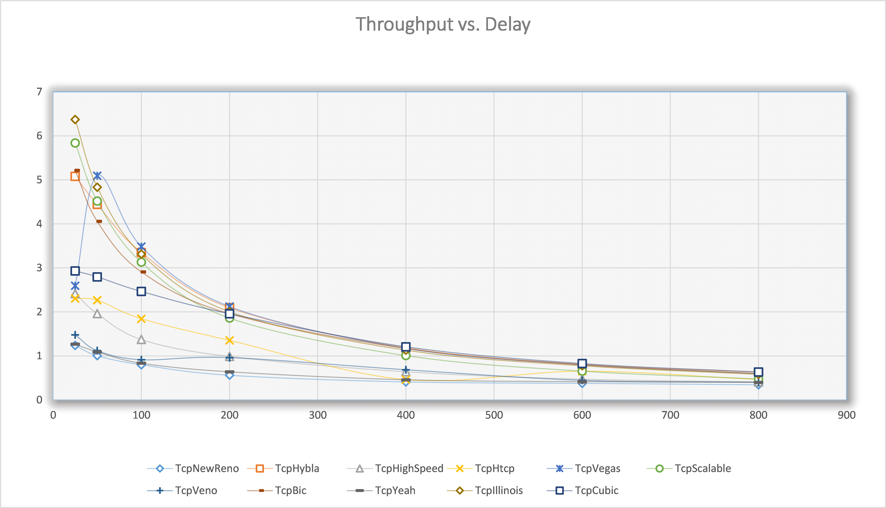
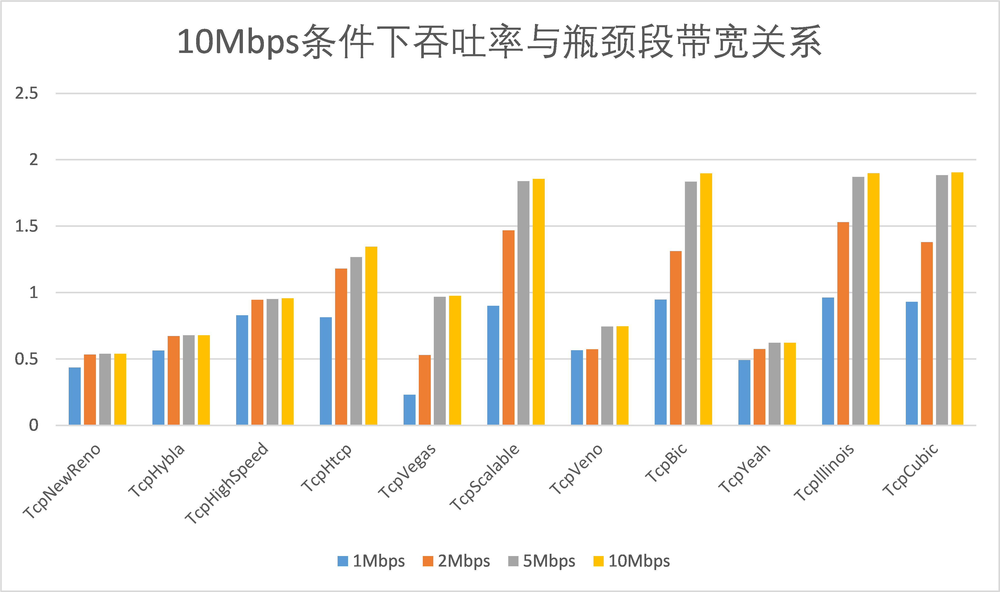
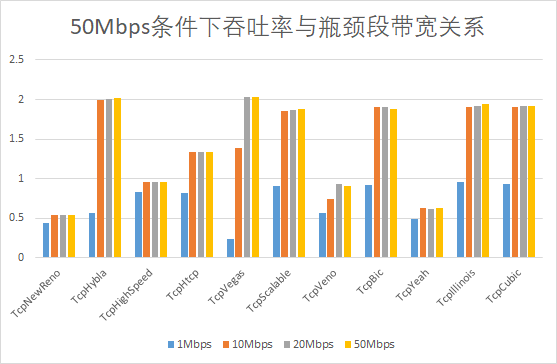
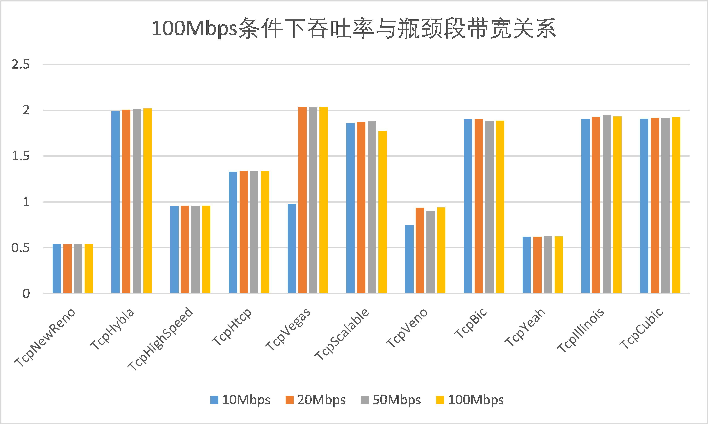

# 《基于NS-3的卫星链路TCP仿真研究》虚拟实验项目

##### 小组成员

- `1950591` 黄茂森
- `1952060` 张佰一
- `1951015` 余世璇
- `1951722` 刘创

# 1 实验目的

本小组在讨论阅读的文献并进行选题答辩后，决定将研究的目标聚焦在传输层。我们选取了余腾、刘志敏所著的《基于 NS-3的卫星链路 TCP仿真研究》。

该论文使用虚拟实验仿真了Linux内核中的11种TCP拥塞控制算法，在特定的场景下对这些算法的性能进行了比较，取得的仿真结论是：在卫星链路中，根据卫星链路特性选择适合于该特性的 TCP协议比采用传统 TCP 协议具有更高的传输效率。具有时延独立性的TCP Hybla算法是目前最适合卫星链路的TCP算法。

本小组决定以该文献为基础，利用NS-3虚拟仿真平台研究在具有高延迟特点的卫星链路这一特定场景下，不同TCP算法性能的优异。实验目的如下。

1. 加深对计算机网络基本理论知识中传输层的理解
2. 学会使用NS-3虚拟仿真平台设计、编码、分析实验
3. 探究在高时延场景中11种TCP算法的特点和性能优异

# 2 实验原理

## 2.1 传输层相关的实验原理

### 2.1.1 传输层及其协议

传输层是整个协议层次结构的核心，传输层位于网络层和应用之间，在终端用户之间提供透明数据传输，向上层提供可靠的数据传输服务。网络层是通信子网的最高层，但却无法保证通信子网或路由器提供的面向连接的服务可靠性，而在网络层之上的传输层正好可以解决这一问题，改善了传输质量。

传输层协议具有代表性的是TCP协议和UDP协议,TCP是一种可靠的,安全的,进行数据通信之前必须建立连接,才能实现数据传送的传输层协议,时效性弱。本实验着眼于在卫星链路场景下，比较不同TCP的性能优劣，验证论文所取得的仿真结果。

### 2.1.2 TCP的链接

TCP协议报文组成如下图


TCP的链接：三次握手


### 2.1.3 拥塞窗口的状态


| 名词                 | 解释                                      |
| -------------------- | ----------------------------------------- |
| slow start           | 慢启动                                    |
| congestion avoidance | 拥塞避免                                  |
| fast recovery        | 快速恢复                                  |
| fast retransmission  | 快速重传                                  |
| ssthresh             | slow start threshhold的缩写，即慢启动阈值 |

根据状态图，t时间轴上三种状态，慢启动，拥塞避免，以及快速恢复的关系，总结如下：

1. 开始的时候拥塞窗口为1，慢启动阈值为 64KB。
2. 不管是什么什么状态（包括现在是慢启动状态），一旦计时器超时，都重新进入慢启动状态，即 `ssthresh= cwnd/2(ssthresh不小于2)， cwnd= 1`。
3. 在慢启动阶段和拥塞避免阶段，一旦发现三个重复的确认，马上快速重传，然后进入快速恢复阶段。即 `ssthresh= cwnd/2, cwnd= ssthresh+ 3*MSS`。
4. 在快速恢复阶段，如果发生超时，则进入慢启动，如果收到了ack，则`cwnd= ssthresh`，重新进入拥塞避免阶段。

## 2.2 NS-3相关实验原理

### 2.2.1 NS-3平台
ns-3是一个离散事件驱动网络模拟器，其核心模块全部采用C++语言编写完成，旨在满足学术研究和教学对网络仿真模拟的需求。ns-3为网络研究和教育提供了一个开放，可扩展的网络仿真平台。简而言之，ns-3提供了分组数据网络如何工作和执行的模型，并为用户提供了进行模拟实验的模拟引擎。使用ns-3的一些原因包括进行更难或不可能用真实系统执行的研究，在高度可控，可重复的环境中研究系统行为，以及了解网络如何工作。


ns-3的官网：http://www.nsnam.org/

### 2.2.2 实验中主要使用的NS-3类

#### 2.2.2.1 NodeContainer类
NodeContainer的拓扑生成器提供一种简便的方式来创建、管理和使用任何节点对象，我们用这些节点来运行模拟器。在实验中的下面两行代码将创建ns-3节点对象，它们在仿真中代表计算机。第一行声明了一个名为”nodes”的NodeContainer。第二行调用了nodes对象的Create()方法创建了10个节点。这个容器调用NS-3种的内部函数来产生节点对象，并把指向这些对象的指针存储在系统之中。

```cpp
NodeContainer nodes;
nodes.Create(10);
```
#### 2.2.2.2 PointToPointHelper类
我们使用拓扑生成器来完成创建、连接的底层工作。在真实的世界中，网络设备、信道大致相当于外设卡和网线。需要说明的是这两样东西紧密的联系在一起而不能够把它们交互地使用（比如以太网设备和无线信道就不能一起使用）。拓扑生成器遵循了这种紧密的连接，因此在代码中仅需使用PointToPointHelper来配置和连接ns-3的PointToPointNetDevice和PointToPointChannel对象。

我们在实验中使用类似如下的代码，其中第一行在栈中初始化了一个PointToPointHelper的对象p2p2。第二行从上层的角度告诉PointToPointHelper对象当创建一个PointToPointNetDevice对象时使用的数据速率。第三行表示PointToPointHelper设置每一个被创建的点到点信道传输延时值。参数设置为可调方便实验进行。

```cpp
PointToPointHelper p2p2;
p2p2.SetDeviceAttribute("DataRate", StringValue(bandwidth));
p2p2.SetChannelAttribute("Delay", StringValue(delay));
```

#### 2.2.2.3 NetDeviceContainer类
正如使用NodeContainer拓扑生成器对象来为我们的模拟创建节点，我们会让PointToPointHelper来做关于创建，配置和安装设备的工作。我们需要一个所有被创建的NetDevice对象列表，因此使用一个NetDeviceContainer对象来存放它们，就像我们使用一个NodeContainer对象来存放我们所创建节点。

我们用下面的代码来生成设备容器并完成主要工作。PointToPointHelper的Install()方法以一个NodeContainer对象作为一个参数。在Install()方法内，一个NetDeviceContainer被创建了。对于在NodeContainer对象中的每一个节点（对于一个点到点链路必须明确有两个节点)，一个PointToPointNetDevice被创建和保存在设备容器内。一个PointToPointChannel对象被创建，两个PointToPointNetDevices与之连接。当PointToPointHelper对象创建时，那些在生成器中就被预先地设置的属性被用来初始化对象对应的属性值。 当调用了pointToPoint.Install(nodes)后，我们会有两个节点，每一个节点安装了点到点网络设备，在它们之间是一个点到点信道。两个设备会被配置在一个有我们设置的传输延时的信道上以设置的速率传输数据。

```cpp
//注册NetDeviceContainer设备
NetDeviceContainer d0d4 = p2p.Install(n0n4);
...
```

#### 2.2.2.4 InternetStackHelper类

配置了节点和设备后，在节点上用此类安装任何协议栈。下面两行代码安装网络协议栈。类InternetStackHelper是一个安装PointToPointHelper对象和点到点网络设备的网络协议栈的拓扑生成器类。其中Install()方法以一个NodeContainer 对象做为一个参数，当它被执行后，它会为每一个节点容器中的节点安装一个网络协议栈（TCP,UDP,IP等等）。

```cpp
//网络栈
InternetStackHelper stack;
stack.Install(nodes);
```

#### 2.2.2.5 Ipv4AddressHelper类
用此类为节点上的设备设置IP地址。有一个拓扑生成器来管理IP地址的分配。当执行实际的地址分配时唯一用户可见的API是设置基IP地址和子网掩码。 
```cpp
Ipv4AddressHelper ipv4;
ipv4.SetBase("10.1.1.0", "255.255.255.0");
Ipv4InterfaceContainer i0i4 = ipv4.Assign(d0d4);
```
上述代码前两行声明了一个地址生成器对象，并且告诉它应该开始从10.1.1.0开始以子网掩码为255.255.255.0分配地址。地址分配默认是从1开始并单调增长，因此在这个基础上第一个分配的地址会是10.1.1.1，紧跟着是10.1.1.2等等。底层ns-3系统事实上会记住所有分配的IP地址。第三行代码完成了真正的地址配置。在ns-3中我们使用Ipv4Interface对象将一个IP地址同一个设备关联起来。正如我们有时候需要一个被生成器创建的网络设备列表一样，我们有时候需要一个Ipv4Interface对象的列表。Ipv4InterfaceContainer提供了这样的功能。 我们在实验中使用一个安装了协议栈，配置了IP地址类的点到点的网络，运用它来产生数据通信。

#### 2.2.2.6 Applications类
ns-3系统的一个核心抽象是Application类，它是所有ns-3程序的基类。在实验中，我们编写了MyApp类继承该类完成主要功能。

## 2.3 TCP拥塞控制算法介绍

以下部分图片为本组实验数据生成。

### 2.3.1 TCP Hybla


这种算法是专门为了高RTT场景设计的，在计算拥塞窗口时删除了对于RTT的依赖。
### 2.3.2 TCP Bic


这种算法是为了在高延迟、高带宽场景下充分利用带宽所设计的，该算法在搜索最大拥塞窗口值时除了使用加递增，还使用了其特色的二分搜索递增。
### 2.3.3 TCP Cubic


这种算法是TCP Bic的改良版本，在TCP友好性，公平性方面相比于TCP Bic有所提升。
### 2.3.4 TCP Vegas


该算法使用传输时延，而不是丢失率，来确定传输速率，因此，该算法比TCP Reno对于可用带宽的变化更为敏感。

### 2.3.5 TCP Veno


该算法检测网络拥塞情况，从而确定丢包是因为网络拥塞还是bit错误，从而能够有效应对随机丢包。

# 3 实验内容

1. 构建虚拟实验平台环境
2. 不同算法拥塞窗口大小变化情况
4. 不同算法在不同时延下的表现
5. 不同算法在不同带宽下的表现
6. 不同算法高错误率下的表现

## 3.1 构建虚拟实验平台环境

### 3.1.1 网络拓扑


### 3.1.2 节点设置

`Node[0...3]`与`Node[6...9]`八个节点模拟地面连接，`Node[4]`和`Node[5]`模拟卫星链路。

```cpp
NodeContainer nodes;
nodes.Create (10);
```

### 3.1.3 点到点连接

根据上述拓扑图，我们建立三种点到点连接。

```cpp
  //模拟地面链路
  PointToPointHelper p2p;
  p2p.SetDeviceAttribute("DataRate", StringValue("100Mbps"));
  p2p.SetChannelAttribute("Delay", StringValue("30ms"));

  //模拟卫星链路，参数设置为可调方便实验进行。
  PointToPointHelper p2p2;
  p2p2.SetDeviceAttribute("DataRate", StringValue(dataRate));
  p2p2.SetChannelAttribute("Delay", StringValue(delay));
```

中间的`p2p2`为研究对象。其传输速率和延迟可以通过命令行参数改变。

### 3.1.4 网络设备容器

此处为每一个节点安装了点到点网络设备，在它们之间是一个点到点信道。请注意看`d4d5`这个信道的配置为不同的`PointToPointHelper`对象。

```cpp
  //注册NetDeviceContainer设备
  NetDeviceContainer d0d4 = p2p.Install(n0n4);
  NetDeviceContainer d1d4 = p2p.Install(n1n4);
  NetDeviceContainer d2d4 = p2p.Install(n2n4);
  NetDeviceContainer d3d4 = p2p.Install(n3n4);
  NetDeviceContainer d4d5 = p2p2.Install(n4n5);
  NetDeviceContainer d5d6 = p2p.Install(n5n6);
  NetDeviceContainer d5d7 = p2p.Install(n5n7);
  NetDeviceContainer d5d8 = p2p.Install(n5n8);
  NetDeviceContainer d5d9 = p2p.Install(n5n9);
```

### 3.1.5 安装协议栈

为所有节点安装一个网络协议栈

```cpp
  InternetStackHelper stack;
  stack.Install(nodes);
```

### 3.1.6 为节点配置IP地址

声明一个地址生成器对象`ipv4`

```cpp
  Ipv4AddressHelper ipv4;
  ipv4.SetBase("10.1.1.0", "255.255.255.0");
```

将IP地址与设备进行关联

```cpp
  Ipv4InterfaceContainer i0i4 = ipv4.Assign(d0d4);
```

上述代码完成了`d0d4`这个网络设备容器中的节点（`Node[0]`与`Node[4]`）的地址分配。接下来的代码重复性高，不再展示。

### 3.1.7 配置应用程序

我们编写了继承自`Application`抽象类的应用程序类`MyTcpApp`。

```cpp
class MyTcpApp : Public Application {
	public:
    MyTcpApp();
    virtual ~MyTcpApp();
    void SetUp(Ptr<Socket> socket, Address address, uint32_t packetSize, uint32_t nPackets, DataRate dataRate);
}
```

作为`OnOffApplication`类的完善，使用`PacketSink`应用程序类来完成组播接收、消耗发送到某个IP地址和端口（Socket）收到的网络流量。

```cpp
  uint16_t sinkPort = 8080; //选取一个端口
  Address sinkAddress1(InetSocketAddress(i5i9.GetAddress(1), sinkPort)); //确定地址
  PacketSinkHelper packetSinkHelper1("ns3::TcpSocketFactory", InetSocketAddress(Ipv4Address::GetAny(), sinkPort)); //该类帮助我们创建PacketSink对象
  ApplicationContainer sinkApps1 = packetSinkHelper1.Install(nodes.Get(9)); //在9号节点上安装一个配置好的PacketSink应用程序
```

由于实验聚焦不同的TCP算法，所以我们需要自定义Socket的设置，如下。

```cpp
  TypeId tid1 = TypeId::LookupByName("ns3::" + prot);
  Config::Set("/NodeList/1/$ns3::TcpL4Protocol/SocketType", TypeIdValue(tid1));
  Ptr<Socket> ns3TcpSocket1 = Socket::CreateSocket(nodes.Get(1), TcpSocketFactory::GetTypeId());

  //跟踪拥塞窗口变化
  ns3TcpSocket1->TraceConnectWithoutContext("CongestionWindow", MakeCallback(&CwndChange));
```

为另一边节点安装`MyTcpApp`应用

```cpp
  //建立并配置应用程序对象
  Ptr<MyApp> app1 = CreateObject<MyApp>();
  app1->Setup(ns3TcpSocket1, sinkAddress1, 1024, 10000000, DataRate(bandwidth));
  nodes.Get(1)->AddApplication(app1);
```

此处的包大小为1KB，在之后的实验中根据研究对象的不同会做出调整。

### 3.1.8 监控与日志

在拥塞窗口大小实验中，我们使模拟器追踪拥塞窗口大小改变的事件，并输出到文件中用GNUPLOT分析。

```cpp
  Simulator::Schedule(Seconds(0.00001), &TraceCwnd, prefix_file_name + "-cwnd.data");
```

在分析网络性能实验中，我们利用`FlowMonitor`类分析吞吐量、抖动等性能指标。

```cpp
  Ptr<FlowMonitor> flowMonitor;
  FlowMonitorHelper flowHelper;
  flowMonitor = flowHelper.InstallAll();
...
  flowMonitor->CheckForLostPackets();
  Ptr<Ipv4FlowClassifier> classifier = DynamicCast<Ipv4FlowClassifier>(flowHelper.GetClassifier());
  std::map<FlowId, FlowMonitor::FlowStats> stats = flowMonitor->GetFlowStats();
  std::cout << std::endl
            << "*** Flow monitor statistics ***" << std::endl;
  std::cout << "  Tx Packets:   " << stats[1].txPackets << std::endl;
  std::cout << "  Tx Bytes:   " << stats[1].txBytes << std::endl;
  std::cout << "  Offered Load: " << stats[1].txBytes * 8.0 / (stats[1].timeLastTxPacket.GetSeconds() - stats[1].timeFirstTxPacket.GetSeconds()) / 1000000 << " Mbps" << std::endl;
  std::cout << "  Rx Packets:   " << stats[1].rxPackets << std::endl;
  std::cout << "  Rx Bytes:   " << stats[1].rxBytes << std::endl;
  std::cout << "  Throughput: " << stats[1].rxBytes * 8.0 / (stats[1].timeLastRxPacket.GetSeconds() - stats[1].timeFirstRxPacket.GetSeconds()) / 1000000 << " Mbps" << std::endl;
  std::cout << "  Mean delay:   " << stats[1].delaySum.GetSeconds() / stats[1].rxPackets << std::endl;
  std::cout << "  Mean jitter:   " << stats[1].jitterSum.GetSeconds() / (stats[1].rxPackets - 1) << std::endl;
```

以上便是我们实验程序的*WalkThrough*。

在实际实验中，我们使用命令行参数来控制变量。如下：

```
$ sudo ./waf --run "scratch/project --prot=TcpHybla --delay=100ms"
```

意味着使用Hybla算法，延迟为100ms。其他参数类似。

## 3.2 不同算法拥塞窗口大小变化情况

#### 设计实验

使程序使用不同的TCP算法，从`Node[1]`到`Node[9]`（经过`Node[4]`和`Node[5]`）传输1MB的数据。收集模拟过程中所有拥塞窗口大小（Congestion Window Size）的数据。最后使用GNULPLOT作图分析。

#### 源数据


上图为节选数据。左边为时刻，右边为该时刻的拥塞窗口大小。

在GNUPLOT中使用命令生成图像。

```
plot '...-cwnd.data' using 1:2 title '(a) NewReno'
```

#### 实验结果


结合前方实验原理分析，可以明显看到该图像能反映部分算法的特点。也可以得到Hybla算法的优越性。

## 3.3 不同算法在不同时延下的表现

### 3.3.1 设计实验

本实验使用不同时延作为变量，观测11种算法的吞吐率大小，绘制图表分析结果。

### 3.3.2 实验过程

```cpp
sudo ./waf --run "scratch/main2 --prot=TcpNewReno --delay=25ms --error_p=0.000001 --bandwidth=100Mbps"
*** Flow monitor statistics ***
  Tx Packets:   26112
  Tx Bytes:   15325036
  Offered Load: 1.23771 Mbps
  Rx Packets:   26098
  Rx Bytes:   15316804
  Throughput: 1.23704 Mbps
  Mean delay:   0.085204
  Mean jitter:   4.70804e-05

sudo ./waf --run "scratch/main2 --prot=TcpNewReno --delay=50ms --error_p=0.000001 --bandwidth=100Mbps"
*** Flow monitor statistics ***
  Tx Packets:   21210
  Tx Bytes:   12442660
  Offered Load: 1.00457 Mbps
  Rx Packets:   21154
  Rx Bytes:   12409732
  Throughput: 1.00414 Mbps
  Mean delay:   0.110205
  Mean jitter:   4.70003e-05
  
...
```

得到以下结果：

| TCP/delay    | 25      | 50      | 100      | 200      | 400      | 600      | 800      |
| ------------ | ------- | ------- | -------- | -------- | -------- | -------- | -------- |
| TcpNewReno   | 1.23704 | 1.00414 | 0.799237 | 0.5602   | 0.409294 | 0.377274 | 0.345317 |
| TcpHybla     | 5.08005 | 4.44376 | 3.34912  | 2.09447  | 1.18072  | 0.805236 | 0.632212 |
| TcpHighSpeed | 2.41617 | 1.96177 | 1.37284  | 0.987666 | 0.639978 | 0.471821 | 0.409701 |
| TcpHtcp      | 2.30365 | 2.26469 | 1.84389  | 1.35201  | 0.460301 | 0.652116 | 0.461916 |
| TcpVegas     | 2.5927  | 5.09471 | 3.48288  | 2.11967  | 1.16811  | 0.796956 | 0.596481 |
| TcpScalable  | 5.83859 | 4.51883 | 3.12885  | 1.86148  | 1.00738  | 0.654242 | 0.477797 |
| TcpVeno      | 1.47583 | 1.11854 | 0.911728 | 0.959777 | 0.684963 | 0.444475 | 0.402582 |
| TcpBic       | 5.21579 | 4.05786 | 2.90804  | 1.95832  | 1.16897  | 0.796956 | 0.596481 |
| TcpYeah      | 1.265   | 1.08841 | 0.832526 | 0.636217 | 0.455126 | 0.412436 | 0.395693 |
| TcpIllinois  | 6.37158 | 4.83361 | 3.31296  | 2.00533  | 1.13121  | 0.776247 | 0.581232 |
| TcpCubic     | 2.92852 | 2.79542 | 2.46377  | 1.95717  | 1.20591  | 0.825626 | 0.634099 |

### 3.3.3 本实验总结



从图中可以看出，Cubic，Illinois，Vegas，Hybla的表现领先其他算法。

## 3.4 不同算法在不同带宽下的表现

在原论文中，作者探究了不同算法在不同带宽下的表现，这里对于原论文中的实验进行复现。
在实验中，我们采用了dumbbell topology：


实验条件：误码率为1e-6，host 1-4到S1与S2到host 5-8的时延为1000ns，**S1与S2之间的时延为270ms，该值为卫星链路典型时延值**。


### 3.4.1 第一组实验：
host 1-4到S1与S2到host 5-8的带宽为10Mbps，改变S1与S2之间的带宽，并测试不同算法此时的表现。
结果如下：

| TCP\bandwidth | 1Mbps    | 2Mbps    | 5Mbps    | 10Mbps   |
|---------------|----------|----------|----------|----------|
| TcpNewReno    | 0.436445 | 0.533044 | 0.53906  | 0.539272 |
| TcpHybla      | 0.56376  | 0.671913 | 0.677965 | 0.678194 |
| TcpHighSpeed  | 0.827794 | 0.945412 | 0.951723 | 0.95574  |
| TcpHtcp       | 0.812725 | 1.18054  | 1.26685  | 1.34673  |
| TcpVegas      | 0.230227 | 0.529625 | 0.967266 | 0.975473 |
| TcpScalable   | 0.900588 | 1.46756  | 1.83812  | 1.85539  |
| TcpVeno       | 0.565643 | 0.57288  | 0.743902 | 0.745075 |
| TcpBic        | 0.947753 | 1.31218  | 1.83594  | 1.89716  |
| TcpYeah       | 0.491511 | 0.574066 | 0.621287 | 0.621654 |
| TcpIllinois   | 0.962549 | 1.52964  | 1.87162  | 1.89962  |
| TcpCubic      | 0.929389 | 1.3799   | 1.88336  | 1.90519  |

用柱状图加以表示：



可以看出，在该条件下TCP Hybla和TCP Vegas表现不佳，表现较好的有TCP Scalable,TCP Bic, TCP Illinois以及TCP Cubic。


### 3.4.2 第二组实验：
host 1-4到S1与S2到host 5-8的带宽为50Mbps，改变S1与S2之间的带宽，并测试不同算法此时的表现。
结果如下：

| TCP\bandwidth | 1Mbps    | 10Mbps   | 20Mbps   | 50Mbps   |
|---------------|----------|----------|----------|----------|
| TcpNewReno    | 0.437102 | 0.540092 | 0.539658 | 0.541459 |
| TcpHybla      | 0.564285 | 1.98804  | 2.00265  | 2.01477  |
| TcpHighSpeed  | 0.828509 | 0.95554  | 0.958854 | 0.957481 |
| TcpHtcp       | 0.812065 | 1.33053  | 1.33713  | 1.34046  |
| TcpVegas      | 0.231273 | 1.3916   | 2.03716  | 2.03099  |
| TcpScalable   | 0.900766 | 1.86092  | 1.87112  | 1.87681  |
| TcpVeno       | 0.566201 | 0.746485 | 0.937769 | 0.900686 |
| TcpBic        | 0.92411  | 1.90003  | 1.90089  | 1.88312  |
| TcpYeah       | 0.492469 | 0.622599 | 0.622103 | 0.623091 |
| TcpIllinois   | 0.962615 | 1.91131  | 1.91871  | 1.93732  |
| TcpCubic      | 0.929288 | 1.90798  | 1.9161   | 1.91607  |

用柱状图加以表示：



可以看出，在该条件下TCP Hybla, TCP Vegas, TCP Scalable,TCP Bic, TCP Illinois以及TCP Cubic表现较好


### 3.4.3 第三组实验：
host 1-4到S1与S2到host 5-8的带宽为100Mbps，改变S1与S2之间的带宽，并测试不同算法此时的表现。
结果如下：
| TCP\bandwidth | 10Mbps   | 20Mbps   | 50Mbps   | 100Mbps  |
|---------------|----------|----------|----------|----------|
| TcpNewReno    | 0.540194 | 0.53976  | 0.541563 | 0.541676 |
| TcpHybla      | 1.98975  | 2.00631  | 2.01516  | 2.0176   |
| TcpHighSpeed  | 0.95572  | 0.959037 | 0.95808  | 0.958023 |
| TcpHtcp       | 1.3308   | 1.33709  | 1.34072  | 1.33657  |
| TcpVegas      | 0.975801 | 2.03256  | 2.03139  | 2.03439  |
| TcpScalable   | 1.86126  | 1.87148  | 1.87717  | 1.77385  |
| TcpVeno       | 0.746624 | 0.937946 | 0.902036 | 0.939938 |
| TcpBic        | 1.90037  | 1.90208  | 1.88349  | 1.88563  |
| TcpYeah       | 0.622717 | 0.622221 | 0.623305 | 0.623434 |
| TcpIllinois   | 1.90514  | 1.92901  | 1.94802  | 1.93216  |
| TcpCubic      | 1.90831  | 1.91649  | 1.91644  | 1.92273  |
用柱状图加以表示：



可以看出，在该条件下TCP Hybla, TCP Vegas, TCP Scalable,TCP Bic, TCP Illinois以及TCP Cubic表现较好

### 3.4.4 本实验总结：
综合以上三个实验，发现TCP Hybla在带宽较大时才能有较优表现，但是和其他一些TCP变种的表现差距不大。

## 3.5 不同算法高丢包率下的表现

本实验是在3.4基础上的进一步探究，故采用与3.4相同的拓扑结构。

### 3.5.1 实验条件：

host 1-4到S1与S2到host 5-8的时延为1000ns，S1与S2之间的时延为270ms，该值为卫星链路典型时延值；host 1-4到S1与S2，host 5-8的带宽为100Mbps。与3.4不同的地方在于误码率从1e-6提升到1e-5。在实验中改变S1与S2之间的带宽，并测试不同算法此时的表现。

### 3.5.2 实验数据：

| TCP\bandwidth | 10Mbps    | 20Mbps    | 50Mbps    |
|---------------|-----------|-----------|-----------|
| TcpHybla      | 1.43482   | 1.44844   | 1.44844   |
| TcpHtcp       | 0.156633  | 0.156761  | 0.156761  |
| TcpVegas      | 0.234206  | 0.234375  | 0.241938  |
| TcpScalable   | 0.241318  | 0.241938  | 0.241938  |
| TcpIllinois   | 0.0361079 | 0.0616362 | 0.0616362 |
| TcpCubic      | 0.341951  | 0.34885   | 0.34885   |

用柱状图加以表示：


### 3.5.3 本实验总结：

在提高了误码率后，TCP Hybla的表现明显优于其他算法，这一点与论文中的结论相符：

论文中探究误码率 1e-6(丢包率0.05%)时吞吐率随带宽的变化


论文中探究误码率 1e-5(丢包率0.5%)时吞吐率随带宽的变化


## 3.6 实验总结

最后，我们得出了和作者一致的结论：在低丢包率时，TCP-hybla表现良好，但是和Cubic，Illinois，Vegas等算法难分高下；而在高丢包率时，TCP-hybla的表现一骑绝尘，远远领先其他算法。同时，我们发现了一个原论文中忽略的结论——在低带宽时，TCP-Hybla的表现并不好，只有在有着充足带宽的前提下，TCP-Hybla才能发挥出其优势。

# 4 实验小结

我们在实验过程中遇到了许多困难，不过我们都顺利攻克难关。

首先，由于ns3版本迭代，原作者的实现方法——nsc无法落实。后经查资料后发现ns3已经内置了十几种TCP算法，故采纳之。其次，实验开始时对生成的XML文件暴力使用NetAnim分析，无结果。研究后发现该文件是Flow Monitor的监测数据，学习到了XML文件的多功能性。最后，对大量数据缺少批量操作的工具，一遍一遍运行Shell命令非常麻烦。我们的解决方法是写.sh脚本，批量运行代码，并用gnuplot生成分析结果的图片。

本次实验收获颇丰。我们学习了大型网络模拟实验的基本操作和分析方法，和在面对不符合理论的实验结果时，如何解释、怎样优化的方法，并且加深了对TCP相关技术的理解、对多层网络模型的贯穿认识。

