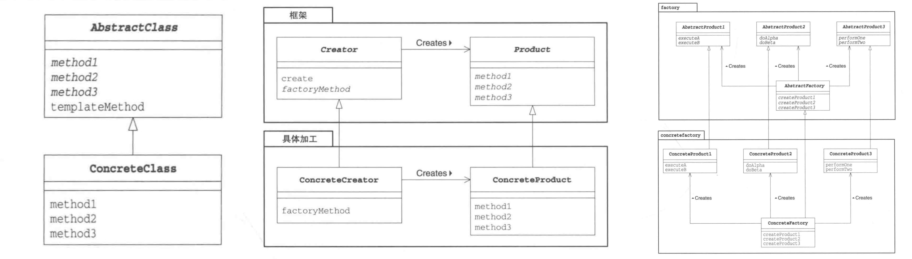
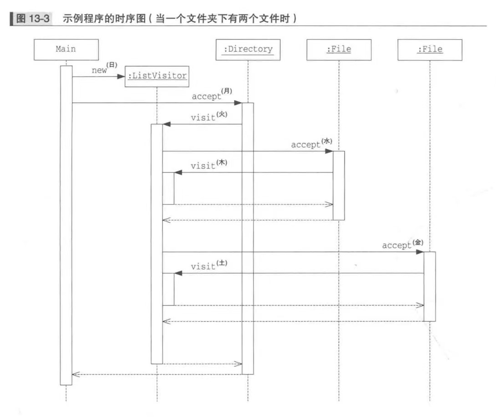

# 《软件设计模式》学习心得

短短的半个学期，设计模式的学习结束了。侯捷先生的耐心讲解引人入胜，提供的实例竟直指语言底层的内容，不得不佩服大师功夫之深。对于设计模式，我起初感觉没什么作用、意义不大。学完后我却觉得处处都有设计模式，处处都必需设计模式。经历了两个月的艰苦奋斗，在小组的激烈讨论中，我也学习到了不少东西，在此整理成几个小部分加以总结。

## Part 1 | 模板方法模式、工厂方法模式与抽象工厂模式辨析

在[这篇科普文章](https://www.runoob.com/design-pattern/abstract-factory-pattern.html)中，作者介绍道“抽象工厂模式是围绕一个超级工厂创建其他工厂”，这样理解容易造成歧义，以为仅仅是一个抽象类做“抽象工厂”，其他具体工厂类继承实现该抽象工厂的部分函数。但阅读日本作家结城浩所著的《图解设计模式》后，才意识到了自己理解出了偏差。

工厂方法模式从模版方法模式中演变而来。模版方法中，在父类规定处理的流程，在子类中实现具体的处理。模版方法模式使用这样的规程去处理一件事情。如果不是处理事情，而是生成一个实例，模版方法模式就变成了工厂方法模式。

在工厂方法模式中，父类决定实例的生成方式。不决定具体的要生成的类，具体处理全部交给子类负责。这样做的好处是，在工厂中可以不用`new`来生成实例，只用调用生成实例专用的方法来即可，这样做就可以使父类与其他的具体类解耦，给程序带来很强的拓展性。

抽象工厂虽然名字中有“工厂”二字，但却和工厂方法大相径庭。抽象工厂的作用是将“抽象零件”组装为“抽象产品”。用网页的例子很好地能说明这个问题。假设现在要做一个网页，其中有链接和存放链接的容器这两种主要的组件。此时可以用列表方式组织链接，也即将`List`作为上述的容器；也可以用表格方式即`Table`作为上述的容器。在这个例子中，链接和容器、最终的页面就是抽象零件，抽象的工厂只知道需要生成抽象的零件，具体这个零件怎样加入到容器中，就要让继承工厂类的具体类去处理了。

抽象工厂模式给增加具体的工厂提供了非常方便的接口，无论增加多少个工厂都不用修改抽象工厂类的代码，甚至都不用修改委托者类的调用函数（通过运行时参数指定具体工厂类选何）。可以说这个设计模式完美地体现了`OCP`原则。

上图分别是模版方法模式、工厂方法模式、抽象工厂模式的类图。结合实践经验，现在对于三者的作用和区别，就一目了然了。

## Part 2 | 理解访问者模式的递归调用

访问者模式，我最初学的时候一头雾水。只知道它是和数据结构有关的一种模式，看到`accept`方法和`visit`方法相互调用，还是不知道具体发生了什么事情。

总结来讲，使用访问者模式一共有这么三个步骤。

1. 数据结构维护`accept`方法给访问者提供具体实例。让数据结构继承某个接口，实现能够接受访问者类做参数的`accept`方法，此处的`accept`方法，有一个`this`的*buff*，此时的`this`指向的是当前数据结构类中的某个实例所在的位置，进而在该`accept`方法中让访问者参数（也就是访问者实例）访问该`this`，此时`this`又做了参数，访问者实例根据这个参数来决定访问这个实例时采用什么流程，这是下一个步骤中要说明的内容。
2. 访问者维护`visit`方法来明确对于具体实例采用怎样的操作去访问。在访问者类中实现`visit`方法。一般来说，不同的访问者可以设定不同的职责，如果是访问文件系统的访问者，就可以设计为对于文件夹读名后迭代地访问其中内容；对于文件则读名输出。此方式要求此访问者实现两个`visit`方法，一个能够接受文件夹作为参数，另一个接受文件作为参数。
3. 如果存在递归结构，则可以实现递归调用`accept`方法和`visit`方法。还是拿文件系统来说，如果访问者访问到文件夹，则对于文件夹中的每一个项都调用其`accept`方法将该访问者自身的实例传给该数据结构实例，该数据结构实例得到访问者的参数后，调访问者的`visit`方法，如此一来就实现了递归调用。不是递归地调用自身，而是两个方法之间互相递归调用。既然是递归调用，就会有程序数据结构管理的问题，对于这个例子来说，访问者访问根目录的`visit`方法在该访问者实例访问其子树的时候，还存在于调用堆栈之中。等所有的项目遍历结束、所有文件访问结束后，会有一个逐步返回的过程，最终回到第一次调用访问者的`accept`方法的位置。

在访问者模式中，`visit`方法将“处理”都集中在`ListVisitor`里面了。访问者模式将处理从数据结构中分离出来，也是一种`OCP`的很好示范。这让需要增加新的处理时，能够不去修改数据结构的代码。对扩展开放，对修改关闭。这样编写的代码维护起来相当方便。

上图是文件系统作为例子的访问者调用时序图，易知使用的一直是同一个访问者的实例（`ListVisitor`类），其生命周期一直到程序最后才结束。

## Part 3 | 良师益友、宝刀利器

从一开始我们小组便决定不要将设计模式都分开，而要将多个设计模式都有机融合在我们程序地场景之中。这就要求我们对于我们要做的东西有相当好的了解，当然也需要对设计模式了如指掌。这个过程是相当痛苦的，因为需求总是提不完，顶层设计很难一步到位。负责整体架构设计的同学展现了对`Java`语言让人叹服的熟悉，并将它灵活地运用到了项目之中。有机融合设计模式的过程也是一场硬战。我们开了许多次忘记时间的大组会、小组会，整理了许多文档理清思路。善于思考的同学展现了一种精益求精的学习态度，这一点让我印象颇深。为学当以之为榜样。

我们使用的测试单元`JUnit`对我来说也是新的尝试。在后期开发中，加入了交互、停顿等等代码，直接运行调试会浪费许多时间。但使用测试单元就会事半功倍。无论是理论还是实践，我都深刻地感觉到软件开发确实不是上来就写代码。构思设计模式、配置好测试单元、理清思路等等工作，和写代码一样重要。

